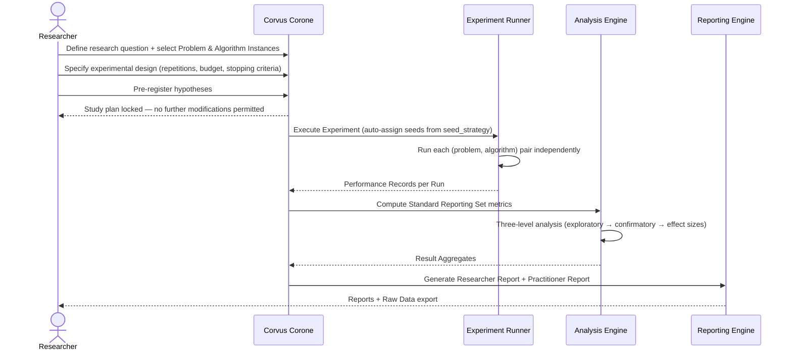

# UC-01: Design and Execute a Reproducible Benchmarking Study

**Actor:** Researcher
**Trigger:** Has a research question about HPO algorithm behavior
**Goal:** Execute a reproducible benchmarking Study and receive a statistically valid analysis report

---

## Diagram

---

## Design Note: Why "dataset" does not appear here

This use case benchmarks **HPO algorithms**, not ML models. An HPO algorithm interacts with a Problem Instance through an objective function interface — it submits a hyperparameter configuration and receives a scalar score. It never touches raw data directly.

If a Problem Instance represents a real ML task (e.g., tuning a neural network on CIFAR-10), the dataset is an internal implementation detail of that problem's evaluation function, not a separate input to the benchmarking study. It is captured implicitly in the Problem Instance record via `provenance`, `real_or_synthetic`, and `source_reference` fields (→ `docs/03-technical-contracts/01-data-format/02-problem-instance.md`).

The **Problem Instance** is the correct unit of analysis here — it defines the search space, objective, and budget that the algorithm operates against. Datasets, where relevant, are encapsulated within that abstraction.

---

## Preconditions

- At least one Algorithm Instance is registered in the Algorithm Registry
- At least one Problem Instance is registered with all characteristics documented
- The Researcher has formulated a specific research question (not a generic ranking request)

## Main Flow

1. Researcher defines a research question and records it as the Study's `research_question` field (→ `docs/03-technical-contracts/01-data-format/04-study.md` §2.3 Study)
2. Researcher selects Problem Instances from the Problem Repository, verifying characteristic diversity across the intended test set (→ MANIFESTO Principles 4–5; `docs/02-design/02-architecture/03-c4-leve2-containers/01-index.md` Problem Repository)
3. Researcher selects Algorithm Instances to compare and reviews each `configuration_justification` for fairness (→ MANIFESTO Principle 10; `docs/03-technical-contracts/01-data-format/03-algorithm-instance.md` §2.2)
4. Researcher specifies experimental design: repetitions, budget allocation, stopping criteria (→ `docs/04-scientific-practice/01-methodology/01-benchmarking-protocol.md` Steps 1–4)
5. Researcher pre-registers hypotheses in the Study record — the system locks the Study plan at this point; no modification to problem set, algorithm set, or hypotheses is permitted after this step (→ `docs/04-scientific-practice/01-methodology/01-benchmarking-protocol.md` Step 5; MANIFESTO Principle 16)
6. System executes the Experiment: assigns seeds automatically per the Study's `experimental_design.seed_strategy`, runs each (problem, algorithm) pair independently, records a Performance Record sequence per Run (→ `docs/04-scientific-practice/01-methodology/01-benchmarking-protocol.md` Step 6; `docs/03-technical-contracts/02-interface-contracts/04-runner-interface.md` Runner interface; `docs/03-technical-contracts/01-data-format/05-experiment.md` §2.4–`docs/03-technical-contracts/01-data-format/07-performance-record.md` §2.6)
7. System computes Standard Reporting Set metrics across all Runs and constructs Result Aggregates (→ `docs/03-technical-contracts/03-metric-taxonomy/08-standard-reporting-set.md` Standard Reporting Set; `docs/03-technical-contracts/01-data-format/08-result-aggregate.md` §2.7)
8. System runs three-level statistical analysis: exploratory (visualizations, summary statistics), confirmatory (pre-registered hypothesis tests, multiple-testing correction), practical significance (effect sizes) (→ `docs/04-scientific-practice/01-methodology/02-statistical-methodology.md`)
9. System generates Researcher Report and Practitioner Report, each with an explicit limitations section scoping conclusions to the tested Problem Instances (→ `docs/04-scientific-practice/01-methodology/01-benchmarking-protocol.md` Steps 7–8; MANIFESTO Principles 23–25)
10. Researcher receives the reports and a Raw Data export for independent analysis (→ NFR-OPEN-01); results may additionally be exported to external platforms (COCO, IOHprofiler, Nevergrad) via UC-06

## Postconditions

- A completed Experiment record exists with all Run data, seeds, and execution environment archived
- Result Aggregates exist for every (problem, algorithm) pair
- Researcher Report and Practitioner Report are produced
- Raw Data export is available in a machine-readable format
- All Artifacts are versioned and reproducible by a third party from archived materials

## Failure Scenarios

- *F1: Insufficient problem diversity* — System warns if the Problem Instance set does not meet minimum diversity requirements (`REF-TASK-0021`)
- *F2: Run failure* — Failed Runs record the failure reason; the Study continues; the analyst is warned if failure rate exceeds threshold (→ `docs/03-technical-contracts/01-data-format/06-run.md` §2.5 Run.status)
- *F3: Pre-registration gate violation* — If the Researcher attempts to modify hypotheses after Step 5, the system rejects the change and records the attempt with a timestamp
- *F4: Seed collision* — System detects and rejects duplicate seeds within an Experiment

## Connects to

- `docs/01-manifesto/MANIFESTO.md` — Principles 1, 4–5, 10, 12–16, 18–22, 23–25
- `docs/02-design/02-architecture/02-c4-leve1-context/01-c4-l1-context/01-c1-context.md` — Researcher actor definition
- `docs/03-technical-contracts/01-data-format/04-study.md` — §2.3 (Study)
- `docs/03-technical-contracts/01-data-format/05-experiment.md` — §2.4 (Experiment)
- `docs/03-technical-contracts/01-data-format/06-run.md` — §2.5 (Run)
- `docs/03-technical-contracts/01-data-format/07-performance-record.md` — §2.6 (Performance Record)
- `docs/03-technical-contracts/01-data-format/08-result-aggregate.md` — §2.7 (Result Aggregate)
- `docs/03-technical-contracts/02-interface-contracts/04-runner-interface.md` — Runner interface
- `docs/03-technical-contracts/02-interface-contracts/05-analyzer-interface.md` — Analyzer interface
- `docs/03-technical-contracts/03-metric-taxonomy/08-standard-reporting-set.md` — Standard Reporting Set
- `docs/04-scientific-practice/01-methodology/01-benchmarking-protocol.md` — all 8 steps
- `docs/04-scientific-practice/01-methodology/02-statistical-methodology.md` — three-level analysis framework
- `03-functional-requirements/01-index.md`: FR-08, FR-09, FR-10, FR-11, FR-13, FR-14, FR-15, FR-17, FR-18, FR-20, FR-21, FR-22
- `04-non-functional-requirements/01-index.md`: NFR-REPRO-01, NFR-STAT-01, NFR-OPEN-01
