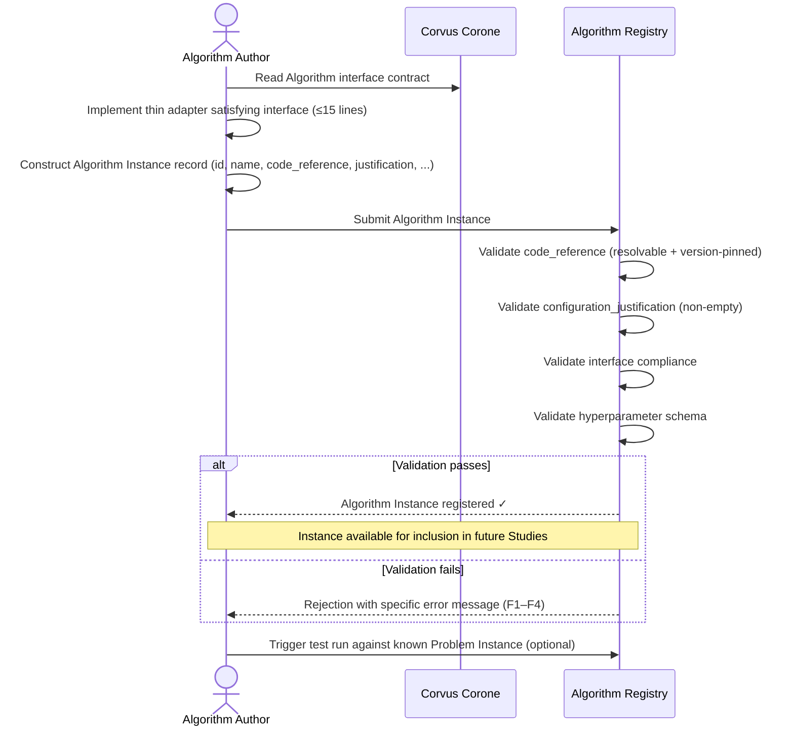

# UC-02: Contribute an Algorithm Implementation

**Actor:** Algorithm Author
**Trigger:** Has a new HPO algorithm or wants to wrap an existing optimizer
**Goal:** Contribute a new Algorithm Instance that is registered with full provenance and available for fair evaluation

---

## Diagram

---

## Preconditions

- The Algorithm Author has an existing optimizer (e.g., an Optuna sampler, a scipy.optimize function)
- The optimizer can be wrapped to satisfy the Algorithm interface (→ `docs/03-technical-contracts/02-interface-contracts/03-algorithm-interface.md` Algorithm interface)

## Main Flow

1. Author reads the Algorithm interface contract to understand required method signatures (→ `docs/03-technical-contracts/02-interface-contracts/03-algorithm-interface.md` Algorithm interface)
2. Author implements a thin adapter satisfying the interface — common wrappers require ≤15 lines (NFR-USABILITY-01; `docs/05-community/01-contribution-guide.md`)
3. Author constructs the Algorithm Instance record: `id`, `name`, `algorithm_family`, `hyperparameters`, `configuration_justification`, `code_reference` (version-pinned), `language`, `framework`, `framework_version`, `known_assumptions` (→ `docs/03-technical-contracts/01-data-format/03-algorithm-instance.md` §2.2)
4. Author submits the Algorithm Instance to the Algorithm Registry (→ `docs/02-design/02-architecture/03-c4-leve2-containers/01-index.md` Algorithm Registry)
5. System validates: `code_reference` is resolvable and version-pinned; hyperparameter names match declared schema; `configuration_justification` is non-empty; interface is satisfied
6. (Optionally) Author triggers a test run against a known Problem Instance to verify the adapter operates correctly
7. Algorithm Instance is approved and available for inclusion in future Studies

## Postconditions

- Algorithm Instance record exists with full provenance (`contributed_by`, `created_at`, `code_reference`)
- The Implementation is version-pinned and independently reproducible
- The Instance appears in the Algorithm Registry for Study design

## Failure Scenarios

- *F1: Interface not satisfied* — System rejects registration with specific method signature errors identifying which methods are missing or incorrect
- *F2: Code reference unresolvable* — System rejects registration; `code_reference` must resolve to a pinned, retrievable artifact
- *F3: Missing configuration justification* — System rejects registration; `configuration_justification` cannot be empty (MANIFESTO Principle 10)
- *F4: Hyperparameter schema mismatch* — System rejects if declared hyperparameter names do not match the algorithm's known parameter schema

## Connects to

- `docs/01-manifesto/MANIFESTO.md` — Principles 8, 10, 11, 19, 31
- `docs/02-design/02-architecture/02-c4-leve1-context/01-c4-l1-context/01-c1-context.md` — Algorithm Author actor definition
- `docs/03-technical-contracts/01-data-format/03-algorithm-instance.md` — §2.2 (Algorithm Instance)
- `docs/03-technical-contracts/02-interface-contracts/03-algorithm-interface.md` — Algorithm interface contract
- `docs/05-community/01-contribution-guide.md` — contribution process and review
- `03-functional-requirements/01-index.md`: FR-05, FR-06, FR-07
- `04-non-functional-requirements/01-index.md`: NFR-MODULAR-01, NFR-USABILITY-01
