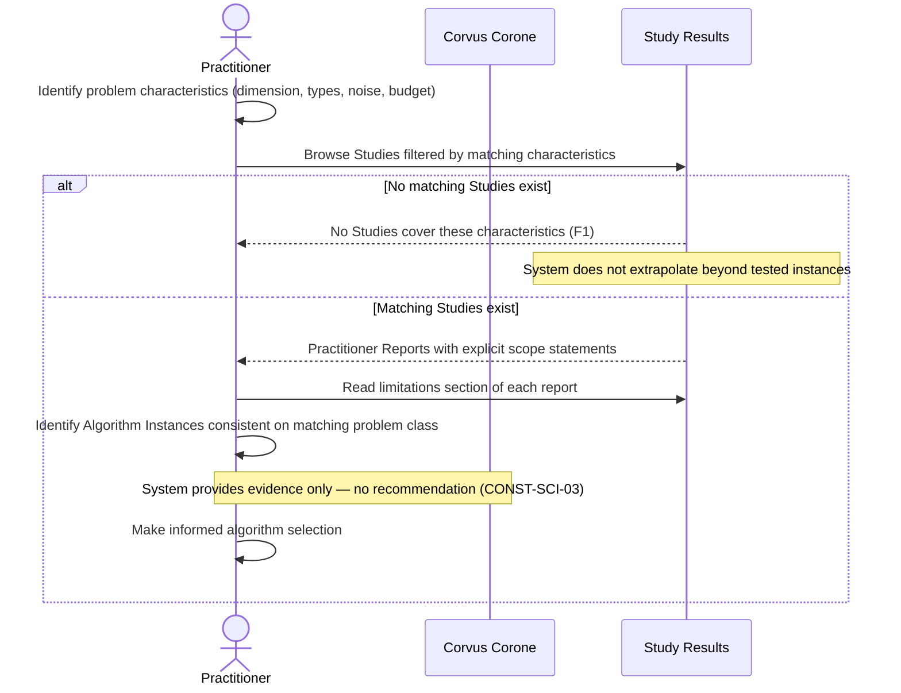

# UC-03: Select an HPO Algorithm for an ML Project

**Actor:** Practitioner
**Trigger:** Needs to select an HPO algorithm for an ML project
**Goal:** Find performance summaries scoped to problem characteristics matching their application, with explicit scope statements

---

## Diagram

---

## Preconditions

- Published Study results exist covering problem characteristics similar to the Practitioner's application

## Main Flow

1. Practitioner identifies their problem characteristics: search space dimension, variable types, noise level, budget constraints
2. Practitioner browses available Study results filtered by problem characteristics matching their application
3. Practitioner reads the Practitioner Report for relevant Studies: performance of Algorithm Instances on matching Problem Instances, with explicit scope statements (→ MANIFESTO Principle 25; FR-20)
4. Practitioner reads the limitations section of each report to understand the scope boundary of every conclusion (→ MANIFESTO Principle 24; CONST-SCI-06)
5. Practitioner identifies Algorithm Instances that perform consistently on their matching problem class (→ MANIFESTO Principle 2)
6. Practitioner makes an informed selection — the system provides evidence, not a recommendation (CONST-SCI-03)

## Postconditions

- Practitioner has reviewed evidence scoped to their problem class
- Practitioner has read the explicit limitations of those conclusions

## Failure Scenarios

- *F1: No matching Problem Instances* — System indicates that no Studies cover the Practitioner's problem characteristics; the system does not extrapolate beyond tested instances (CONST-SCI-06)

## Connects to

- `docs/01-manifesto/MANIFESTO.md` — Principles 2, 3, 24, 25
- `docs/02-design/02-architecture/02-c1-context.md` — Practitioner actor definition
- `03-functional-requirements/01-functional-requirements.md`: FR-20, FR-21
- `05-constraints/01-constraints.md`: CONST-SCI-03, CONST-SCI-06
