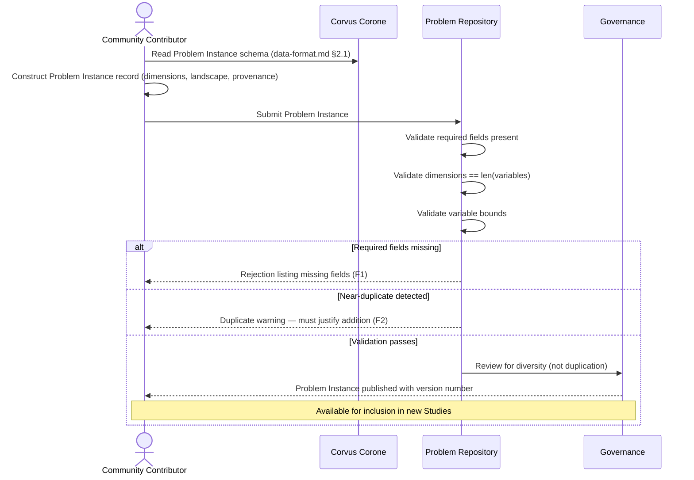

# UC-04: Contribute a New Problem Instance

**Actor:** Community Contributor
**Trigger:** Discovers a benchmark gap — a problem type not represented in the current set
**Goal:** Contribute a new Problem Instance that enriches the benchmark's characteristic diversity

---

## Diagram

---

## Preconditions

- The Problem Instance has fully documented characteristics (dimension, variable types, bounds, noise level, known optimum if available, landscape characteristics)
- The Problem Instance is not a near-duplicate of an existing registered instance

## Main Flow

1. Contributor reads the Problem Instance schema to understand required fields (→ `docs/03-technical-contracts/01-data-format/02-problem-instance.md` §2.1)
2. Contributor constructs the Problem Instance record: `id`, `name`, `version`, search space descriptors, objective specification, evaluation budget, `landscape_characteristics`, provenance fields (`created_by`, `source_reference`) (→ `docs/03-technical-contracts/01-data-format/02-problem-instance.md` §2.1)
3. Contributor submits the record to the Problem Repository (→ `docs/02-design/02-architecture/03-c4-leve2-containers/01-index.md` Problem Repository)
4. System validates completeness: all required fields present; `dimensions` equals `len(variables)`; variable bounds valid for each variable type (→ `docs/03-technical-contracts/01-data-format/02-problem-instance.md` §2.1 validation rules)
5. Governance review verifies the contribution adds diversity rather than duplication (→ `docs/05-community/02-versioning-governance.md`)
6. Problem Instance is published with a version number and added to the benchmark set

## Postconditions

- Problem Instance record exists with full provenance
- The Problem Instance is available for inclusion in new Studies

## Failure Scenarios

- *F1: Incomplete documentation* — System rejects submission if required fields are missing; rejection message lists the missing fields
- *F2: Duplicate detection* — System warns if the submitted characteristic profile is within tolerance of an existing instance; contributor must justify the addition

## Connects to

- `docs/01-manifesto/MANIFESTO.md` — Principles 4, 5, 6, 7, 27
- `docs/02-design/02-architecture/02-c4-leve1-context/01-c4-l1-context/01-c1-context.md` — Community Contributor actor definition
- `docs/03-technical-contracts/01-data-format/02-problem-instance.md` — §2.1 (Problem Instance)
- `docs/05-community/02-versioning-governance.md` — governance and review process
- `03-functional-requirements/01-index.md`: FR-01, FR-02, FR-03
- `04-non-functional-requirements/01-index.md`: NFR-MODULAR-01
