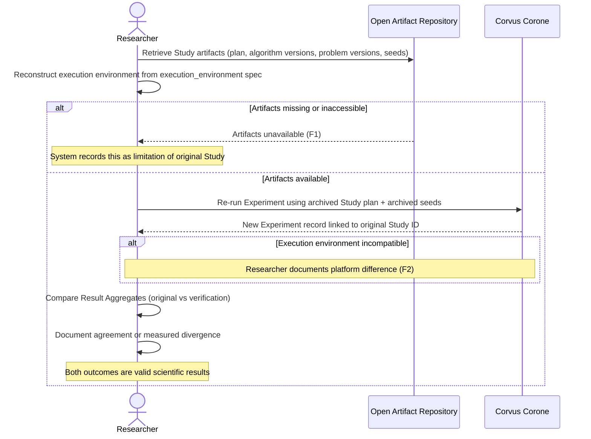

# UC-05: Verify a Published Study

**Actor:** Researcher
**Trigger:** Wants to independently verify claims of a published benchmarking Study
**Goal:** Re-execute the Study from archived Artifacts and document agreement or measured divergence

---

## Diagram

---

## Preconditions

- The Study's Artifacts are published in an open repository (code, data, seeds, procedures)
- The Researcher has access to compatible execution environment specifications

## Main Flow

1. Researcher retrieves the archived Study record: Study plan, Algorithm Instance versions, Problem Instance versions, seed assignments (→ MANIFESTO Principle 19; `docs/03-technical-contracts/01-data-format.md` §2.3–§2.5)
2. Researcher reconstructs the execution environment matching the recorded `execution_environment` specification (→ `docs/03-technical-contracts/01-data-format.md` §2.4 Experiment)
3. Researcher re-runs the Experiment using the archived Study plan — seeds come from the archived Run records, not re-generated
4. System produces a new Experiment record linked to the same Study ID
5. Researcher compares Result Aggregates between the original and verification Experiments (→ `docs/03-technical-contracts/01-data-format.md` §2.7)
6. Researcher documents agreement or measured divergence with explanation — both outcomes are valid scientific results and should be published

## Postconditions

- A new Experiment record exists representing the verification run, linked to the original Study
- Agreement or divergence is documented with the verification Experiment

## Failure Scenarios

- *F1: Missing Artifacts* — If code or data is not publicly available, verification is impossible; the system records this as a limitation of the original Study
- *F2: Incompatible execution environment* — The Researcher documents the platform difference; the system does not silently substitute alternatives or adjust seeds

## Connects to

- `docs/01-manifesto/MANIFESTO.md` — Principles 19, 20, 21, 22
- `docs/02-design/02-architecture/02-c1-context.md` — Researcher actor definition
- `docs/03-technical-contracts/01-data-format.md` — §2.3 (Study), §2.4 (Experiment), §2.5 (Run), §2.7 (Result Aggregate)
- `docs/05-community/02-versioning-governance.md` — Artifact versioning policy
- `03-functional-requirements/01-functional-requirements.md`: FR-17, FR-18, FR-19
- `04-non-functional-requirements/01-non-functional-requirements.md`: NFR-REPRO-01
