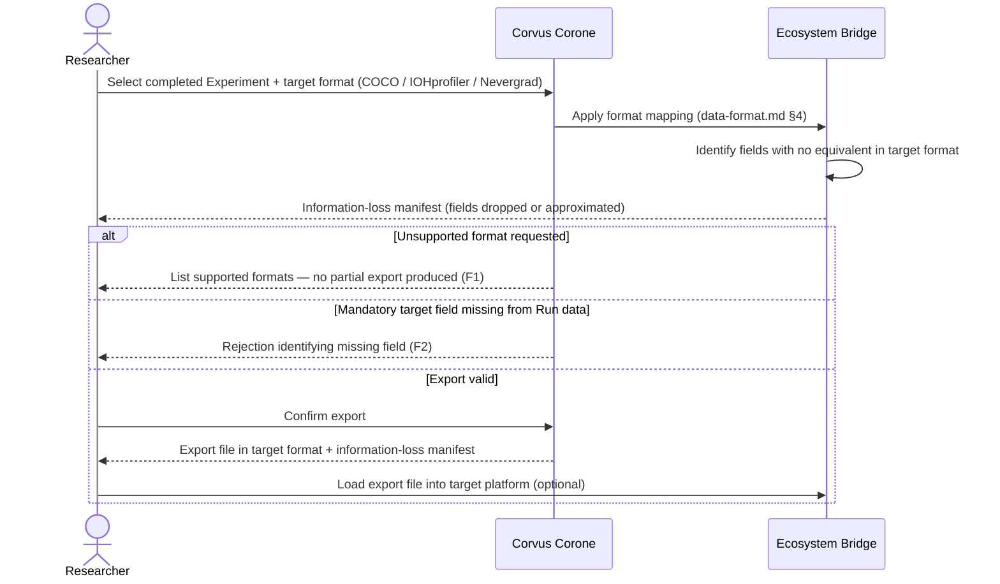

# UC-06: Export Results to an External Platform

**Actor:** Researcher
**Trigger:** Has completed a Study and wants to compare results with data from COCO, IOHprofiler, or Nevergrad
**Goal:** Produce an export file in the target platform's format, with any information loss explicitly documented

---

## Diagram

---

## Preconditions

- A completed Experiment exists with Performance Records and Result Aggregates
- The target platform's format mapping is documented (→ `docs/03-technical-contracts/01-data-format.md` §4)

## Main Flow

1. Researcher selects a completed Experiment and a target export format (COCO, IOHprofiler `.dat`, Nevergrad)
2. System applies the format mapping for the selected target (→ `docs/03-technical-contracts/01-data-format.md` §4 Interoperability Mappings)
3. System reports all information loss: fields in the Corvus Corone schema that have no equivalent in the target format are listed explicitly before the export is produced
4. Researcher confirms and receives the export file ready for loading in the target platform
5. (Optionally) Researcher loads the file into the target platform for cross-platform visualization or comparison

## Postconditions

- Export file is produced in the target format
- An information-loss manifest is produced alongside the export, documenting every field that was dropped or approximated

## Failure Scenarios

- *F1: Unsupported format* — System lists supported export formats and refuses to produce a partial export for an unsupported target
- *F2: Mandatory target field missing* — If the target format requires a field not captured in the Run data, the system rejects the export with an explicit error identifying the missing field

## Connects to

- `docs/01-manifesto/MANIFESTO.md` — Principle 26
- `docs/02-design/02-architecture/02-c1-context.md` — external systems: COCO, IOHprofiler, Nevergrad
- `docs/03-technical-contracts/01-data-format.md` — §4 (Interoperability Mappings)
- `docs/03-technical-contracts/02-interface-contracts.md` — Ecosystem Bridge interface
- `03-functional-requirements/01-functional-requirements.md`: FR-23, FR-24, FR-25, FR-26
- `04-non-functional-requirements/01-non-functional-requirements.md`: NFR-INTEROP-01
