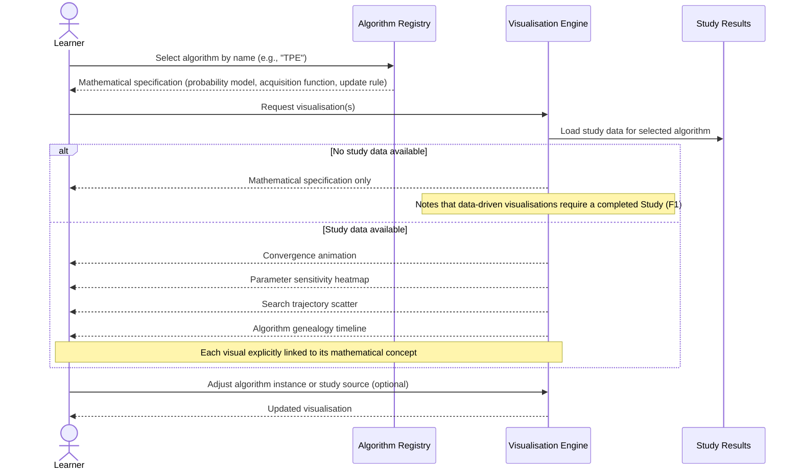

# UC-07: Algorithm Visualisation

**Actor:** Learner
**Trigger:** Wants to understand how an HPO algorithm works and needs both mathematical and visual/intuitive entry points
**Goal:** Receive a mathematical description and a visual/intuitive representation of the algorithm that minimises introduction cost for non-experts

---

## Diagram

---

## Preconditions

- The algorithm is registered in the Algorithm Registry
- Study results exist for the algorithm (required for data-driven visualisations such as convergence plots and search trajectories)

## Main Flow

1. Learner selects an algorithm by name (e.g., "TPE") from the available Algorithm Registry
2. System presents the mathematical specification of the algorithm: objective function structure, probability model, acquisition function or sampling rule
3. System generates intuitive visualisations derived from recorded study data: animated convergence, parameter sensitivity heatmap, search trajectory scatter, algorithm genealogy timeline
4. Learner can request a specific visualisation type (convergence, sensitivity, trajectory, genealogy) or receive all at once
5. Each visualisation is labelled with the concept it represents and linked to the corresponding mathematical element from Step 2
6. Learner can adjust the study or algorithm instance used as the data source for the visualisation

## Postconditions

- Learner has received both a mathematical description and at least one visual representation of the algorithm
- Each visual element is explicitly linked to its corresponding mathematical concept

## Failure Scenarios

- *F1: No study data for algorithm* — System presents the mathematical specification only and notes that data-driven visualisations require at least one completed Study
- *F2: Algorithm not registered* — System returns a not-found error listing available algorithms; it does not fabricate a visualisation

## Connects to

- `docs/01-manifesto/MANIFESTO.md` — principles relevant to education and accessible understanding (note: Learner Actor section not yet present in MANIFESTO)
- `docs/02-design/02-architecture/02-c1-context.md` — Learner actor definition (REF-TASK-0025)
- `03-functional-requirements/01-functional-requirements.md`: no existing FR yet — Learner actor FRs to be added in a future task
- REF-TASK-0027
- IMPL-044
