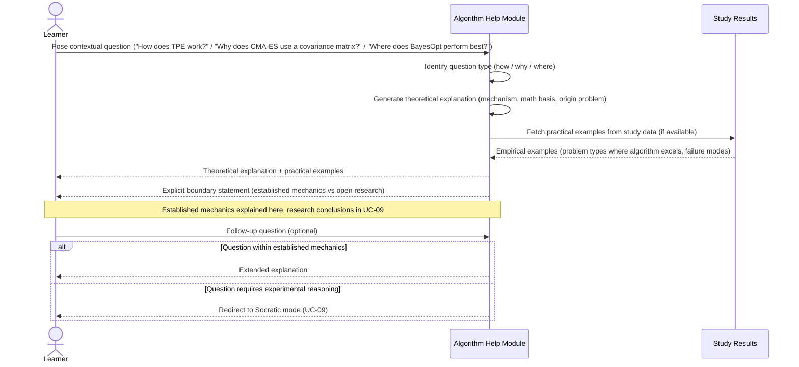

# UC-08: Contextual Algorithm Help

**Actor:** Learner
**Trigger:** Wants to understand how an algorithm works, why it works, and where it works best
**Goal:** Receive contextual explanations with theoretical depth and practical examples so the Learner can independently understand the algorithm without requiring researcher-level expertise

---

## Diagram

---

## Preconditions

- The algorithm is registered in the Algorithm Registry
- An LLM-powered explanation module is available

## Main Flow

1. Learner poses a contextual question about an algorithm: "How does TPE work?", "Why does CMA-ES use a covariance matrix?", or "Where does Bayesian optimisation perform best?"
2. System identifies the question type (how / why / where) and selects the appropriate explanation strategy
3. System generates a theoretical explanation: the mechanism of the algorithm, its mathematical basis, the problem it was designed to solve
4. System supplements the theoretical explanation with practical examples drawn from recorded study data where available: problem types where the algorithm excels, characteristic failure modes, comparisons against alternatives on similar problems
5. System explicitly marks the boundary between established algorithm mechanics (what this module explains) and open research conclusions (which are not provided here — see UC-09 for Socratic exploration of research questions)
6. Learner can ask follow-up questions; the system answers within the established mechanics scope, redirecting to Socratic mode (UC-09) when the question moves into experimental-design territory

## Postconditions

- Learner has received a how/why/where explanation grounded in established algorithm theory
- Practical examples have been provided alongside the theoretical account
- The boundary between established mechanics and open research conclusions is explicit

## Failure Scenarios

- *F1: Question outside algorithm mechanics scope* — System redirects to Socratic mode (UC-09) rather than fabricating a conclusion; it states explicitly that the question requires experimental reasoning rather than established fact
- *F2: Algorithm not registered* — System returns a not-found error; it does not generate an explanation for an unknown algorithm

## Connects to

- `docs/01-manifesto/MANIFESTO.md` — principles relevant to education and accessible understanding (note: Learner Actor section not yet present in MANIFESTO)
- `docs/02-design/02-architecture/02-c1-context.md` — Learner actor definition (REF-TASK-0025)
- `03-functional-requirements/01-functional-requirements.md`: no existing FR yet — Learner actor FRs to be added in a future task
- REF-TASK-0026
- IMPL-048
