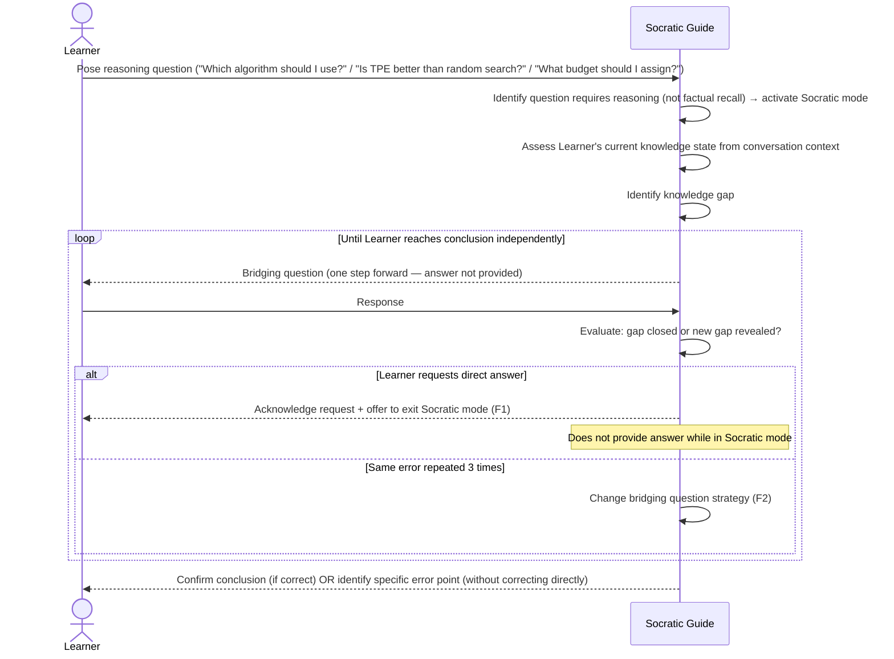

# UC-09: Socratic Guided Deduction

**Actor:** Learner
**Trigger:** Wants to deepen understanding of an algorithm or experimental design question
**Goal:** System challenges the Learner with guided questions and leads them toward their own conclusions rather than providing direct answers; applies to both algorithm understanding and experimental design reasoning

---

## Diagram

---

## Preconditions

- The Learner has a question about algorithm behaviour or experimental design
- Socratic interaction mode is active (explicit opt-in or detected from question type)

## Main Flow

1. Learner poses a question that involves reasoning or experimental judgment: "Which algorithm should I use for my problem?", "Is TPE better than random search?", or "What budget should I assign to this study?"
2. System identifies that the question requires reasoning rather than factual recall, and activates Socratic mode
3. System identifies what the Learner already knows from prior conversation context
4. System identifies the gap between the Learner's current knowledge state and the conclusion they are seeking
5. System generates a bridging question that nudges the Learner one reasoning step forward without providing the answer
6. Learner responds; system evaluates whether the response closes the gap or reveals a new knowledge gap
7. Steps 5–6 repeat until the Learner has reasoned their way to a conclusion independently
8. System confirms the Learner's conclusion if correct, or identifies the specific point of error without providing the corrected answer directly

## Postconditions

- Learner has arrived at a conclusion through their own reasoning process
- The system has not provided the conclusion directly at any point in the interaction

## Failure Scenarios

- *F1: Learner requests direct answer* — System acknowledges the request, explains that Socratic mode requires independent reasoning, and offers to exit Socratic mode if the Learner chooses; it does not provide the direct answer while in Socratic mode
- *F2: Reasoning loop detected* — If the Learner repeats the same incorrect reasoning step three times, the system changes the bridging question strategy rather than continuing to ask the same question

## Connects to

- `docs/01-manifesto/MANIFESTO.md` — principles relevant to education and accessible understanding (note: Learner Actor section not yet present in MANIFESTO)
- `docs/02-design/02-architecture/02-c1-context.md` — Learner actor definition (REF-TASK-0025)
- `03-functional-requirements/01-index.md`: no existing FR yet — Learner actor FRs to be added in a future task
- REF-TASK-0028
- IMPL-045
