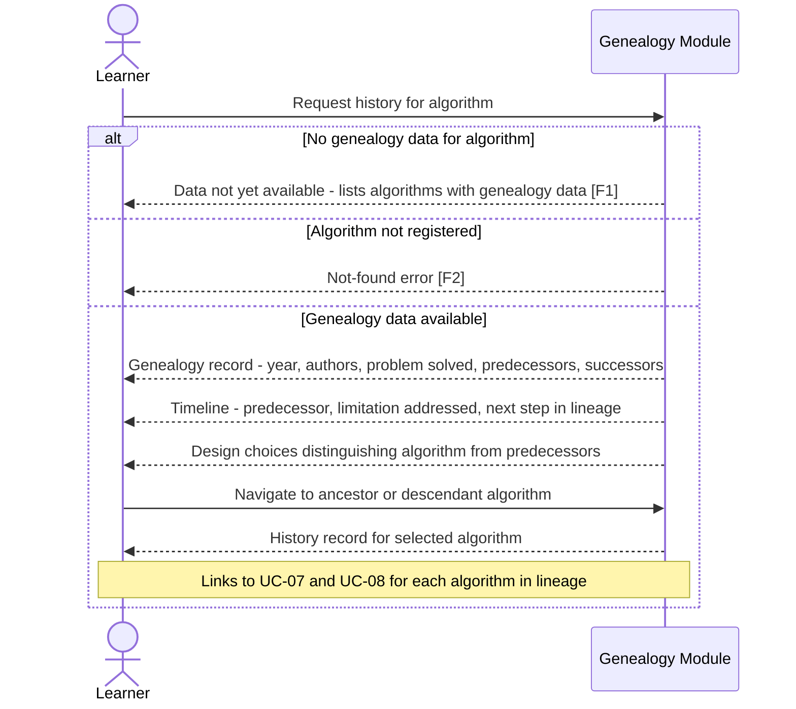

# UC-10: Algorithm History and Evolution

**Actor:** Learner
**Trigger:** Wants to understand the historical development and intellectual genealogy of an HPO algorithm
**Goal:** Receive the algorithm's genealogy — predecessor algorithms, historical development timeline, and rationale behind key design choices — so the Learner builds comprehensive understanding of why the algorithm is designed the way it is

---

## Diagram

---

## Preconditions

- The algorithm is registered in the Algorithm Registry
- Genealogy data for the algorithm exists in the system's genealogy data store

> **Architecture note:** The genealogy data store that backs the Genealogy Module is not yet defined in the C2/C3 architecture. Its container and storage format are pending definition in a future architecture task.

## Main Flow

1. Learner selects an algorithm and requests its history (e.g., "Show me the history of TPE")
2. System retrieves the algorithm's genealogy record: year of origin, authors, the problem it was designed to solve, predecessor algorithms it built on, successor algorithms it inspired
3. System presents the lineage as a timeline: each predecessor is described with the specific problem it solved and the specific limitation that motivated the next step in the lineage
4. System highlights the design choices that distinguish the target algorithm from its predecessors, connecting each design choice to the problem it addressed
5. Learner can navigate the genealogy graph: selecting any ancestor or descendant algorithm to view its own history record
6. System links the historical account to the corresponding visualisation (UC-07) and contextual explanation (UC-08) for each algorithm in the lineage

## Postconditions

- Learner has received a genealogy record covering the algorithm's key predecessors and the design decisions that connect them
- Each design choice in the lineage is connected to the problem it was invented to solve

## Failure Scenarios

- *F1: No genealogy data for algorithm* — System notes that genealogy data is not yet available for the selected algorithm and lists algorithms for which genealogy data exists
- *F2: Algorithm not registered* — System returns a not-found error; it does not fabricate a historical account

## Connects to

- `docs/01-manifesto/MANIFESTO.md` — principles relevant to education and accessible understanding (note: Learner Actor section not yet present in MANIFESTO)
- `docs/02-design/02-architecture/02-c4-leve1-context/01-c4-l1-context/01-c1-context.md` — Learner actor definition (REF-TASK-0025)
- `03-functional-requirements/01-index.md`: no existing FR yet — Learner actor FRs to be added in a future task
- REF-TASK-0030
- IMPL-046
