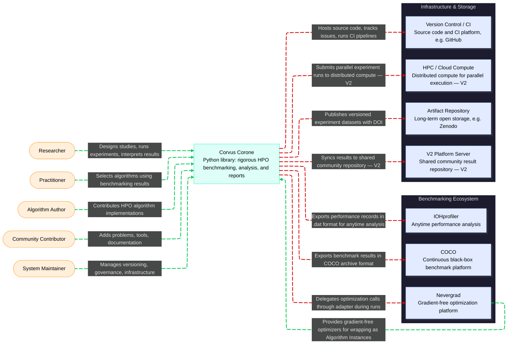

# C1: System Context — Corvus Corone: HPO Algorithm Benchmarking Platform

<!--
STORY ROLE: The "bird's eye view". The first chapter after MANIFESTO.
Answers: who interacts with this system, and what world does it live in?
This is where values from MANIFESTO become concrete actors and boundaries.

NARRATIVE POSITION:
  MANIFESTO → (WHY we build this) → C1 → (WHO uses it and WHAT surrounds it)
  → C2 (WHAT are the parts) → SRS (WHAT must it do)

CONNECTS TO:
  ← MANIFESTO                        : values/principles explain WHY these actors and integrations exist
  → docs/02-design/01-software-requirement-specification/SRS.md : each actor here becomes a stakeholder (§3); each external system becomes an interface requirement (§7)
  → docs/02-design/02-architecture/c2-containers.md             : the "System" black box here is decomposed into containers there
  → docs/03-technical-contracts/data-format.md                  : data exchanged with external systems must conform to schemas defined there (§3 Interoperability Mappings)
  → docs/GLOSSARY.md                 : all actor and system names used here are defined there
-->

---

## Purpose

A **Python library** that enables researchers and practitioners to conduct rigorous, reproducible hyperparameter optimization algorithm benchmarking studies — where the user provides their algorithm implementation and the system handles study execution, measurement, statistical analysis, and report generation automatically.

The system exists to serve the discovery of truth about algorithm performance, not its promotion. It builds knowledge about which algorithms work well in which contexts, not rankings.

---

## System Context Diagram

> HPC/cloud distributed execution is **deferred to V2**. In V1, all Runs execute locally (sequentially or with Python multiprocessing). The decision is recorded in `docs/02-design/02-architecture/adr/ADR-001-library-with-server-ready-data-layer.md`. Runs are independent by design (MANIFESTO Principle 18), so the execution backend can be swapped via the Repository/Runner abstraction without changing the data format.

---

## Actors

### Researcher

**Role:** A scientist or engineer conducting comparative studies of HPO algorithm behavior.

**Goal:** Formulate a precise Research Question, design a rigorous Study, execute it, and produce scientifically valid conclusions scoped to the tested Problem Instances.

**Gives the system:** Research question, Study design (problem selection, algorithm portfolio, budget), interpretation and publication of results.

**Gets from the system:** Automated execution of Runs, full Performance curves, statistical analysis report (three-level: exploratory, confirmatory, practical significance), visualization outputs.

**Relevant principles:** 1 (research question first), 13 (three-level analysis), 15 (statistical rigor), 16 (planning precedes execution), 19 (full reproducibility).

---

### Practitioner

**Role:** An ML engineer or data scientist who needs to select an HPO algorithm for a specific application but is not conducting primary research.

**Goal:** Consume existing benchmarking results to make an informed algorithm selection decision for a particular problem class, without running a full study themselves.

**Gives the system:** *(none — read-only consumer of results)*

**Gets from the system:** Practitioner-level summaries — which algorithms perform well on which problem characteristics, with explicit scope statements (not universal rankings).

**Relevant principles:** 2 (context-dependent performance), 24 (transparency of limitations), 25 (accessibility for different audiences).

---

### Algorithm Author

**Role:** A researcher publishing a new HPO algorithm, or an ML engineer wrapping an existing optimization library (Optuna, SMAC, HyperOpt, etc.) for evaluation.

**Goal:** Contribute an algorithm Implementation to the system so it can be evaluated fairly against other Algorithm Instances across a representative set of Problem Instances.

**Gives the system:** Algorithm Implementation conforming to the Algorithm Interface, complete Algorithm Instance metadata, default configuration with justification.

**Gets from the system:** Fair, reproducible comparison against other algorithms; analysis results for their algorithm's performance profile.

**Relevant principles:** 8 (precision of description), 10 (configuration fairness), 11 (sensitivity documentation), 31 (fairness in comparisons).

> **`TODO: REF-TASK-0004`** — Define the "10-line wrapper" onboarding experience for Algorithm Authors.
> The contribution interface should require minimal boilerplate for wrapping existing optimizers.
> Owner: library design lead. Acceptance: a tutorial exists in `docs/06_tutorials/` demonstrating
> wrapping an Optuna sampler in under 15 lines of code.

---

### Community Contributor

**Role:** A member of the benchmarking community who extends the system without being an algorithm author — by contributing new Problem Instances, analysis tools, visualizations, documentation improvements, or bug reports.

**Goal:** Improve the system's coverage, quality, or accessibility without necessarily running studies themselves.

**Gives the system:** Problem Instance implementations, analysis plugins, documentation, issue reports.

**Gets from the system:** Credit in provenance records; a living system that reflects the state of the field.

**Relevant principles:** 4 (problem representativeness), 6 (evolution of problem sets), 27 (community development), 28 (education and support).

---

### System Maintainer

**Role:** A trusted member responsible for the long-term health of the system — versioning governance, artifact archival, dependency management, CI/CD, and community moderation.

**Goal:** Ensure the system remains reproducible, interoperable, and available as the surrounding ecosystem evolves.

**Gives the system:** Governance decisions, artifact versioning, deprecation notices, infrastructure management.

**Gets from the system:** *(operational role — no study outputs)*

**Relevant principles:** 21 (artifact versioning), 22 (long-term availability), 26 (system interoperability).

---

## External Systems

### COCO (Comparing Continuous Optimizers)

**What it is:** A widely-used benchmark framework for continuous black-box optimization, maintained by the COCO community. Defines standard problem suites (BBOB) and a performance analysis workflow.

**Why we interact with it:** Interoperability (MANIFESTO Principle 26). Researchers already use COCO; publishing results in COCO-compatible format enables cross-study comparisons.

**Direction:** Outbound export — our system produces data exportable to COCO's format. Import of COCO problem definitions is a secondary use case.

**Risk:** COCO's data format evolves. If incompatible changes are made, the export mapping must be updated. Format mapping is documented in `docs/03-technical-contracts/data-format.md` §3.

> **`TODO: REF-TASK-0005`** — Define the COCO format mapping in `data-format.md` §3 when the
> internal data format is finalized. Owner: ecosystem integration lead. Acceptance: a study result
> can be exported and loaded by COCO's analysis tools without data loss beyond documented mappings.

---

### Nevergrad

**What it is:** Facebook Research's gradient-free optimization platform providing a large portfolio of algorithms and benchmark functions, with Python-first design.

**Why we interact with it:** Nevergrad algorithm implementations are a primary source of Algorithm Instances for our library. Its benchmark functions may serve as Problem Instances.

**Direction:** Bidirectional — we import Nevergrad algorithms and export results back for cross-platform comparison.

**Risk:** Nevergrad is actively developed; API changes may break wrapped implementations. Algorithm Instances must pin exact Nevergrad versions.

> **`TODO: REF-TASK-0006`** — Define the Nevergrad adapter pattern: how to wrap a Nevergrad
> optimizer as an Algorithm Instance with minimal code. Owner: library design lead.
> Acceptance: example in `docs/06_tutorials/` and adapter utility in library.

---

### IOHprofiler

**What it is:** An analysis and visualization platform for iterative optimization heuristics, providing ECDF-based anytime performance analysis and statistical comparison tools.

**Why we interact with it:** IOHprofiler's analysis methodology directly aligns with our Anytime Performance requirements (Principle 14). Exporting to IOHprofiler format makes our results accessible to its powerful visualization tools.

**Direction:** Outbound export — we produce IOHprofiler-compatible data files from our Run records.

**Risk:** IOHprofiler's data format is well-documented but specific. Export mapping must be maintained as both systems evolve.

> **`TODO: REF-TASK-0007`** — Define the IOHprofiler export format mapping in `data-format.md` §3.
> Owner: ecosystem integration lead. Acceptance: Performance Records export to IOHprofiler `.dat`
> format and load correctly in IOHanalyzer.

---

### HPC / Cloud Compute

**What it is:** Distributed computing infrastructure (SLURM clusters, cloud VMs, etc.) used to execute parallel Runs when local compute is insufficient.

**Why we interact with it:** Runs are independent by design (Principle 18), making them trivially parallelizable. Large studies with many (algorithm, problem, repetition) combinations require distributed execution.

**Direction:** Outbound — the system submits jobs and collects results.

**V1 scope:** Deferred. V1 supports local execution only (sequential or Python multiprocessing). The `Runner` interface is designed as an abstraction so a SLURM or cloud backend can be plugged in for V2 without changing the data format or library API. See `ADR-001`.

---

### V2 Platform Server (future)

**What it is:** A planned community server providing shared result repositories, persistent artifact identifiers (DOIs), study discovery, and cross-researcher comparison — not deployed in V1.

**Why we plan to interact with it:** MANIFESTO Principles 20–22 require open data in stable repositories with persistent identifiers. A local Python library alone cannot fulfill these requirements — once a researcher closes their laptop, results are isolated. The V2 Platform Server closes this gap.

**Direction:** Bidirectional — the library's `Repository` interface can be backed by this server in V2. Researchers store studies locally in V1; they can republish to the shared server in V2 without migrating their data because all entity schemas are server-compatible from V1.

**V1 design constraint:** All entity schemas must use globally unique IDs (UUIDs), be JSON-serializable, and reference other entities by ID — not by local file path. This ensures V1-produced artifacts are valid V2 server artifacts without any migration step. This constraint is documented in `docs/03-technical-contracts/data-format.md §1` and enforced by `ADR-001`.

> **`TODO: REF-TASK-0023`** — Design the storage abstraction interface (`Repository`) that allows switching between `LocalFileRepository` (V1) and `ServerRepository` (V2) without modifying library code. Owner: library design lead. Acceptance: `docs/03-technical-contracts/interface-contracts.md` contains the `Repository` interface specification; a `LocalFileRepository` implementation passes the interface contract test suite.

---

### Artifact Repository (e.g. Zenodo)

**What it is:** A long-term open data repository for archiving versioned datasets, code snapshots, and study results under persistent identifiers (DOIs).

**Why we interact with it:** MANIFESTO Principles 20 and 22 require open data in stable, long-term repositories. A DOI-backed repository ensures study results remain citable and accessible after the platform evolves.

**Direction:** Outbound — the system publishes versioned Artifacts to the repository. Results are immutable once published.

**Risk:** Repository availability and policy changes. Mitigation: use repositories with long-term preservation commitments (Zenodo, institutional repositories).

---

### Version Control / CI (e.g. GitHub)

**What it is:** The source code repository, issue tracker, and CI/CD pipeline for the library itself and for community contributions.

**Why we interact with it:** All community contributions (algorithms, problems, tools) flow through version control. CI enforces interface compliance and test coverage automatically.

**Direction:** Bidirectional — source lives there; CI outputs feed back into development.

---

### Architectural Decision Records

The choice of delivery form (Python library) and the server-ready data layer design are documented in:

> `docs/02-design/02-architecture/adr/ADR-001-library-with-server-ready-data-layer.md`

---

## Explicit Scope Exclusions

The following are explicitly outside this system's scope. Each exclusion traces to a MANIFESTO anti-pattern:

| Excluded Capability | Anti-Pattern | Rationale |
|---|---|---|
| Algorithm ranking or leaderboards | Anti-pattern 1 | Rankings are scientifically invalid (No Free Lunch); they promote algorithms, not understanding |
| Competition infrastructure | Anti-pattern 3 | The goal is understanding algorithm behavior, not determining a winner |
| Automated algorithm selection / AutoML | Anti-pattern 7 | Results require researcher interpretation; the system does not make decisions on behalf of the user |
| Opaque analysis pipelines | Anti-pattern 4 | All analysis steps must be transparent, inspectable, and reproducible |
| Proprietary or closed data formats | Anti-pattern 5 | Isolation from the benchmarking ecosystem defeats the purpose |
| Marketing-oriented result presentation | Anti-pattern 6 | Reports communicate limitations alongside results, not promotional summaries |

> These exclusions become hard constraints in `docs/02-design/01-software-requirement-specification/SRS.md` §6.
