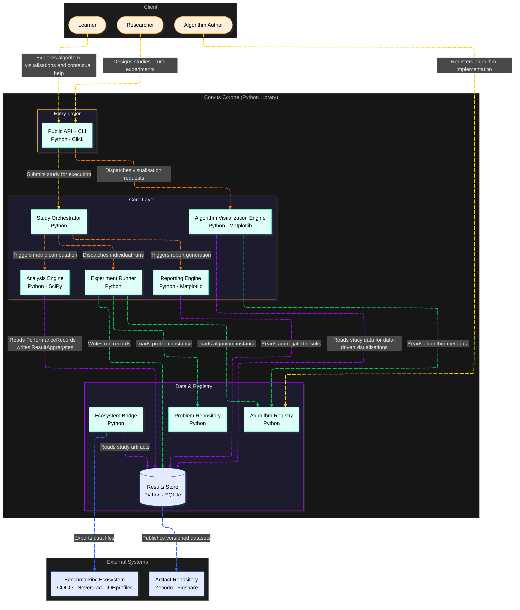

# C2: Containers — Corvus Corone: HPO Algorithm Benchmarking Platform

<!--
STORY ROLE: "What are the major moving parts?"
Decomposes the single black box from C1 into deployable/runnable units.
This is where architecture decisions become visible for the first time.

NARRATIVE POSITION:
  C1 (WHO and WHAT world) → C2 → (WHAT are the parts and HOW do they communicate)
  → C3 (WHAT is inside each part) → SRS (WHAT must each part do)

CONNECTS TO:
  ← C1                    : the system boundary from there is decomposed here
  → C3                    : each container here is zoomed into in a C3 document
  → SRS §4                : each container maps to one or more functional requirement groups
  → specs/data-format.md  : data flowing between containers must conform to schemas there
  → architecture/adr/     : technology choices for each container should have a corresponding ADR
-->

---

## Container Diagram

---

## Containers

### Public API + CLI

**Responsibility:** Expose the complete researcher-facing surface of the library — the
Python module API (`import corvus_corone as cc`) and the `corvus` terminal commands —
as a single thin coordination layer that delegates to the Core Layer.

**Technology:** Python · [Click](https://click.palletsprojects.com/) (CLI framework).
Click was chosen because it integrates cleanly with Python packaging (`console_scripts`
entry point), supports composable command groups, and generates `--help` output
automatically from docstrings and parameter annotations. No separate build step is
required.

**Interfaces exposed:**

| Surface | Form | Who uses it |
|---|---|---|
| Python API | Module functions: `cc.create_study()`, `cc.run()`, `cc.list_problems()`, `cc.generate_reports()`, `cc.export_raw_data()`, etc. | Researcher (scripts, notebooks), Algorithm Author |
| CLI | `corvus run`, `corvus list-problems`, `corvus list-algorithms`, `corvus report`, `corvus verify`, `corvus export` | Researcher (terminal), CI scripts |

Full Python API contract:
`docs/03-technical-contracts/04-public-api-contract.md`

Full CLI command reference and complete example session:
[`02-cli-spec.md`](02-cli-spec.md)

**Dependencies:**

| Dependency | Reason |
|---|---|
| Study Orchestrator | `cc.create_study()` and `cc.run()` delegate orchestration to this component |
| Algorithm Registry | `cc.list_algorithms()` / `cc.get_algorithm()` read from the registry |
| Problem Repository | `cc.list_problems()` / `cc.get_problem()` read from the repository |
| Results Store | `cc.get_experiment()`, `cc.get_runs()`, `cc.get_result_aggregates()`, `cc.export_raw_data()` read from the store |
| Reporting Engine | `cc.generate_reports()` delegates report generation here |

**Data owned:** None. This container holds no persistent state. All storage is
delegated to the Data & Registry layer.

**Actors served:** Researcher (primary), Algorithm Author (registry reads), Learner
(future — visualisation commands).

**Relevant SRS section:** FR-4.1 (problem registry reads), FR-4.2 (algorithm registry
reads), FR-4.3 (study execution), FR-4.5 (reproducibility), FR-4.6 (reporting).

---

## Key End-to-End Flows

<!--
  Describe the most architecturally significant flows — those that cross multiple containers.
  These flows make the architecture "come alive" and reveal integration points.

  For each flow:
    - Name: a short, human-readable label (e.g., "Run a benchmarking study")
    - Trigger: what initiates this flow? (researcher action, scheduled job, API call)
    - Steps: numbered sequence of container interactions
    - Data exchanged at each step: reference specs/data-format.md entity names
    - End state: what is different in the system after this flow completes?

  Hint — flows to consider:
    1. "Design and execute a benchmarking study" (main researcher workflow)
    2. "Register a new benchmark problem" (contributor workflow)
    3. "Register a new algorithm implementation" (algorithm author workflow)
    4. "Generate a study report" (practitioner workflow)
    5. "Export results to IOHprofiler / COCO" (interoperability workflow)
    6. "Reproduce a published study" (reproducibility workflow)

  Each flow here should correspond to a use case in SRS §3.
-->
