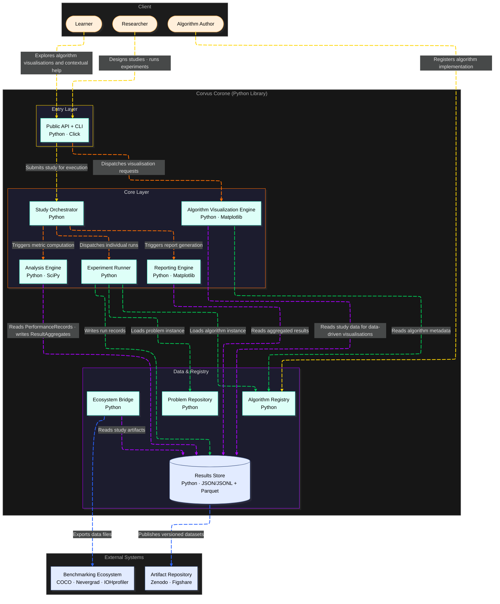

# C2: Containers — Corvus Corone: HPO Algorithm Benchmarking Platform

<!--
STORY ROLE: "What are the major moving parts?"
Decomposes the single black box from C1 into deployable/runnable units.
This is where architecture decisions become visible for the first time.

NARRATIVE POSITION:
  C1 (WHO and WHAT world) → C2 → (WHAT are the parts and HOW do they communicate)
  → C3 (WHAT is inside each part) → SRS (WHAT must each part do)

CONNECTS TO:
  ← C1                    : the system boundary from there is decomposed here
  → C3                    : each container here is zoomed into in a C3 document
  → SRS §4                : each container maps to one or more functional requirement groups
  → specs/data-format.md  : data flowing between containers must conform to schemas there
  → architecture/adr/     : technology choices for each container should have a corresponding ADR
-->

---

## Container Diagram

---

## Containers

| Container | Layer | File |
|---|---|---|
| Public API + CLI | Entry Layer | [04-public-api-cli.md](04-public-api-cli.md) |
| Corvus Pilot V2 | Entry Layer (Agent) | [14-corvus-pilot.md](14-corvus-pilot.md) |
| Study Orchestrator | Core Layer | [07-study-orchestrator.md](07-study-orchestrator.md) |
| Experiment Runner | Core Layer | [08-experiment-runner.md](08-experiment-runner.md) |
| Analysis Engine | Core Layer | [09-analysis-engine.md](09-analysis-engine.md) |
| Reporting Engine | Core Layer | [05-reporting-engine.md](05-reporting-engine.md) |
| Algorithm Visualization Engine | Core Layer | [06-algorithm-visualization-engine.md](06-algorithm-visualization-engine.md) |
| Algorithm Registry | Data & Registry | [10-algorithm-registry.md](10-algorithm-registry.md) |
| Problem Repository | Data & Registry | [11-problem-repository.md](11-problem-repository.md) |
| Results Store | Data & Registry | [12-results-store.md](12-results-store.md) |
| Ecosystem Bridge | Data & Registry | [13-ecosystem-bridge.md](13-ecosystem-bridge.md) |

---

## Key End-to-End Flows

### Flow 1: Design and execute a benchmarking study

**Use case:** UC-01 · **Trigger:** Researcher calls `cc.create_study()` then `cc.run()`

| # | From | To | Data exchanged |
|---|---|---|---|
| 1 | Researcher | Public API + CLI | Study definition: `research_question`, `problem_instance_ids`, `algorithm_instance_ids`, `experimental_design`, `pre_registered_hypotheses` |
| 2 | Public API + CLI | Study Orchestrator | `Study` record (draft) → `StudyRepository.create_study()` |
| 3 | Study Orchestrator | Results Store | `Study` locked — `StudyRepository.lock_study()` transitions status to `"locked"`; fields become immutable |
| 4 | Study Orchestrator | Experiment Runner | `run_study(study)` — locked `Study` record |
| 5 | Experiment Runner | Algorithm Registry | `get_algorithm(algorithm_instance_id)` per Run — returns `AlgorithmInstance` |
| 6 | Experiment Runner | Problem Repository | `get_problem(problem_instance_id)` per Run — returns `ProblemInstance` |
| 7 | Experiment Runner | Results Store | `create_run(run)` + `save_performance_records(run_id, records)` — `Run` + `PerformanceRecord[]` written after each trigger fires (ADR-002) |
| 8 | Study Orchestrator | Analysis Engine | `analyze(experiment_id, config)` — triggered after all Runs reach `"completed"` or `"failed"` |
| 9 | Analysis Engine | Results Store | Reads `PerformanceRecord[]` per Run; writes `ResultAggregate[]` via `save_result_aggregates()` |
| 10 | Study Orchestrator | Reporting Engine | `generate_reports(experiment_id)` |
| 11 | Reporting Engine | Results Store | Reads `ResultAggregate[]`, `Run[]`, `Study`; writes `Report` entity + two HTML artifacts |
| 12 | Public API + CLI | Researcher | Report file paths + raw data export |

**End state:** Completed `Experiment` record with `Run[]`, `PerformanceRecord[]`, `ResultAggregate[]`, and two `Report` HTML files on disk. All entities version-pinned and reproducible.

---

### Flow 2: Register a new benchmark problem

**Use case:** UC-04 · **Trigger:** Community Contributor calls `corvus verify` or `cc.register_problem()` with a new `ProblemInstance` record

| # | From | To | Data exchanged |
|---|---|---|---|
| 1 | Community Contributor | Public API + CLI | `ProblemInstance` record: `name`, `version`, search space descriptor, `landscape_characteristics`, `provenance`, `source_reference` |
| 2 | Public API + CLI | Problem Repository | `register_problem(problem)` — full `ProblemInstance` |
| 3 | Problem Repository | Problem Repository | Validation: required fields present; `dimensions == len(variables)`; variable bounds valid per type |
| 4 | Problem Repository | Results Store | `ProblemInstance` persisted under `problems/<id>/` with assigned UUID |
| 5 | Public API + CLI | Community Contributor | Registered ID or structured rejection with specific missing-field errors (F1) / duplicate warning (F2) |

**End state:** `ProblemInstance` record published and available in `list_problems()` for Study design. Deprecated instances remain retrievable by exact ID for reproducibility.

---

### Flow 3: Register a new algorithm implementation

**Use case:** UC-02 · **Trigger:** Algorithm Author calls `corvus verify` or `cc.register_algorithm()` with a new `AlgorithmInstance` record

| # | From | To | Data exchanged |
|---|---|---|---|
| 1 | Algorithm Author | Public API + CLI | `AlgorithmInstance` record: `name`, `algorithm_family`, `code_reference` (version-pinned), `configuration_justification`, `hyperparameters`, `known_assumptions` |
| 2 | Public API + CLI | Algorithm Registry | `register_algorithm(algorithm)` — full `AlgorithmInstance` |
| 3 | Algorithm Registry | Algorithm Registry | Validation: `code_reference` resolvable and version-pinned; `configuration_justification` non-empty; hyperparameter schema matches declared names; Algorithm interface satisfied |
| 4 | Algorithm Registry | Results Store | `AlgorithmInstance` persisted under `algorithms/<id>/` with assigned UUID |
| 5 | Public API + CLI | Algorithm Author | Registered ID or structured rejection (F1–F4: interface missing, code unresolvable, no justification, schema mismatch) |

**End state:** `AlgorithmInstance` record published and available in `list_algorithms()` for Study design. The implementation is version-pinned and independently reproducible.

---

### Flow 4: Generate a study report (practitioner workflow)

**Use case:** UC-03 · **Trigger:** Practitioner accesses reports from a completed Experiment via `corvus report` or direct HTML path

| # | From | To | Data exchanged |
|---|---|---|---|
| 1 | Practitioner | Public API + CLI | Query: problem characteristics matching their application domain |
| 2 | Public API + CLI | Results Store | `ExperimentRepository.list_experiments()` + `StudyRepository.list_studies()` — returns `ExperimentSummary[]` with matched problem characteristic tags |
| 3 | Practitioner | Public API + CLI | `get_report(experiment_id)` — requests Practitioner Report for a specific Experiment |
| 4 | Public API + CLI | Results Store | `ReportRepository.list_reports(experiment_id)` — returns `Report` records with `artifact_reference` (HTML file path) |
| 5 | Public API + CLI | Practitioner | Practitioner Report HTML: scoped summaries, explicit limitations section, no global rankings (FR-20, FR-21) |

**End state:** Practitioner has read evidence scoped to matching problem characteristics, with explicit limitations and scope boundary. No new data is written; the Results Store is read-only in this flow.

---

### Flow 5: Export results to IOHprofiler / COCO

**Use case:** UC-06 · **Trigger:** Researcher calls `corvus export` or `cc.export_raw_data()` with a target format

| # | From | To | Data exchanged |
|---|---|---|---|
| 1 | Researcher | Public API + CLI | `experiment_id`, `format` (`"coco"` / `"ioh"` / `"nevergrad"`), `output_dir` |
| 2 | Public API + CLI | Ecosystem Bridge | `export(experiment, format)` |
| 3 | Ecosystem Bridge | Results Store | Reads `Study`, `Experiment`, `Run[]`, `PerformanceRecord[]`, `AlgorithmInstance[]`, `ProblemInstance[]` for the target Experiment |
| 4 | Ecosystem Bridge | Ecosystem Bridge | Applies format mapping (→ `data-format.md §4`); identifies fields with no target equivalent; builds `information_loss_manifest` |
| 5 | Ecosystem Bridge | Public API + CLI | Pre-export manifest listing `LOSS-*` items — critical items (e.g., `LOSS-COCO-01`) displayed before export proceeds |
| 6 | Researcher | Public API + CLI | Confirms export |
| 7 | Ecosystem Bridge | Researcher | Export files in target format (`*.info` + `*.dat` for COCO; JSON sidecar + `*.dat` for IOH; JSON-lines for Nevergrad) + `information_loss_manifest` |

**End state:** Export files written to `output_dir`. `information_loss_manifest` documents every field dropped or approximated. No Corvus entities are modified.

---

### Flow 6: Reproduce a published study

**Use case:** UC-05 · **Trigger:** Researcher retrieves archived Study artifacts and calls `cc.run()` using the archived Study plan and original seeds

| # | From | To | Data exchanged |
|---|---|---|---|
| 1 | Researcher | External artifact repository | Retrieves archived `Study` record, `AlgorithmInstance` versions, `ProblemInstance` versions, `Run` seed assignments |
| 2 | Researcher | Public API + CLI | Imports archived `Study` record (status `"locked"`) and pinned entity versions |
| 3 | Public API + CLI | Algorithm Registry | `register_algorithm()` for each pinned `AlgorithmInstance` version (if not already present) |
| 4 | Public API + CLI | Problem Repository | `register_problem()` for each pinned `ProblemInstance` version (if not already present) |
| 5 | Public API + CLI | Study Orchestrator | `run_study(study)` — locked `Study` with seeds from archived `Run` records (not re-generated) |
| 6 | Study Orchestrator | Experiment Runner | `run_study(study)` — seeds injected from archived records |
| 7 | Experiment Runner | Algorithm Registry | `get_algorithm(id, version="<pinned>")` — exact archived version |
| 8 | Experiment Runner | Problem Repository | `get_problem(id, version="<pinned>")` — exact archived version |
| 9 | Experiment Runner | Results Store | Writes new `Experiment` record linked to original `Study.id`; `Run[]` + `PerformanceRecord[]` |
| 10 | Study Orchestrator | Analysis Engine | `analyze(experiment_id, config)` on the new Experiment |
| 11 | Public API + CLI | Researcher | New `ResultAggregate[]` for comparison against original published aggregates |

**End state:** New `Experiment` record exists, linked to the original `Study` by `study_id`. Researcher can compare `ResultAggregate[]` between the original and verification Experiment. Agreement or divergence is documented — both are valid scientific outcomes.
