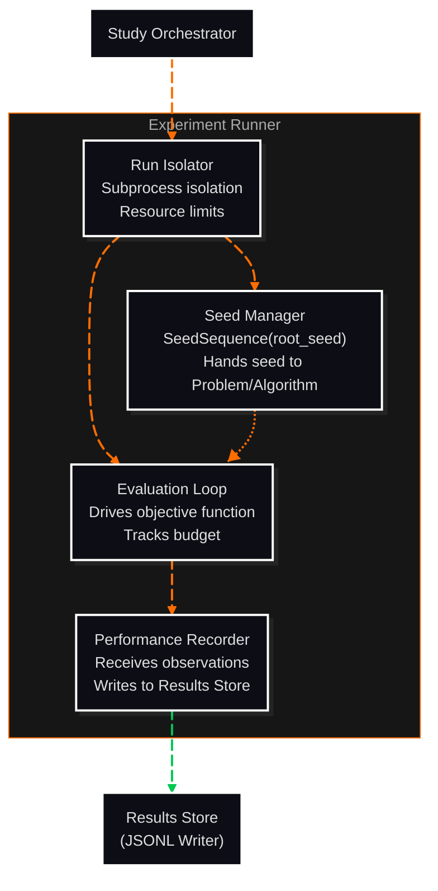

# C3: Components — Experiment Runner

> C2 Container: [08-experiment-runner.md](../../08-experiment-runner.md)
> C3 Index: [C3 overview](../01-c4-l3-components/01-c4-l3-components.md)

The Experiment Runner executes individual algorithm Runs in isolated subprocesses, injects reproducible seeds, drives the evaluation loop, and records performance observations to the Results Store.
Actors: invoked by Study Orchestrator; writes PerformanceRecords to Results Store.

---

## Component Diagram

---

## Components

| Component | File | Responsibility |
|---|---|---|
| Seed Manager | [02-seed-manager.md](02-seed-manager.md) | Generates, stores, and injects per-Run random seeds into Python's random stack |
| Run Isolator | [03-run-isolator.md](03-run-isolator.md) | Wraps each Run in a subprocess with resource limits and failure handling |
| Evaluation Loop | [04-evaluation-loop.md](04-evaluation-loop.md) | Drives the algorithm's ask/tell cycle within budget; records each observation |
| Performance Recorder | [05-performance-recorder.md](05-performance-recorder.md) | Receives observation data and writes PerformanceRecord objects to the Results Store |

---

## Cross-Cutting Concerns

### Logging & Observability

Each Run logs start time, seed, budget, and outcome (success/skip/abort) as a structured JSON line to the run log file at `{results_dir}/{experiment_id}/runs/{run_id}/run.log`. Node-level progress is not logged to avoid I/O overhead during tight evaluation loops.

### Error Handling

Two failure modes for a single Run:
- **skip**: non-fatal failure (e.g., algorithm raised `ValueError` on a specific parameter set). The Run is marked `status=skipped`; remaining runs continue. The Study Orchestrator receives a partial result.
- **abort**: fatal failure (e.g., subprocess crash, memory limit exceeded). The Run is marked `status=aborted`; the Study Orchestrator decides whether to continue remaining runs based on `on_failure` configuration.

Exceptions are never silently swallowed — all failures are written to `run.log` with full traceback.

### Randomness / Seed Management

All seeds are derived by the Seed Manager from the Study's `root_seed` before execution begins (ADR-017). The seed travels with the Run record, which is the only channel: `Run.seed` is a field, and no component writes a seed file or reads one from the environment (ADR-001).

The seed is then handed to `Problem.reset(seed)` and `Algorithm.initialize(search_space, seed)`, each of which constructs its own generator from it. No process-global generator is seeded: `07-cross-cutting-contracts.md` § Randomness Isolation forbids the legacy global API, and interpreter-wide state would leak between Runs, which FR-11 rules out.

Seed storage: the `seed` field of the Run record, read back through `RunRepository.get_run()` on resume (ADR-017). No seed file is written.

### Configuration

| Parameter | Source | Scope |
|---|---|---|
| `budget` | Study | Per-Run |
| `on_failure` | *not in any entity schema* | — |
| `max_workers` | *V2 name, reserved by SRS §1.4 B-01* | — |
| `memory_limit_mb` | *not in any entity schema* | — |

> **Unresolved (REF-TASK-0041).** Only `budget` exists as a Study field. `on_failure`,
> `max_workers`, `memory_limit_mb` and `Run.timeout_s` appear in no entity schema, and the Run
> statuses `skipped` and `aborted` used in the failure-handling section above are not in the
> `06-run.md` enumeration (`completed`, `failed`, `budget_exhausted`). A descriptive document may
> not coin them (ADR-012). The failure and resource-limit model is an open decision; what is
> written here is a proposal awaiting a contract change, not a specification.

### Testing Strategy

- **Seed Manager**: unit-tested; verifies that two runs with the same seed produce identical objective function evaluation sequences.
- **Run Isolator**: integration-tested; verifies that a subprocess crash does not crash the parent process and produces an `aborted` status.
- **Evaluation Loop**: unit-tested with a mock objective function; verifies budget enforcement (loop stops at `budget` evaluations).
- **Performance Recorder**: unit-tested against a mock JSONL writer; verifies that a record is written exactly when a sampling, improvement or end-of-run trigger fires, and that `trigger_reason` names the triggers that fired.
