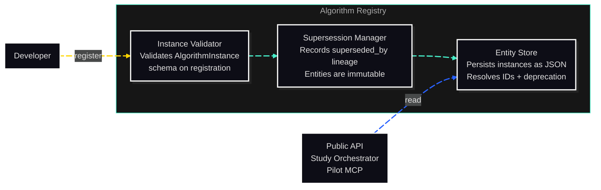

# C3: Components — Algorithm Registry

> C2 Container: [10-algorithm-registry.md](../../10-algorithm-registry.md)
> C3 Index: [C3 overview](../01-c4-l3-components/01-c4-l3-components.md)

The Algorithm Registry stores and serves Algorithm Instance registrations. Each instance is validated on registration and immutable thereafter; a revision is registered as a new entity and the old one records `superseded_by` (ADR-020). Reproducibility follows from the UUID in an archived Run never changing meaning.
Actors: Study Orchestrator and Public API read from it; developers register new instances during library development.

---

## Component Diagram

---

## Components

| Component | File | Responsibility |
|---|---|---|
| Instance Validator | [02-instance-validator.md](02-instance-validator.md) | Validates AlgorithmInstance schema and required fields on registration |
| Supersession Manager | [03-supersession-manager.md](03-supersession-manager.md) | Records the `superseded_by` lineage between an entity and the registration that replaces it (ADR-020) |
| Entity Store | [04-entity-store.md](04-entity-store.md) | Persists algorithm instances as JSON; resolves IDs; supports the deprecation flag |

---

## Cross-Cutting Concerns

### Logging & Observability

One log entry per registration: `algorithm_id`, `registered_at`, `registered_by`. One log entry per deprecation: `algorithm_id`, `deprecated_at`, `reason`, `superseded_by`. All at INFO level.

### Error Handling

- `ValidationError`: raised by Instance Validator on schema violations. Lists all violations.
- `CodeReferenceError`: raised by Instance Validator when `code_reference` does not resolve or is not version-pinned (FR-06).
- `EntityNotFoundError`: raised by Entity Store when `get_algorithm(id)` finds no matching entry.

### Randomness / Seed Management

No random state. Registry is purely read/write storage.

### Configuration

The Registry reads its storage path from `CORVUS_REGISTRY_DIR` (env) or defaults to the package's bundled `data/algorithm_registry/` directory.

### Testing Strategy

All three components are unit-tested with fixture AlgorithmInstance objects. Integration tests verify round-trip registration and retrieval fidelity.
