# C3: Components

## System Overview Diagram

```mermaid
---
config:
  look: neo
  theme: redux-dark
  themeVariables:
    background: transparent
---
flowchart TD
  %% ── Entry Layer ────────────────────────────────────────────────────────────
  subgraph Entry["Entry Layer"]
    direction LR
    subgraph PilotSG["Corvus Pilot V2"]
      mcp["MCP Server\nExposes cc.* tools\nover MCP protocol"]
      lg["LangGraph Graph\nPilotState TypedDict\nMemorySaver checkpointing"]
      qr["Query Router\nroute_query() conditional\nedge · intent classification"]
      sg["Socratic Guide Node\nNever answers directly\nElicits requirements"]
      pl["Planner Node\nDecomposes goals into\nStudySpec candidates"]
      ex["Executor Node\nCalls cc.* via API Facade\nHandles tool results"]
      an["Analyst Node\nInterprets results\nformats findings"]
      st["Session Tracker\nPersists conversation\nstate across turns"]
    end
    subgraph APISg["Public API + CLI"]
      af["API Facade\ncc.* functions\nInput validation"]
      cli["CLI Command Group\nClick commands\ncorvus run / list / export"]
      rm["Response Mapper\nDomain objects → API DTOs\nStable versioned schema"]
    end
  end

  %% ── Core Execution ──────────────────────────────────────────────────────────
  subgraph Execution["Core Execution"]
    subgraph OrchSG["Study Orchestrator"]
      sb["Study Builder\nValidates & assembles\nStudySpec from inputs"]
      ec["Execution Coordinator\nProcessPoolExecutor\nfan-out per Run"]
      pep["Post-Execution Pipeline\nTriggers analysis\nand reporting"]
    end
    subgraph ERSG["Experiment Runner"]
      sm["Seed Manager\nGenerates & injects seeds\nnumpy / random / torch"]
      ri["Run Isolator\nSubprocess spawn\nResource limits"]
      el["Evaluation Loop\nask/tell cycle\nBudget tracking"]
      perf["Performance Recorder\nObservation → PerformanceRecord\nWrites to Results Store"]
    end
    subgraph AESG["Analysis Engine"]
      md["Metric Dispatcher\nRoutes metrics to\ncorrect calculator"]
      stat["Statistical Tester\nWilcoxon · Mann-Whitney\nKruskal via SciPy"]
      sa["Scope Annotator\nAttaches run / study\nscope metadata"]
      locf["LOCF Interpolator\nFills missing budget\npoints (last-obs carry-fwd)"]
    end
  end

  %% ── Output Layer ────────────────────────────────────────────────────────────
  subgraph OutputLayer["Output"]
    subgraph RESG["Reporting Engine"]
      rr["Result Reader\nLoads PerformanceRecords\nfrom Results Store"]
      mvr["Mandatory Viz Renderer\nEnsures required plots\nare always produced"]
      htr["HTML Template Renderer\nJinja2 templates\nself-contained HTML"]
      le["Limitations Enforcer\nBlocks incomplete reports\nReportIncompleteError"]
    end
    subgraph AVESG["Algorithm Visualization Engine"]
      dr["Data Resolver\nLoads algorithm state\nfallback chain"]
      sr["Static Renderer\nmatplotlib PNG/SVG\nconvergence & trajectory"]
      ar2["Animation Renderer\nmatplotlib FuncAnimation\nmanim (deferred)"]
      ir["Interactive Renderer\nPlotly HTML widgets\noptional [interactive]"]
    end
  end

  %% ── Storage & Registry ──────────────────────────────────────────────────────
  subgraph StorageLayer["Storage & Registry"]
    subgraph RSSG["Results Store"]
      lfr["Local File Repository\nDirectory layout\nper Study/Run"]
      jes["JSON Entity Store\nStudySpec & metadata\nper-run JSON files"]
      jw["JSONL Writer\nStreaming observation\nappend per evaluation"]
      pw["Parquet Writer\nPost-run snappy conversion\ncolumnar analytics"]
      prr["Performance Record Reader\nLoads & deserialises\nrecords for analysis"]
    end
    subgraph ARSG["Algorithm Registry"]
      aiv["Instance Validator\nValidates AlgorithmInstance\nschema on registration"]
      avm["Version Manager\nImmutable versions\nDeprecation flag"]
      aes["Entity Store\nJSON persistence\nID resolution"]
    end
    subgraph PRSG["Problem Repository"]
      piv["Instance Validator\nValidates ProblemInstance\nschema on registration"]
      pvm["Version Manager\nImmutable versions\nDeprecation flag"]
      pes["Entity Store\nJSON persistence\nID resolution"]
    end
  end

  %% ── Ecosystem Bridge ────────────────────────────────────────────────────────
  subgraph BridgeLayer["Ecosystem"]
    subgraph EBSG["Ecosystem Bridge"]
      coco["COCO Exporter\nConverts results to\nCOCO benchmark format"]
      ioh["IOH Exporter\nConverts results to\nIOHprofiler format"]
      nga["Nevergrad Adapter\nBidirectional bridge\nto Nevergrad ask/tell"]
      la["Loss Auditor\nDetects information loss\nproduces manifest"]
    end
  end

  %% ── Intra-Pilot (0–8) ───────────────────────────────────────────────────────
  mcp L_mcp_lg@--> lg
  lg L_lg_qr@--> qr
  qr L_qr_sg@-- guided --> sg
  qr L_qr_pl@-- plan --> pl
  qr L_qr_ex@-- execute --> ex
  qr L_qr_an@-- analyse --> an
  pl L_pl_ex@--> ex
  ex L_ex_an@--> an
  an L_an_st@--> st

  %% ── MCP / CLI → API Facade (9–11) ────────────────────────────────────────────
  mcp L_mcp_af@-- MCP → cc.* --> af
  cli L_cli_af@--> af
  af L_af_rm@--> rm

  %% ── Entry → Execution (12–19) ────────────────────────────────────────────────
  af L_af_sb@-- run_study() --> sb
  sb L_sb_ec@--> ec
  ec L_ec_ri@-- spawn Run --> ri
  ec L_ec_pep@--> pep
  ri L_ri_sm@--> sm
  ri L_ri_el@--> el
  sm -.->|"seed injection"| el
  el L_el_perf@--> perf

  %% ── Post-Execution → Analysis / Reporting (20–24) ───────────────────────────
  pep L_pep_md@-- trigger analysis --> md
  pep L_pep_rr@-- trigger report --> rr
  md L_md_stat@--> stat
  md L_md_sa@--> sa
  md L_md_locf@--> locf

  %% ── Output internals (25–31) ────────────────────────────────────────────────
  rr L_rr_mvr@--> mvr
  mvr L_mvr_htr@--> htr
  le -.->|"guards"| htr
  htr L_htr_dr@--> dr
  dr L_dr_sr@--> sr
  dr L_dr_ar2@--> ar2
  dr L_dr_ir@--> ir

  %% ── Writes to Results Store (32–41) ─────────────────────────────────────────
  perf L_perf_jw@-- JSONL append --> jw
  perf L_perf_jes@-- JSON metadata --> jes
  jw L_jw_pw@-- post-run --> pw
  stat L_stat_jes@-- analysis results --> jes
  htr L_htr_lfr@-- report artefacts --> lfr
  sr L_sr_lfr@-- PNG/SVG --> lfr
  ar2 L_ar2_lfr@-- animation --> lfr
  ir L_ir_lfr@-- HTML widget --> lfr
  coco L_coco_lfr@-- export --> lfr
  ioh L_ioh_lfr@-- export --> lfr

  %% ── Reads from Results Store (42–44) ────────────────────────────────────────
  rr L_rr_prr@-- load records --> prr
  prr L_prr_jes@--> jes
  dr L_dr_prr@-- load state --> prr

  %% ── Registry / Repo operations (45–53) ──────────────────────────────────────
  af L_af_aiv@-- register / resolve --> aiv
  af L_af_piv@-- register / resolve --> piv
  aiv L_aiv_avm@--> avm
  avm L_avm_aes@--> aes
  piv L_piv_pvm@--> pvm
  pvm L_pvm_pes@--> pes
  stat L_stat_aes@-- resolve algorithm --> aes
  stat L_stat_pes@-- resolve problem --> pes
  dr L_dr_aes@-- resolve algorithm --> aes

  %% ── Ecosystem Bridge (54–59) ────────────────────────────────────────────────
  af L_af_coco@-- export() --> coco
  af L_af_ioh@-- export() --> ioh
  af L_af_nga@-- adapt() --> nga
  la -.->|"audits"| coco
  la -.->|"audits"| ioh
  nga L_nga_el@-- bidirectional --> el

  %% ── Subgraph styles ─────────────────────────────────────────────────────────
  style Entry fill:#1e1e1e,stroke:#555555,color:#aaaaaa
  style PilotSG fill:#161616,stroke:#FFD600,color:#aaaaaa
  style APISg fill:#161616,stroke:#FFD600,color:#aaaaaa
  style Execution fill:#1e1e1e,stroke:#555555,color:#aaaaaa
  style OrchSG fill:#161616,stroke:#FF6D00,color:#aaaaaa
  style ERSG fill:#161616,stroke:#FF6D00,color:#aaaaaa
  style AESG fill:#161616,stroke:#AA00FF,color:#aaaaaa
  style OutputLayer fill:#1e1e1e,stroke:#555555,color:#aaaaaa
  style RESG fill:#161616,stroke:#00BCD4,color:#aaaaaa
  style AVESG fill:#161616,stroke:#00BCD4,color:#aaaaaa
  style StorageLayer fill:#1e1e1e,stroke:#555555,color:#aaaaaa
  style RSSG fill:#161616,stroke:#00C853,color:#aaaaaa
  style ARSG fill:#161616,stroke:#46EDC8,color:#aaaaaa
  style PRSG fill:#161616,stroke:#46EDC8,color:#aaaaaa
  style BridgeLayer fill:#1e1e1e,stroke:#555555,color:#aaaaaa
  style EBSG fill:#161616,stroke:#D50000,color:#aaaaaa

  %% ── Link colours ────────────────────────────────────────────────────────────
  %% Intra-Pilot: yellow
  linkStyle 0,1,2,3,4,5,6,7,8 stroke:#FFD600,fill:none
  %% MCP/CLI → API: yellow
  linkStyle 9,10,11 stroke:#FFD600,fill:none
  %% Entry → Execution: orange (incl. dashed seed injection at 18)
  linkStyle 12,13,14,15,16,17,18,19 stroke:#FF6D00,fill:none
  %% Analysis pipeline: purple (incl. dashed guards at 27)
  linkStyle 20,21,22,23,24 stroke:#AA00FF,fill:none
  %% Output rendering: cyan (incl. dashed guards at 27)
  linkStyle 25,26,27,28,29,30,31 stroke:#00BCD4,fill:none
  %% Writes to Results Store: green
  linkStyle 32,33,34,35,36,37,38,39,40,41 stroke:#00C853,fill:none
  %% Reads from Results Store: blue
  linkStyle 42,43,44 stroke:#2962FF,fill:none
  %% Registry / Repo operations: teal
  linkStyle 45,46,47,48,49,50,51,52,53 stroke:#46EDC8,fill:none
  %% Ecosystem Bridge (incl. dashed audits at 57,58): red
  linkStyle 54,55,56,57,58,59 stroke:#D50000,fill:none

  %% ── Animations ──────────────────────────────────────────────────────────────
  L_mcp_lg@{ animation: slow }
  L_lg_qr@{ animation: slow }
  L_qr_sg@{ animation: slow }
  L_qr_pl@{ animation: slow }
  L_qr_ex@{ animation: slow }
  L_qr_an@{ animation: slow }
  L_pl_ex@{ animation: slow }
  L_ex_an@{ animation: slow }
  L_an_st@{ animation: slow }
  L_mcp_af@{ animation: fast }
  L_cli_af@{ animation: slow }
  L_af_rm@{ animation: fast }
  L_af_sb@{ animation: fast }
  L_sb_ec@{ animation: fast }
  L_ec_ri@{ animation: fast }
  L_ec_pep@{ animation: fast }
  L_ri_sm@{ animation: fast }
  L_ri_el@{ animation: fast }
  L_el_perf@{ animation: fast }
  L_pep_md@{ animation: fast }
  L_pep_rr@{ animation: fast }
  L_md_stat@{ animation: fast }
  L_md_sa@{ animation: fast }
  L_md_locf@{ animation: fast }
  L_rr_mvr@{ animation: fast }
  L_mvr_htr@{ animation: fast }
  L_htr_dr@{ animation: fast }
  L_dr_sr@{ animation: fast }
  L_dr_ar2@{ animation: fast }
  L_dr_ir@{ animation: fast }
  L_perf_jw@{ animation: fast }
  L_perf_jes@{ animation: fast }
  L_jw_pw@{ animation: fast }
  L_stat_jes@{ animation: fast }
  L_htr_lfr@{ animation: fast }
  L_sr_lfr@{ animation: fast }
  L_ar2_lfr@{ animation: fast }
  L_ir_lfr@{ animation: fast }
  L_coco_lfr@{ animation: fast }
  L_ioh_lfr@{ animation: fast }
  L_rr_prr@{ animation: fast }
  L_prr_jes@{ animation: fast }
  L_dr_prr@{ animation: fast }
  L_af_aiv@{ animation: fast }
  L_af_piv@{ animation: fast }
  L_aiv_avm@{ animation: fast }
  L_avm_aes@{ animation: fast }
  L_piv_pvm@{ animation: fast }
  L_pvm_pes@{ animation: fast }
  L_stat_aes@{ animation: fast }
  L_stat_pes@{ animation: fast }
  L_dr_aes@{ animation: fast }
  L_af_coco@{ animation: fast }
  L_af_ioh@{ animation: fast }
  L_af_nga@{ animation: fast }
  L_nga_el@{ animation: fast }
```

> **Arrow colour legend**
> | Colour | Meaning |
> |---|---|
> |  yellow | Entry layer — Pilot internal flow · MCP/CLI → API |
> |  orange | Entry → Core execution dispatch |
> |  purple | Analysis pipeline |
> |  cyan | Output rendering |
> |  green | Writes to Results Store |
> |  blue | Reads from Results Store |
> |  teal | Registry / Repository operations |
> |  red | Ecosystem Bridge |

---

## Contents

| Container | C3 Folder |
|---|---|
| Corvus Pilot V2 | [02-corvus-pilot/index.md](02-corvus-pilot/index.md) |
| Experiment Runner | [03-experiment-runner/index.md](03-experiment-runner/index.md) |
| Analysis Engine | [04-analysis-engine/index.md](04-analysis-engine/index.md) |
| Results Store | [05-results-store/index.md](05-results-store/index.md) |
| Study Orchestrator | [06-study-orchestrator/index.md](06-study-orchestrator/index.md) |
| Reporting Engine | [07-reporting-engine/index.md](07-reporting-engine/index.md) |
| Algorithm Visualization Engine | [08-algorithm-visualization-engine/index.md](08-algorithm-visualization-engine/index.md) |
| Ecosystem Bridge | [09-ecosystem-bridge/index.md](09-ecosystem-bridge/index.md) |
| Public API + CLI | [10-public-api-cli/index.md](10-public-api-cli/index.md) |
| Algorithm Registry | [11-algorithm-registry/index.md](11-algorithm-registry/index.md) |
| Problem Repository | [12-problem-repository/index.md](12-problem-repository/index.md) |
