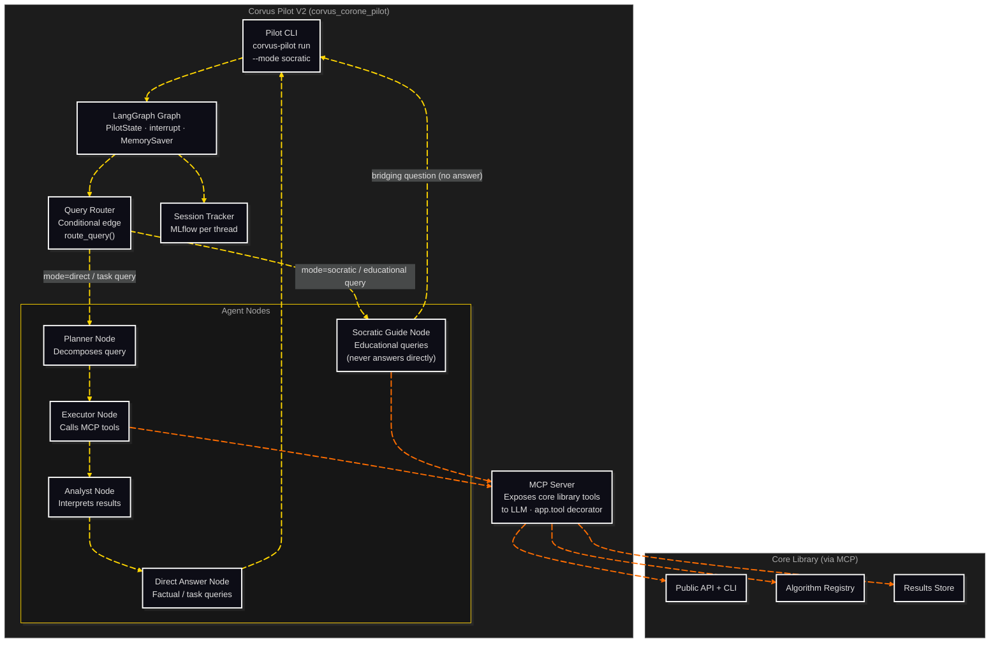

# C3: Components — Corvus Pilot V2

> C2 Container: [14-corvus-pilot.md](../../03-c4-leve2-containers/14-corvus-pilot.md)
> C3 Index: [../01-c4-l3-components/01-c4-l3-components.md](../01-c4-l3-components/01-c4-l3-components.md)

Corvus Pilot V2 is the LLM-powered interaction layer over the Corvus Corone core library.
It wraps library tools via MCP, routes queries through a LangGraph multi-agent lg, and
exposes two distinct interaction modes: **direct answer** (default) and **Socratic** (opt-in).
Actors: Researcher (direct mode), Learner (Socratic mode, UC-08, UC-09).

---

## Component Diagram

---

## Components

| Component | File | Responsibility |
|---|---|---|
| MCP Server | [mcp-server.md](02-mcp-server.md) | Exposes core library as LLM-callable tools via MCP `@app.tool()` |
| LangGraph Graph | [03-langgraph-graph.md](03-langgraph-graph.md) | Manages agent session lifecycle, state, and checkpointing via `PilotState` + `MemorySaver` |
| Query Router | [query-router.md](04-query-router.md) | Classifies each incoming query and routes it to the correct agent node |
| Socratic Guide Node | [socratic-guide-node.md](05-socratic-guide-node.md) | Guides Learners toward conclusions through bridging questions — never provides answers directly |
| Planner Node | [planner-node.md](06-planner-node.md) | Decomposes natural-language task queries into sequences of MCP tool calls |
| Executor Node | [executor-node.md](07-executor-node.md) | Executes MCP tool calls; pauses before `run_study()` for human-in-the-loop confirmation |
| Analyst Node | [analyst-node.md](08-analyst-node.md) | Interprets MCP tool results and generates the final direct answer or report summary |
| Session Tracker | [session-tracker.md](09-session-tracker.md) | Records each Pilot session as an MLflow run for observability |

---

## Cross-Cutting Concerns

### Logging & Observability

All agent node invocations log to the Session Tracker (MLflow). Each log entry records: `thread_id`, node name, input token count, output token count, latency ms, and any MCP tool call names. Structured JSON log format; no free-text log messages from within node logic.

### Error Handling

MCP tool call failures are caught at the Executor Node boundary. If a tool call raises an exception:
- Executor Node retries once with a back-off (500 ms).
- On second failure, the Executor Node reports failure to the Analyst Node with a structured error payload.
- The Analyst Node surfaces the failure to the user in natural language.
- Socratic Guide Node: MCP tool failures silently fall back to metadata-only mode — no error surfaced to the Learner.

Unhandled exceptions in any node propagate to the LangGraph Graph, which catches and wraps them in a `PilotError` and surfaces to CLI.

### Randomness / Seed Management

No components in this container generate random state. All randomness is inside the core library (managed by the Experiment Runner's Seed Manager). Pilot receives results from the core library deterministically after the fact.

### Configuration

| Parameter | Source | Scope |
|---|---|---|
| `--mode` | CLI flag | Session |
| `--model` | CLI flag / env `CORVUS_PILOT_MODEL` | Session |
| Ollama base URL | env `OLLAMA_BASE_URL` | Deployment |
| MLflow tracking URI | env `MLFLOW_TRACKING_URI` | Deployment |
| MCP server port | env `CORVUS_MCP_PORT` (default: 5010) | Deployment |

### Testing Strategy

- **LangGraph Graph + Query Router**: Unit-tested via `lg.invoke()` with synthetic `PilotState` fixtures. No real LLM call.
- **Socratic Guide Node**: Unit-tested with synthetic conversation fixtures. Key acceptance criterion: node output MUST NOT contain the answer to any question in the test fixture set.
- **MCP Server**: Integration-tested against a real running instance of the core library. Tool schemas are snapshot-tested.
- **Planner/Executor/Analyst pipeline**: End-to-end tested with a recorded Ollama response fixture (no live LLM call in CI).
- **Session Tracker**: Integration-tested against MLflow in-memory tracking store.
