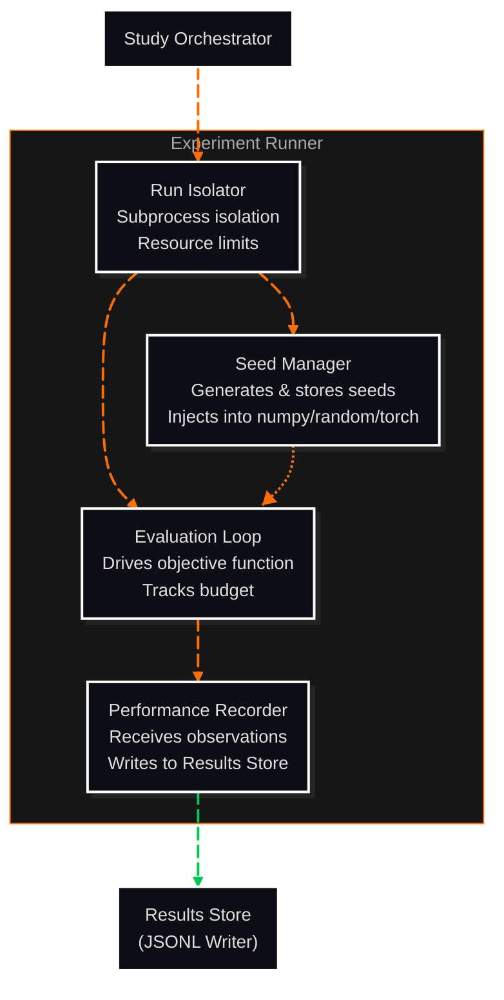

# C3: Components — Experiment Runner

> C2 Container: [08-experiment-runner.md](../../03-c4-leve2-containers/08-experiment-runner.md)
> C3 Index: [../01-c3-components.md](../01-c3-components.md)

The Experiment Runner executes individual algorithm Runs in isolated subprocesses, injects reproducible seeds, drives the evaluation loop, and records performance observations to the Results Store.
Actors: invoked by Study Orchestrator; writes PerformanceRecords to Results Store.

---

## Component Diagram

---

## Components

| Component | File | Responsibility |
|---|---|---|
| Seed Manager | [seed-manager.md](02-seed-manager.md) | Generates, stores, and injects per-Run random seeds into Python's random stack |
| Run Isolator | [run-isolator.md](03-run-isolator.md) | Wraps each Run in a subprocess with resource limits and failure handling |
| Evaluation Loop | [evaluation-loop.md](04-evaluation-loop.md) | Drives the algorithm's ask/tell cycle within budget; records each observation |
| Performance Recorder | [performance-recorder.md](05-performance-recorder.md) | Receives observation data and writes PerformanceRecord objects to the Results Store |

---

## Cross-Cutting Concerns

### Logging & Observability

Each Run logs start time, seed, budget, and outcome (success/skip/abort) as a structured JSON line to the run log file at `{results_dir}/{experiment_id}/runs/{run_id}/run.log`. Node-level progress is not logged to avoid I/O overhead during tight evaluation loops.

### Error Handling

Two failure modes for a single Run:
- **skip**: non-fatal failure (e.g., algorithm raised `ValueError` on a specific parameter set). The Run is marked `status=skipped`; remaining runs continue. The Study Orchestrator receives a partial result.
- **abort**: fatal failure (e.g., subprocess crash, memory limit exceeded). The Run is marked `status=aborted`; the Study Orchestrator decides whether to continue remaining runs based on `on_failure` configuration.

Exceptions are never silently swallowed — all failures are written to `run.log` with full traceback.

### Randomness / Seed Management

All seeds are generated by the Seed Manager before subprocess creation. The seed is passed to the subprocess via its initial `PilotState` payload, not via environment variable. Inside the subprocess, the Seed Manager component sets seeds on `random`, `numpy.random`, and `torch` (if importable) at process start — before any algorithm code executes.

Seed storage: `{results_dir}/{experiment_id}/runs/{run_id}/seed.json` — used by resume logic.

### Configuration

| Parameter | Source | Scope |
|---|---|---|
| `budget` | StudyConfig | Per-Run |
| `on_failure` | StudyConfig (`skip` or `abort`) | Per-Study |
| `max_workers` | StudyConfig | Per-Study |
| `memory_limit_mb` | StudyConfig (default: 4096) | Per-Run subprocess |

### Testing Strategy

- **Seed Manager**: unit-tested; verifies that two runs with the same seed produce identical objective function evaluation sequences.
- **Run Isolator**: integration-tested; verifies that a subprocess crash does not crash the parent process and produces an `aborted` status.
- **Evaluation Loop**: unit-tested with a mock objective function; verifies budget enforcement (loop stops at `budget` evaluations).
- **Performance Recorder**: unit-tested against a mock JSONL writer; verifies that every `tell()` call produces a PerformanceRecord.
