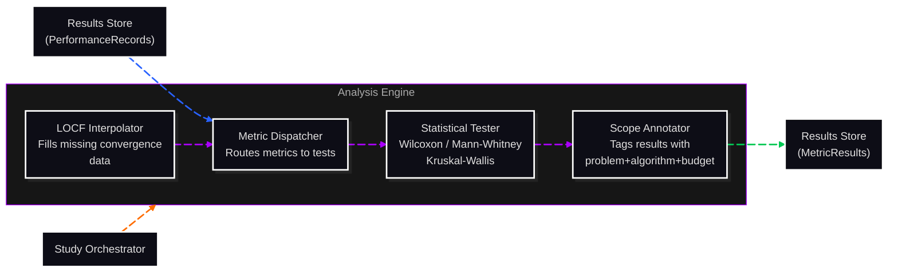

# C3: Components — Analysis Engine

> C2 Container: [09-analysis-engine.md](../../03-c4-leve2-containers/09-analysis-engine.md)
> C3 Index: [../01-c3-components.md](../01-c3-components.md)

The Analysis Engine computes benchmark metrics from raw PerformanceRecords, applies pre-registered statistical tests, annotates results with scope metadata, and interpolates missing data. It is batch-only in V1 — it runs after all Runs in a Study complete.
Actors: invoked by Study Orchestrator; reads PerformanceRecords from Results Store; writes MetricResults back to Results Store.

---

## Component Diagram

---

## Components

| Component | File | Responsibility |
|---|---|---|
| Metric Dispatcher | [metric-dispatcher.md](02-metric-dispatcher.md) | Loads PerformanceRecords, computes configured metrics, and routes to Statistical Tester |
| Statistical Tester | [statistical-tester.md](03-statistical-tester.md) | Applies pre-registered statistical tests (Wilcoxon, Mann-Whitney U, Kruskal-Wallis) via SciPy |
| Scope Annotator | [scope-annotator.md](04-scope-annotator.md) | Tags every MetricResult with problem+algorithm+budget scope for downstream filtering |
| LOCF Interpolator | [locf-interpolator.md](05-locf-interpolator.md) | Fills missing convergence observations using Last Observation Carried Forward |

---

## Cross-Cutting Concerns

### Logging & Observability

The Analysis Engine logs one structured JSON entry per Study on completion: `experiment_id`, `metrics_computed`, `tests_applied`, `runs_with_missing_data`, `duration_s`. Individual metric computation is not logged to avoid log volume.

### Error Handling

- Missing PerformanceRecords for a Run: the LOCF Interpolator fills gaps; if the entire Run is missing, it is excluded from analysis and flagged in the MetricResult `data_quality` field.
- Statistical test precondition failures (e.g., fewer than 2 samples for Wilcoxon): the tester records `test_result=null` with `reason="insufficient_samples"` rather than raising.
- Pre-registration violations: if a test not declared in the pre-registration config is requested, the Metric Dispatcher raises `PreRegistrationViolationError`. This is not caught internally — it propagates to the Study Orchestrator as a fatal error.

### Randomness / Seed Management

No random state consumed by this container. Statistical tests use deterministic algorithms (exact Wilcoxon or permutation-based with a fixed seed passed in from StudyConfig). The seed is passed as a parameter, not read from global state.

### Configuration

| Parameter | Source | Scope |
|---|---|---|
| `metrics` | StudyConfig.analysis | Per-Study |
| `statistical_tests` | StudyConfig.analysis | Per-Study |
| `pre_registration` | StudyConfig.analysis | Per-Study |
| `locf_max_gap` | StudyConfig.analysis (default: 10) | Per-Study |
| `alpha` | StudyConfig.analysis (default: 0.05) | Per-Study |

### Testing Strategy

- **Metric Dispatcher**: unit-tested with synthetic PerformanceRecord fixtures; verifies correct metric computation for `QUALITY-BEST_VALUE_AT_BUDGET` and `ERT`.
- **Statistical Tester**: unit-tested with known input distributions and known expected p-values from literature.
- **Scope Annotator**: unit-tested; verifies all scope fields are populated and correct.
- **LOCF Interpolator**: unit-tested with time-series fixtures containing deliberate gaps; verifies gap-filling fidelity.
