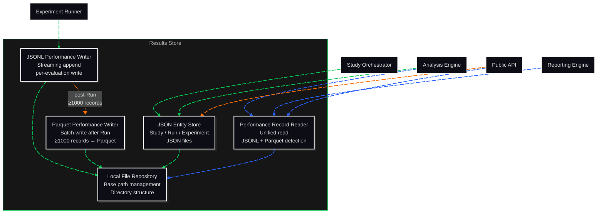

# C3: Components — Results Store

> C2 Container: [12-results-store.md](../../03-c4-leve2-containers/12-results-store.md)
> C3 Index: [../01-c3-components.md](../01-c3-components.md)

The Results Store persists and retrieves all study artifacts to the local filesystem. PerformanceRecords are stored in dual format: JSONL for streaming write during Run execution, and Parquet/snappy for bulk query after Run completion (ADR-010: 20× write throughput, 9.3× smaller files, 59× faster range queries vs. SQLite).
Actors: written to by Experiment Runner and Analysis Engine; read by Reporting Engine, Analysis Engine, and Public API.

---

## Component Diagram

---

## Components

| Component | File | Responsibility |
|---|---|---|
| Local File Repository | [local-file-repository.md](02-local-file-repository.md) | Manages the filesystem path hierarchy and directory structure for all artifacts |
| JSON Entity Store | [json-entity-store.md](03-json-entity-store.md) | Reads and writes domain entities (Study, Experiment, Run) as JSON files |
| JSONL Performance Writer | [jsonl-performance-writer.md](04-jsonl-performance-writer.md) | Streams PerformanceRecord observations to JSONL files during Run execution |
| Parquet Performance Writer | [parquet-performance-writer.md](05-parquet-performance-writer.md) | Converts completed Run JSONL files to Parquet/snappy format post-Run |
| Performance Record Reader | [performance-record-reader.md](06-performance-record-reader.md) | Unified read interface over JSONL and Parquet; detects format automatically |

---

## Cross-Cutting Concerns

### Logging & Observability

File I/O operations are not individually logged (too high volume). The Results Store logs one structured entry per entity write (Study, Run, Experiment) at DEBUG level: `action`, `entity_type`, `entity_id`, `path`, `size_bytes`.

Parquet conversion completion is logged at INFO level: `experiment_id`, `run_id`, `records_converted`, `jsonl_size_bytes`, `parquet_size_bytes`.

### Error Handling

- **Write failures**: if a JSONL write fails mid-Run (e.g., disk full), the writer raises `StorageError` immediately. The Run Isolator catches this and marks the Run `aborted`.
- **Read failures**: if neither JSONL nor Parquet exists for a requested run_id, the reader raises `RecordNotFoundError`. Callers are expected to handle this.
- **Partial Parquet conversion**: if the Parquet writer fails mid-conversion, the JSONL file is preserved (not deleted). The next read operation will fall back to JSONL. The failed Parquet file is deleted to avoid partial reads.

### Randomness / Seed Management

No random state. The Results Store is purely I/O.

### Configuration

| Parameter | Source | Scope |
|---|---|---|
| `results_dir` | StudyConfig / env `CORVUS_RESULTS_DIR` | Global |
| `parquet_threshold` | StudyConfig (default: 1000 records) | Per-Run |
| `compression` | StudyConfig (default: `snappy`) | Per-Run Parquet |

### Testing Strategy

- **Local File Repository**: unit-tested; verifies directory creation, path construction, and cleanup.
- **JSON Entity Store**: unit-tested with all entity types; verifies round-trip serialisation fidelity.
- **JSONL Performance Writer**: unit-tested with synthetic PerformanceRecords; verifies streaming write and flush guarantees.
- **Parquet Performance Writer**: integration-tested; verifies conversion correctness (record count match) and that the JSONL file is preserved if conversion fails.
- **Performance Record Reader**: integration-tested with both JSONL and Parquet sources; verifies identical read results from both formats for the same data.
