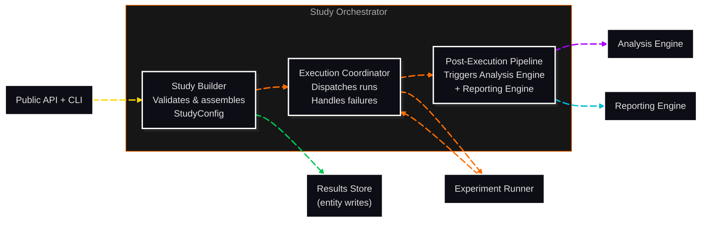

# C3: Components — Study Orchestrator

> C2 Container: [07-study-orchestrator.md](../../03-c4-leve2-containers/07-study-orchestrator.md)
> C3 Index: [../01-c4-l3-components/01-c4-l3-components.md](../01-c4-l3-components/01-c4-l3-components.md)

The Study Orchestrator coordinates the full lifecycle of a Study execution: builds and validates the run plan, dispatches runs to the Experiment Runner, handles partial failures, and triggers the post-execution pipeline (Analysis Engine + Reporting Engine).
Actors: invoked by the Public API + CLI; orchestrates Experiment Runner, Analysis Engine, and Reporting Engine.

---

## Component Diagram

---

## Components

| Component | File | Responsibility |
|---|---|---|
| Study Builder | [study-builder.md](02-study-builder.md) | Validates and assembles a StudyConfig from user input; resolves entity IDs |
| Execution Coordinator | [execution-coordinator.md](03-execution-coordinator.md) | Dispatches Runs to the Experiment Runner; collects results; handles partial failures |
| Post-Execution Pipeline | [post-execution-pipeline.md](04-post-execution-pipeline.md) | Triggers Analysis Engine and Reporting Engine after all Runs complete |

---

## Cross-Cutting Concerns

### Logging & Observability

The Study Orchestrator logs one structured JSON entry per Study lifecycle event: `study_created`, `run_dispatched`, `run_completed`, `run_failed`, `analysis_started`, `analysis_completed`, `report_generated`. Logged to `{results_dir}/{study_id}/orchestrator.log`.

### Error Handling

- **Run-level failures**: delegated to the Execution Coordinator per `on_failure` policy (skip or abort).
- **Analysis Engine failure**: if analysis fails after all runs complete, the Study is marked `status=analysis_failed`. The raw PerformanceRecords are preserved. The user can re-trigger analysis manually via `cc.analyse(experiment_id=...)`.
- **Reporting Engine failure**: non-fatal. The Study is marked `status=report_failed`. Data is not lost.

### Randomness / Seed Management

The Study Builder generates the `base_seed` for the Study (from `StudyConfig.seed` if provided, or from `random.randint(0, 2^31)` if not). This is the only random call in the orchestrator; all downstream seeding uses this base seed via the Seed Manager.

### Configuration

All configuration is driven by `StudyConfig`. There are no global or environment-level configuration settings for the orchestrator beyond `results_dir`.

### Testing Strategy

- **Study Builder**: unit-tested; verifies validation logic for all StudyConfig fields; verifies entity ID resolution against mock registries.
- **Execution Coordinator**: integration-tested against a mock Experiment Runner; verifies `skip` vs `abort` failure handling.
- **Post-Execution Pipeline**: integration-tested; verifies that Analysis Engine and Reporting Engine are called in the correct order and with correct inputs.
