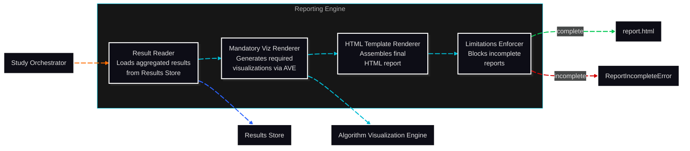

# C3: Components — Reporting Engine

> C2 Container: [05-reporting-engine.md](../../03-c4-leve2-containers/05-reporting-engine.md)
> C3 Index: [../01-c4-l3-components/01-c4-l3-components.md](../01-c4-l3-components/01-c4-l3-components.md)

The Reporting Engine assembles an HTML benchmark report from Study results, mandatory visualizations, statistical summaries, and an explicit limitations section. It enforces completeness: the Limitations Enforcer blocks report generation if any required section is absent.
Actors: triggered by Study Orchestrator; reads from Results Store; delegates visualization rendering to Algorithm Visualization Engine.

---

## Component Diagram

---

## Components

| Component | File | Responsibility |
|---|---|---|
| Result Reader | [result-reader.md](02-result-reader.md) | Loads aggregated MetricResults and entity metadata from the Results Store |
| Mandatory Viz Renderer | [mandatory-viz-renderer.md](03-mandatory-viz-renderer.md) | Generates the visualizations that must appear in every report via the Algorithm Visualization Engine |
| HTML Template Renderer | [html-template-renderer.md](04-html-template-renderer.md) | Assembles the complete HTML report from component outputs using Jinja2 templates |
| Limitations Enforcer | [limitations-enforcer.md](05-limitations-enforcer.md) | Validates that all required report sections are present; raises `ReportIncompleteError` if any are missing |

---

## Cross-Cutting Concerns

### Logging & Observability

One structured log entry per report generation: `experiment_id`, `sections_rendered`, `visualizations_generated`, `limitations_count`, `output_path`, `duration_s`, `status` (complete/incomplete). Logged at INFO level.

### Error Handling

- **Missing study data**: if the Result Reader finds no MetricResults for the experiment, raises `ReportDataNotFoundError`. The Post-Execution Pipeline marks the Experiment `report_failed`.
- **Visualization failure**: if a mandatory visualization cannot be generated, the Mandatory Viz Renderer raises `MandatoryVizError`. This propagates through the Limitations Enforcer as an incomplete report.
- **Template render failure**: if Jinja2 template rendering fails (e.g., missing variable), raises `TemplateRenderError` with the specific missing variable named.
- **Incomplete report**: `ReportIncompleteError` is raised by the Limitations Enforcer only. It lists all missing sections. Never silently generates a partial report.

### Randomness / Seed Management

No random state. Report generation is fully deterministic given the same inputs.

### Configuration

| Parameter | Source | Scope |
|---|---|---|
| `report_title` | StudyConfig.reporting | Per-Study |
| `include_algorithm_viz` | StudyConfig.reporting (default: True) | Per-Study |
| `output_dir` | StudyConfig.reporting | Per-Study |
| `template` | StudyConfig.reporting (default: `standard`) | Per-Study |

### Testing Strategy

- **Result Reader**: unit-tested with mock Results Store; verifies correct loading and aggregation.
- **Mandatory Viz Renderer**: integration-tested against a real Algorithm Visualization Engine instance; verifies all required visualizations are generated.
- **HTML Template Renderer**: unit-tested with fixture data; snapshot-tested for HTML output stability.
- **Limitations Enforcer**: unit-tested with deliberately incomplete section sets; verifies it raises `ReportIncompleteError` with the correct missing section list.
