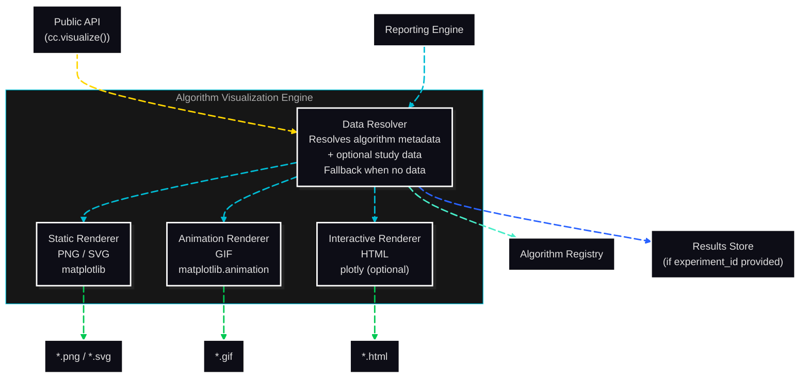

# C3: Components — Algorithm Visualization Engine

> C2 Container: [06-algorithm-visualization-engine.md](../../03-c4-leve2-containers/06-algorithm-visualization-engine.md)
> C3 Index: [../01-c3-components.md](../01-c3-components.md)

The Algorithm Visualization Engine generates four visualization types for HPO algorithms: convergence animation (GIF), search trajectory scatter (PNG), parameter sensitivity heatmap (PNG/HTML), and genealogy timeline (SVG). All types can use a mathematical-only fallback when no study data exists. matplotlib is the core rendering library; plotly is optional for interactive HTML output.
Actors: called by Reporting Engine for mandatory report visualizations; called directly via Public API for Learner education (UC-07, UC-10).

---

## Component Diagram

---

## Components

| Component | File | Responsibility |
|---|---|---|
| Data Resolver | [data-resolver.md](02-data-resolver.md) | Fetches algorithm metadata and optional study data; provides fallback when no study data exists |
| Static Renderer | [static-renderer.md](03-static-renderer.md) | Renders trajectory scatter, sensitivity heatmap, and genealogy SVG using matplotlib |
| Animation Renderer | [animation-renderer.md](04-animation-renderer.md) | Renders convergence animation as GIF using `matplotlib.animation` |
| Interactive Renderer | [interactive-renderer.md](05-interactive-renderer.md) | Renders interactive HTML visualizations using plotly (optional `[interactive]` extra) |

---

## Cross-Cutting Concerns

### Logging & Observability

One structured log entry per `visualize()` call: `algorithm_id`, `viz_type`, `experiment_id` (or null), `format`, `fallback_used`, `output_path`, `duration_ms`. Logged at DEBUG level.

### Error Handling

- `EntityNotFoundError`: raised if the algorithm ID is not in the registry. Not caught internally — surfaces to the caller with a list of available algorithms.
- `VisualizationNotApplicableError`: raised by the Static Renderer if `viz_type="pareto_front"` is requested for a single-objective experiment.
- `ImportError`: raised by the Interactive Renderer if `plotly` is not installed. Message includes `pip install corvus_corone[interactive]`.
- All fallback (no-data) visualizations return a `VisualizationResult` with `fallback_reason` populated and `fallback_used=True`.

### Randomness / Seed Management

No random state consumed. Fallback synthetic data uses a fixed seed (42) passed as a constant — not from global random state — to ensure deterministic fallback visualizations.

### Configuration

| Parameter | Source | Scope |
|---|---|---|
| `format` | `visualize()` call | Per call |
| `output_path` / `output_dir` | `visualize()` call | Per call |
| `experiment_id` | `visualize()` call (optional) | Per call |
| matplotlib DPI | `StudyConfig.reporting` (default: 150) | Per-Study |

### Testing Strategy

- **Data Resolver**: unit-tested with mock registry and mock Results Store; verifies fallback activation when `experiment_id` is not provided.
- **Static Renderer**: integration-tested; verifies output file creation and non-zero file size for each supported viz type.
- **Animation Renderer**: integration-tested; verifies GIF creation with ≥ 2 frames.
- **Interactive Renderer**: unit-tested with `plotly` mocked; verifies `ImportError` is raised correctly when plotly is absent.
