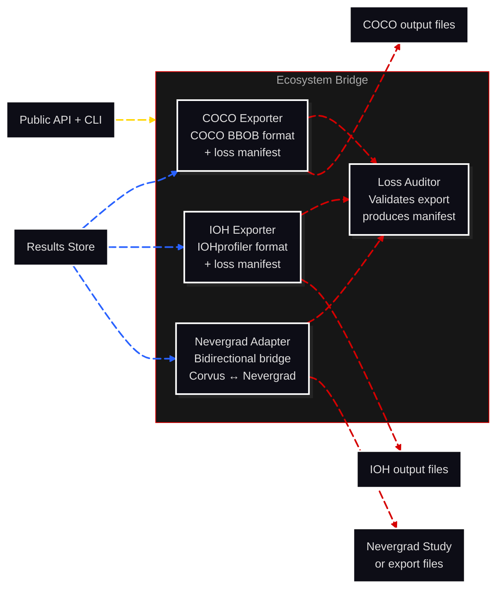

# C3: Components — Ecosystem Bridge

> C2 Container: [13-ecosystem-bridge.md](../../03-c4-leve2-containers/13-ecosystem-bridge.md)
> C3 Index: [../01-c3-components.md](../01-c3-components.md)

The Ecosystem Bridge exports Study results to external benchmarking ecosystems (COCO BBOB, IOHprofiler) and wraps Nevergrad optimizers for use within Corvus studies (and vice versa). Every export produces an information-loss manifest documenting what data could not be faithfully represented in the target format.
Actors: called by Public API + CLI; reads from Results Store; writes to external format files.

---

## Component Diagram

---

## Components

| Component | File | Responsibility |
|---|---|---|
| COCO Exporter | [coco-exporter.md](02-coco-exporter.md) | Exports Study results to COCO BBOB format |
| IOH Exporter | [ioh-exporter.md](03-ioh-exporter.md) | Exports Study results to IOHprofiler format |
| Nevergrad Adapter | [nevergrad-adapter.md](04-nevergrad-adapter.md) | Bidirectional bridge between Corvus and Nevergrad optimizer API |
| Loss Auditor | [loss-auditor.md](05-loss-auditor.md) | Validates export completeness and writes the information-loss manifest |

---

## Cross-Cutting Concerns

### Logging & Observability

One structured log entry per export: `export_type`, `experiment_id`, `records_exported`, `records_lost`, `manifest_path`, `output_path`, `duration_s`. The manifest file provides per-field detail on information loss.

### Error Handling

- **Missing data**: if the requested experiment has no PerformanceRecords, raises `ExportDataNotFoundError`.
- **Format conversion failure**: if a specific record cannot be converted (e.g., unsupported parameter type for COCO), the record is excluded from the export, added to the loss manifest, and export continues. Never aborts on individual record failure.
- **External library absent**: `coco-experiment` or `ioh` Python packages may not be installed. Import checks at call time raise `ImportError` with install instructions.

### Randomness / Seed Management

No random state. Exports are deterministic given the same input records.

### Configuration

| Parameter | Source | Scope |
|---|---|---|
| `output_dir` | export call parameter | Per call |
| `include_skipped_runs` | export call parameter (default: False) | Per call |
| `coco_suite` | export call parameter (default: `bbob`) | Per COCO export |

### Testing Strategy

- **COCO Exporter**: integration-tested with a small synthetic Study; verifies that COCO `Observer` output files are created and readable by `cocopp`.
- **IOH Exporter**: integration-tested; verifies IOH JSON output format against the IOHprofiler schema.
- **Nevergrad Adapter**: tested in both directions; verifies a Nevergrad optimizer run through Corvus produces valid PerformanceRecords, and that Corvus results export to Nevergrad format.
- **Loss Auditor**: unit-tested; verifies the manifest lists all injected information-loss cases.
