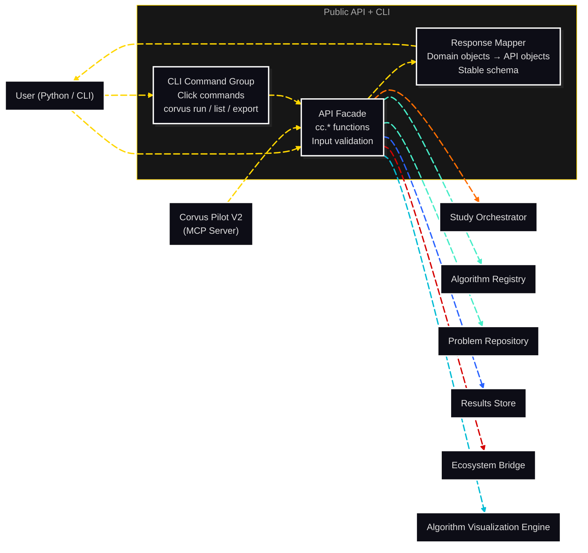

# C3: Components — Public API + CLI

> C2 Container: [04-public-api-cli.md](../../03-c4-leve2-containers/04-public-api-cli.md)
> C3 Index: [../01-c3-components.md](../01-c3-components.md)

The Public API + CLI is the user-facing entry point for the library. It exposes `cc.*` Python functions and a Click-based CLI, validates inputs at the system boundary, and delegates to internal containers. The Response Mapper transforms internal return types to stable, versioned API objects.
Actors: Researcher, Learner (Python or CLI); Corvus Pilot V2 (via MCP server which calls `cc.*` functions).

---

## Component Diagram

---

## Components

| Component | File | Responsibility |
|---|---|---|
| API Facade | [api-facade.md](02-api-facade.md) | Top-level `cc.*` functions; input validation; delegation to core containers |
| CLI Command Group | [cli-command-group.md](03-cli-command-group.md) | Click-based CLI mapping subcommands to API Facade calls |
| Response Mapper | [response-mapper.md](04-response-mapper.md) | Transforms internal domain objects to stable, versioned API return types |

---

## Cross-Cutting Concerns

### Logging & Observability

Public API calls are not individually logged (too high volume for interactive use). CLI commands log one entry per invocation: `command`, `args`, `status`, `duration_ms` at DEBUG level.

### Error Handling

All validation errors at the API Facade boundary are raised as `CorvusValidationError` with a structured error dict listing all validation failures (not just the first). Internal container errors (`StudyAbortedError`, `EntityNotFoundError`, etc.) are caught and re-raised as corresponding `cc.*Error` subclasses with user-friendly messages.

### Randomness / Seed Management

The API Facade generates a Study-level `base_seed` if not provided by the user (via `secrets.randbelow(2**31)` — cryptographically random, not from `random` module). This seed is passed to the Study Builder.

### Configuration

The Public API reads `CORVUS_RESULTS_DIR` from the environment as the default `results_dir`. All other configuration is passed explicitly via function arguments or `StudyConfig`.

### Testing Strategy

- **API Facade**: unit-tested for all validation paths; integration-tested for the happy path (run a minimal 1-run study end-to-end).
- **CLI Command Group**: tested via `click.testing.CliRunner`; verifies all subcommands produce expected output and exit codes.
- **Response Mapper**: unit-tested with fixture domain objects; snapshot-tested for API object schema stability.
