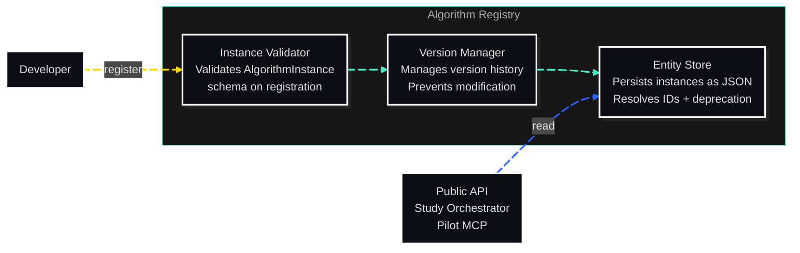

# C3: Components — Algorithm Registry

> C2 Container: [10-algorithm-registry.md](../../03-c4-leve2-containers/10-algorithm-registry.md)
> C3 Index: [../01-c4-l3-components/01-c4-l3-components.md](../01-c4-l3-components/01-c4-l3-components.md)

The Algorithm Registry stores and serves AlgorithmInstance registrations. Each instance is validated on registration, immutable after registration, and versioned to support reproducibility across study executions.
Actors: Study Orchestrator and Public API read from it; developers register new instances during library development.

---

## Component Diagram

---

## Components

| Component | File | Responsibility |
|---|---|---|
| Instance Validator | [instance-validator.md](02-instance-validator.md) | Validates AlgorithmInstance schema and required fields on registration |
| Version Manager | [version-manager.md](03-version-manager.md) | Manages version history and prevents modification of registered versions |
| Entity Store | [entity-store.md](04-entity-store.md) | Persists algorithm instances as JSON; resolves IDs; supports the deprecation flag |

---

## Cross-Cutting Concerns

### Logging & Observability

One log entry per registration: `algorithm_id`, `version`, `registered_at`, `registered_by`. One log entry per deprecation: `algorithm_id`, `deprecated_at`, `reason`. All at INFO level.

### Error Handling

- `AlgorithmValidationError`: raised by Instance Validator on schema violations. Lists all violations.
- `AlgorithmAlreadyExistsError`: raised when attempting to register an ID+version combination that already exists.
- `EntityNotFoundError`: raised by Entity Store when `get_algorithm(id)` finds no matching entry.

### Randomness / Seed Management

No random state. Registry is purely read/write storage.

### Configuration

The Registry reads its storage path from `CORVUS_REGISTRY_DIR` (env) or defaults to the package's bundled `data/algorithm_registry/` directory.

### Testing Strategy

All three components are unit-tested with fixture AlgorithmInstance objects. Integration tests verify round-trip registration and retrieval fidelity.
