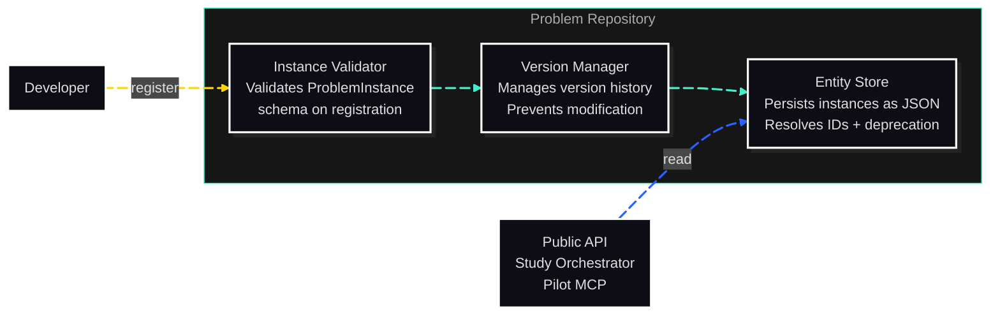

# C3: Components — Problem Repository

> C2 Container: [11-problem-repository.md](../../03-c4-leve2-containers/11-problem-repository.md)
> C3 Index: [../01-c3-components.md](../01-c3-components.md)

The Problem Repository stores and serves ProblemInstance registrations with the same versioning and deprecation architecture as the Algorithm Registry. Each problem instance is validated on registration and immutable thereafter.
Actors: Study Orchestrator and Public API read from it; developers register new problem instances during library development or benchmarking suite expansion.

---

## Component Diagram

---

## Components

| Component | File | Responsibility |
|---|---|---|
| Instance Validator | [instance-validator.md](02-instance-validator.md) | Validates ProblemInstance schema and required fields on registration |
| Version Manager | [version-manager.md](03-version-manager.md) | Manages version history and prevents modification of registered versions |
| Entity Store | [entity-store.md](04-entity-store.md) | Persists problem instances as JSON; resolves IDs; supports the deprecation flag |

---

## Cross-Cutting Concerns

### Logging & Observability

Same pattern as Algorithm Registry: one log entry per registration and per deprecation at INFO level.

### Error Handling

- `ProblemValidationError`: raised by Instance Validator on schema violations.
- `ProblemAlreadyExistsError`: raised on duplicate `(id, version)` registration.
- `EntityNotFoundError`: raised by Entity Store on missing problem ID.

### Randomness / Seed Management

No random state.

### Configuration

The Repository reads its storage path from `CORVUS_PROBLEM_REPO_DIR` (env) or defaults to the package's bundled `data/problem_repository/` directory.

### Testing Strategy

Same pattern as Algorithm Registry: unit tests per component, integration tests for round-trip fidelity.
