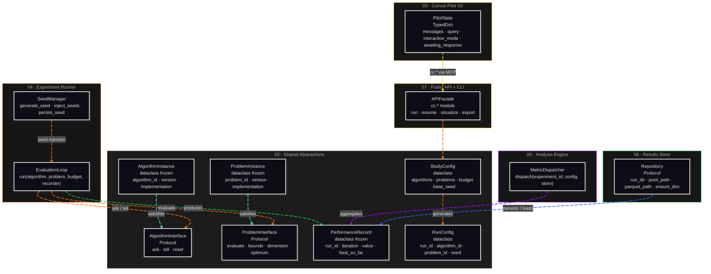

# C4: Code — Index

> C3 Components: [../04-c4-leve3-components/01-c4-l3-components/01-c4-l3-components.md](../04-c4-leve3-components/01-c4-l3-components/01-c4-l3-components.md)

C4 Level 4 documents the architecturally significant code abstractions within Corvus Corone —
the interfaces, protocols, and data types whose shape is a design decision that affects multiple
containers. It is **not** an exhaustive class inventory.

**Selection rule:** an abstraction qualifies for C4 if removing it or changing its shape would
require changes in more than one container. Everything else belongs in docstrings.

---

## Architecture Overview

The diagram below shows all documented abstractions and their relationships. It is the
"map" of this section — each node links to a detailed C4 file.

> **Arrow colour legend**
> | Colour | Meaning |
> |---|---|
> |  yellow | Entry / user-facing (Pilot → API) |
> |  orange | Execution dispatch (API → spec · runner) |
> |  teal | Registry / protocol satisfaction |
> |  green | Writes / produces |
> |  purple | Analysis pipeline |
> |  blue | Reads from store |

---

## Scope

| Section | Abstraction | Containers affected |
|---|---|---|
| [02-shared/01-algorithm-interface.md](02-shared/01-algorithm-interface.md) | `AlgorithmInterface` (Protocol) | Experiment Runner, Algorithm Registry, Analysis Engine, Visualization Engine, Ecosystem Bridge |
| [02-shared/02-problem-interface.md](02-shared/02-problem-interface.md) | `ProblemInterface` (Protocol) | Experiment Runner, Problem Repository, Analysis Engine |
| [02-shared/03-performance-record.md](02-shared/03-performance-record.md) | `PerformanceRecord` (dataclass) | Experiment Runner, Results Store, Analysis Engine, Reporting Engine, Visualization Engine |
| [02-shared/04-study-spec.md](02-shared/04-study-spec.md) | `StudyConfig` + `RunConfig` (dataclasses) | Public API, Study Orchestrator, Experiment Runner, Analysis Engine |
| [03-corvus-corone-pilot/02-pilot-state.md](03-corvus-corone-pilot/02-pilot-state.md) | `PilotState` (TypedDict) | Corvus Pilot V2 — all 7 agent nodes share this state |
| [04-experiment-runner/02-seed-manager.md](04-experiment-runner/02-seed-manager.md) | `SeedManager` (class + invariant) | Experiment Runner — reproducibility contract boundary |
| [04-experiment-runner/03-evaluation-loop.md](04-experiment-runner/03-evaluation-loop.md) | `EvaluationLoop` (ask/tell contract) | Experiment Runner — core execution contract between AlgorithmInterface, ProblemInterface, PerformanceRecorder |
| [05-analysis-engine/02-metric-dispatcher.md](05-analysis-engine/02-metric-dispatcher.md) | `MetricDispatcher` (routing abstraction) | Analysis Engine — adding any new metric requires extending this |
| [06-results-store/02-repository-protocol.md](06-results-store/02-repository-protocol.md) | `Repository` (Protocol) | Results Store — V1→V2 swap point; all path resolution goes through here |
| [07-public-api-cli/02-api-facade.md](07-public-api-cli/02-api-facade.md) | `APIFacade` (`cc.*`) | Public API — versioned surface consumed by CLI, MCP Server, and all external callers |

---

## What is NOT here

- Implementation classes fully contained within one component (e.g. `StatisticalTester`, `HTMLTemplateRenderer`)
- Third-party library internals (LangGraph, SciPy, Click, MLflow)
- Container-internal helpers and private utilities
- Algorithm or problem implementations contributed by users

All of the above belong in code docstrings, adjacent to the implementation.

---

## Conventions used in this section

- **Mermaid `classDiagram`** is used for per-file diagrams. Max ~10 nodes per diagram.
- **`〈Protocol〉`** in node labels marks Python structural-subtyping interfaces (PEP 544).
- **`〈dataclass〉`** marks frozen or mutable dataclasses used as value objects.
- **`〈TypedDict〉`** marks LangGraph-compatible typed dictionaries.
- Method signatures in diagrams show name and arity only — full signatures are in docstrings.
- The overview diagram above uses `flowchart` to support colour-coded, animated arrows.
