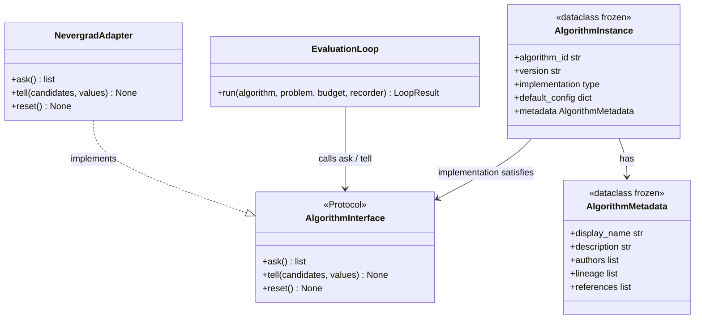

# C4: Code — AlgorithmInterface

> C4 Index: [../01-index.md](../01-index.md)
> C3 Component (Algorithm Registry): [../../04-c4-leve3-components/11-algorithm-registry/01-index.md](../../04-c4-leve3-components/11-algorithm-registry/01-index.md)
> Technical Contract: [../../../../03-technical-contracts/02-interface-contracts/](../../../../03-technical-contracts/02-interface-contracts/)

---

## Component

`AlgorithmInterface` is the structural Protocol that every HPO algorithm implementation must
satisfy. It is the single boundary between the library's execution infrastructure and the
algorithm code contributed by users. Changing its shape forces changes in every container that
creates, stores, or invokes algorithm instances.

---

## Key Abstractions

### `AlgorithmInterface`

**Type:** Protocol (PEP 544 structural subtyping)

**Why Protocol, not ABC:** Algorithm implementations may come from external libraries
(Nevergrad, Optuna wrappers) that cannot inherit from a library-internal base class.
Structural subtyping allows any class with the right methods to satisfy the interface without
modification. ADR to be created if this decision is contested.

**Purpose:** Define the minimum behavioural contract that the Evaluation Loop needs to drive
a black-box optimization run. The interface is intentionally minimal — ask, tell, reset — to
avoid over-constraining algorithm implementations.

**Key elements:**

| Method | Semantics |
|---|---|
| `ask()` | Return the next batch of candidate solutions to evaluate |
| `tell(candidates, values)` | Update the algorithm's internal state with evaluation results |
| `reset()` | Restore the algorithm to its pre-run state (used by the Run Isolator before injecting seed) |

**Constraints / invariants:**

- `reset()` MUST be called before the first `ask()` in any Run. The Run Isolator enforces this.
- After `reset()`, the algorithm's internal state must be entirely determined by the seed
  injected by the Seed Manager. Any other source of randomness is a reproducibility violation.
- `ask()` MUST NOT call `problem.evaluate()` internally. The Evaluation Loop controls all
  objective function calls; algorithms that self-evaluate bypass budget tracking.
- `tell()` MUST be called exactly once per `ask()` before the next `ask()`. The Evaluation
  Loop enforces this ordering.

**Extension points:**

Algorithm authors implement this Protocol. The full onboarding guide is at
`docs/06-tutorials/04-algorithm-author-onboarding.md`. The Nevergrad adapter
(`NevergradAdapter`) is the reference implementation showing how to wrap an external optimizer.

---

### `AlgorithmInstance`

**Type:** Dataclass (frozen after registration)

**Purpose:** Pair an `AlgorithmInterface` implementation with metadata required for
registry storage, reproducibility, and analysis attribution. The Registry stores instances,
not raw implementations.

**Key elements:**

| Field | Semantics |
|---|---|
| `algorithm_id` | Globally unique string identifier (slug format) |
| `version` | Semantic version string — immutable after registration |
| `implementation` | The `AlgorithmInterface`-satisfying class (not an instance) |
| `default_config` | Default hyperparameter configuration with justification |
| `metadata` | `AlgorithmMetadata` — authors, description, lineage, references |

**Constraints / invariants:**

- `algorithm_id` + `version` must be unique in the registry. Attempting to re-register raises
  `AlgorithmAlreadyExistsError`.
- Once registered, `AlgorithmInstance` fields are immutable. Mutation raises
  `FrozenInstanceError` (dataclass `frozen=True`).
- `default_config` must be JSON-serializable (enforced by the Instance Validator on registration).

---

## Class / Module Diagram

---

## Design Patterns Applied

### Protocol (Structural Subtyping)

**Where used:** `AlgorithmInterface` itself.

**Why:** External algorithm libraries cannot inherit from a library-internal ABC. Protocol
allows structural compatibility without import dependency on `corvus_corone`.

**Implications for contributors:** Implement `ask()`, `tell()`, `reset()` with the correct
signatures. No import of `corvus_corone` is required — `mypy --strict` or `pyright` will
report structural incompatibility if any method is missing or has the wrong arity.

### Value Object (Frozen Dataclass)

**Where used:** `AlgorithmInstance`, `AlgorithmMetadata`.

**Why:** Instances are immutable after registration. Mutability would allow silent divergence
between the registered spec and the executing implementation.

**Implications for contributors:** Do not use `replace()` on a registered instance. Create a
new version instead.

---

## Docstring Requirements

All public methods on any class implementing `AlgorithmInterface`:

- `ask()`: document the shape and dtype of returned candidates; document whether the method
  is stateful (i.e., must `tell()` be called before calling `ask()` again).
- `tell()`: document what internal state is updated; document thread-safety guarantees (none
  are required — Runs are single-threaded).
- `reset()`: document which random state is reset; document whether any external resources
  (open files, connections) are also reset.

`AlgorithmInstance` fields:

- `default_config`: each key must be documented with its valid range and the justification for
  the chosen default (MANIFESTO Principle 10 — configuration fairness).
- `metadata.lineage`: document parent algorithm IDs and the modification made.
