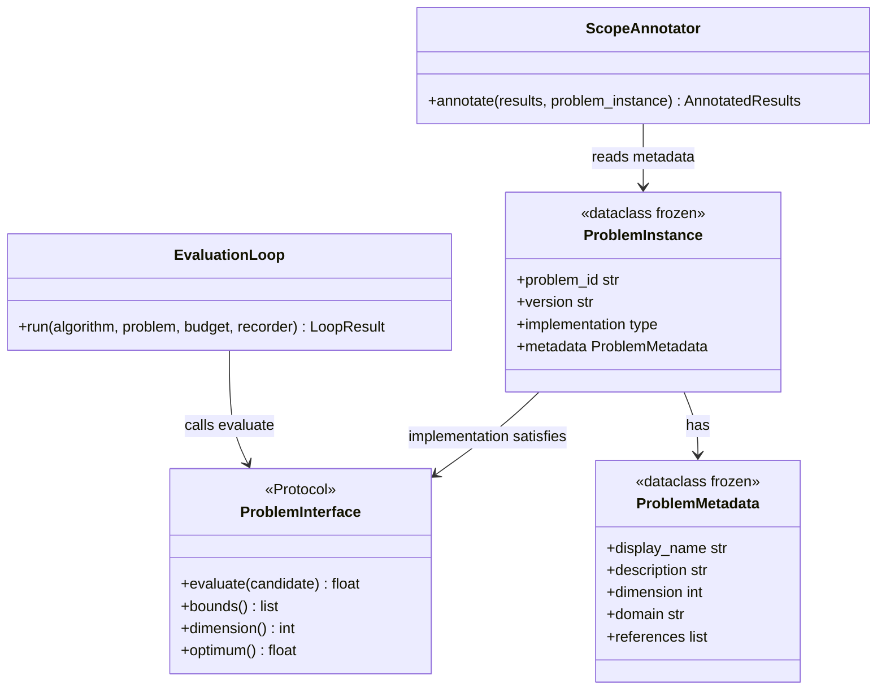

# C4: Code — ProblemInterface

> C4 Index: [../01-index.md](../01-index.md)
> C3 Component (Problem Repository): [../../04-c4-leve3-components/12-problem-repository/01-index.md](../../04-c4-leve3-components/12-problem-repository/01-index.md)
> Technical Contract: [../../../03-technical-contracts/02-interface-contracts/](../../../03-technical-contracts/02-interface-contracts/)

---

## Component

`ProblemInterface` is the structural Protocol that every benchmark problem implementation must
satisfy. It defines the objective function surface exposed to the Evaluation Loop. Changing its
shape forces changes in the Experiment Runner (which calls `evaluate()`), the Problem Repository
(which validates and stores instances), and the Analysis Engine (which uses problem metadata for
scope annotation).

---

## Key Abstractions

### `ProblemInterface`

**Type:** Protocol (PEP 544 structural subtyping)

**Why Protocol, not ABC:** Same rationale as `AlgorithmInterface` — problem implementations
may come from external benchmark suites (COCO, IOHprofiler, Nevergrad benchmark functions)
that cannot inherit from a library-internal base class.

**Purpose:** Provide the Evaluation Loop with a uniform `evaluate()` call regardless of whether
the underlying problem is a synthetic benchmark, a real-world objective, or an adapter wrapping
an external suite.

**Key elements:**

| Method | Semantics |
|---|---|
| `evaluate(candidate)` | Compute the objective value for a given candidate solution |
| `bounds()` | Return the search space bounds as a list of `(lower, upper)` tuples |
| `dimension()` | Return the dimensionality of the search space |
| `optimum()` | Return the known optimum value if available, else `None` |

**Constraints / invariants:**

- `evaluate()` MUST be deterministic given the same candidate. Stochastic problems are not
  supported in V1 (they violate the reproducibility requirement — MANIFESTO Principle 18).
- `evaluate()` MUST NOT modify any global state visible outside the subprocess. The Run
  Isolator's isolation guarantee depends on this.
- `bounds()` and `dimension()` MUST be consistent: `len(bounds()) == dimension()`.
- `optimum()` MAY return `None` for real-world problems with unknown optima. The Analysis
  Engine handles `None` by skipping target-value metrics (e.g., ERT).

**Extension points:**

Problem authors implement this Protocol. Bundled problem instances are in
`data/problem_repository/`. The COCO and IOHprofiler adapters serve as reference
implementations of wrapping external suites.

---

### `ProblemInstance`

**Type:** Dataclass (frozen after registration)

**Purpose:** Pair a `ProblemInterface` implementation with metadata required for registry
storage, reproducibility, and scope annotation in analysis reports.

**Key elements:**

| Field | Semantics |
|---|---|
| `problem_id` | Globally unique string identifier (slug format) |
| `version` | Semantic version string — immutable after registration |
| `implementation` | The `ProblemInterface`-satisfying class (not an instance) |
| `metadata` | `ProblemMetadata` — dimension, domain, difficulty, references |

**Constraints / invariants:**

- `problem_id` + `version` must be unique in the repository.
- Once registered, all fields are immutable (`frozen=True`).
- `metadata.dimension` must equal `implementation().dimension()` — validated by the
  Instance Validator on registration.

---

## Class / Module Diagram

---

## Design Patterns Applied

### Protocol (Structural Subtyping)

**Where used:** `ProblemInterface` itself. Same pattern as `AlgorithmInterface`.

**Implications for contributors:** Implement all four methods with correct arity.
`mypy --strict` will catch missing methods. `bounds()` must return a list of exactly
`dimension()` tuples — validated at registration time, not at runtime.

### Value Object (Frozen Dataclass)

**Where used:** `ProblemInstance`, `ProblemMetadata`.

**Implications for contributors:** Do not attempt to patch a registered problem instance
in-place. Register a new version under the same `problem_id` with an incremented `version`.

---

## Docstring Requirements

All public methods on any class implementing `ProblemInterface`:

- `evaluate()`: document the objective (minimization or maximization), whether the return
  value is noiseless, and any known edge cases at the bounds.
- `bounds()`: document the physical meaning of each dimension's range.
- `optimum()`: if returning a value, cite the source (paper, analytical derivation, or
  numerical approximation); state the precision.

`ProblemInstance` fields:

- `metadata.domain`: use the canonical domain taxonomy from
  `docs/03-technical-contracts/03-metric-taxonomy/` — do not invent new domain strings.
