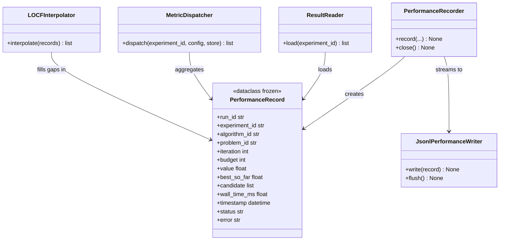

# C4: Code — PerformanceRecord

> C4 Index: [../01-index.md](../01-index.md)
> C3 Component (Performance Recorder): [../../04-c4-leve3-components/03-experiment-runner/05-performance-recorder.md](../../04-c4-leve3-components/03-experiment-runner/05-performance-recorder.md)
> C3 Component (Results Store): [../../04-c4-leve3-components/05-results-store/01-index.md](../../04-c4-leve3-components/05-results-store/01-index.md)
> Technical Contract: [../../../03-technical-contracts/01-data-format/](../../../03-technical-contracts/01-data-format/)

---

## Component

`PerformanceRecord` is the central data type of the system. It is produced by the Evaluation
Loop (via the Performance Recorder), persisted by the Results Store (JSONL → Parquet), loaded
by the Analysis Engine, consumed by the Reporting Engine, and visualized by the Visualization
Engine. Changing its schema affects every pipeline stage.

---

## Key Abstractions

### `PerformanceRecord`

**Type:** Dataclass (frozen — records are immutable once written)

**Purpose:** Represent a single evaluation observation: one call to `problem.evaluate()` from
within the ask/tell cycle. Every metric, plot, and report in the system is derived from a
collection of these records.

**Key elements:**

| Field | Semantics |
|---|---|
| `run_id` | UUID of the Run that produced this record |
| `experiment_id` | UUID of the Experiment this Run belongs to |
| `algorithm_id` | Identifier of the algorithm (resolved from registry) |
| `problem_id` | Identifier of the problem (resolved from repository) |
| `iteration` | Zero-based index of this evaluation within the Run |
| `budget` | Total budget of the Run (enables normalisation across runs) |
| `value` | Raw objective value returned by `problem.evaluate()` — `None` if `status=failed` |
| `best_so_far` | Running minimum (or maximum, per problem) across all evaluations up to this point |
| `candidate` | The solution vector evaluated — list of floats |
| `wall_time_ms` | Wall-clock time of this evaluation in milliseconds |
| `timestamp` | ISO 8601 UTC timestamp of the evaluation |
| `status` | `"success"` or `"failed"` |
| `error` | Exception message if `status=failed`, else `None` |

**Constraints / invariants:**

- `iteration` is monotonically increasing within a `run_id`. Records with the same `run_id`
  and `iteration` must not exist — the JSONL writer appends and never overwrites.
- `best_so_far` is computed by the Performance Recorder, not the algorithm. It is the
  system's authoritative best-value sequence, independent of the algorithm's internal tracking.
- `value` is `None` if and only if `status == "failed"`. The Analysis Engine treats
  `None` values as missing data and applies LOCF interpolation.
- `candidate` length must equal the problem's `dimension()`. Not validated at write time —
  validated by the Analysis Engine before metric computation.
- All fields must be JSON-serializable (enforced by the JSONL writer). `candidate` values
  are serialized as lists of Python `float`, not numpy arrays.

**Extension points:**

This dataclass is intentionally closed to extension. Adding a field requires a schema version
bump and a migration entry in `docs/03-technical-contracts/01-data-format/`. Do not subclass.

---

### `LoopResult`

**Type:** Dataclass

**Purpose:** Summary result returned by the Evaluation Loop to the Run Isolator after a Run
completes. Not persisted directly — the Run Isolator uses it to update the `Run` entity's
status in the JSON Entity Store.

**Key elements:**

| Field | Semantics |
|---|---|
| `evaluations_completed` | Number of evaluations actually performed |
| `best_value` | Best objective value seen across all evaluations |
| `converged` | `True` if algorithm raised `StopIteration` before budget was exhausted |

---

## Class / Module Diagram

---

## Design Patterns Applied

### Immutable Value Object

**Where used:** `PerformanceRecord` (`frozen=True`).

**Why:** Records are an append-only log. Mutability would allow silent data corruption
between the write path (Experiment Runner) and the read path (Analysis Engine). The JSONL
format is also inherently append-only — in-place mutation is impossible at the storage level.

**Implications for contributors:** Never attempt to modify a loaded record. If a field needs
correction, the Run must be re-executed (full reproducibility — MANIFESTO Principle 19).

### Streaming Write with Flush Guarantee

**Where used:** `PerformanceRecorder` + `JsonlPerformanceWriter`.

**Why:** Subprocess crashes must not cause data loss for evaluations already completed.
Streaming append with periodic flush (every 100 records) ensures partial Run data is
preserved.

**Implications for contributors:** Do not buffer `PerformanceRecord` objects before writing.
Call `record()` synchronously after each `tell()`.

---

## Docstring Requirements

`PerformanceRecord`:

- Each field: document the unit (milliseconds, not seconds for `wall_time_ms`), the valid
  range, and the `None` semantics where applicable.
- Class docstring: reference the data format contract in
  `docs/03-technical-contracts/01-data-format/` and state the schema version.

`PerformanceRecorder.record()`:

- Document the flush frequency and the durability guarantee (data is safe after flush, not
  after each write).
- Document the `status=failed` path: which fields are populated, which are `None`.
