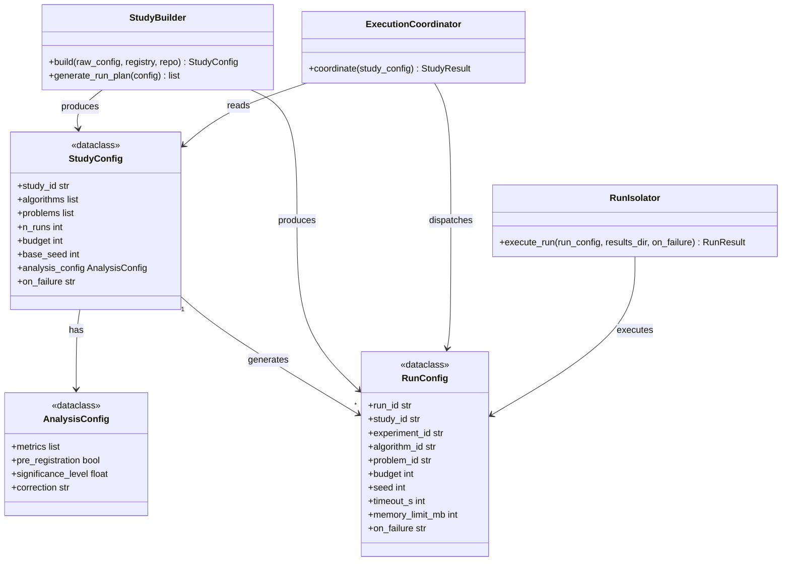

# C4: Code — StudyConfig & RunConfig

> C4 Index: [../01-index.md](../01-index.md)
> C3 Component (Study Builder): [../../04-c4-leve3-components/06-study-orchestrator/02-study-builder.md](../../04-c4-leve3-components/06-study-orchestrator/02-study-builder.md)
> C3 Component (Run Isolator): [../../04-c4-leve3-components/03-experiment-runner/03-run-isolator.md](../../04-c4-leve3-components/03-experiment-runner/03-run-isolator.md)

---

## Component

`StudyConfig` and `RunConfig` are the specification objects that flow from the Public API
through the Study Orchestrator into the Experiment Runner. They are the boundary between
user intent (what the researcher wants to study) and the execution plan (which runs to
execute, in what order, with what seeds). Changing either shape requires changes in the API
Facade, Study Builder, Execution Coordinator, Run Isolator, and Analysis Engine.

---

## Key Abstractions

### `StudyConfig`

**Type:** Dataclass

**Purpose:** Represent the complete, validated specification for a study — after ID resolution,
schema validation, and run plan generation. The Study Builder produces this from the raw user
input dict. Everything downstream operates on `StudyConfig`, never on raw dicts.

**Key elements:**

| Field | Semantics |
|---|---|
| `study_id` | UUID — generated at build time, unique across all studies |
| `algorithms` | List of resolved `AlgorithmInstance` objects |
| `problems` | List of resolved `ProblemInstance` objects |
| `n_runs` | Number of repetitions per algorithm/problem pair |
| `budget` | Number of objective function evaluations per run |
| `base_seed` | Study-level seed used to derive per-run seeds deterministically |
| `analysis_config` | `AnalysisConfig` — which metrics to compute, significance level, pre-registration flag |
| `on_failure` | `"skip"` or `"abort"` — failure policy for the Run Isolator |

**Constraints / invariants:**

- `algorithms` and `problems` are non-empty lists. The Study Builder raises
  `StudyValidationError` if either resolves to zero entries.
- `budget` must be a positive integer. `n_runs` must be ≥ 1.
- `base_seed` is stored as-is; per-run seeds are derived by the Seed Manager using
  `hash(base_seed + run_id)` — not by the Study Builder.
- `StudyConfig` is NOT frozen. The Execution Coordinator may update `status` fields on the
  associated `Study` entity as runs complete, but does not mutate `StudyConfig` itself.
- `StudyConfig` must be JSON-serializable (enforced when persisted via the JSON Entity Store).

---

### `RunConfig`

**Type:** Dataclass

**Purpose:** Represent the execution specification for a single Run — one algorithm × one
problem × one seed. Generated by `StudyBuilder.generate_run_plan()` as the Cartesian product.
Passed by the Execution Coordinator to the Run Isolator for subprocess execution.

**Key elements:**

| Field | Semantics |
|---|---|
| `run_id` | UUID — unique across all runs, all studies |
| `study_id` | Parent study reference |
| `experiment_id` | Parent experiment reference |
| `algorithm_id` | ID string (resolved from `AlgorithmInstance`) |
| `problem_id` | ID string (resolved from `ProblemInstance`) |
| `budget` | Inherited from `StudyConfig.budget` |
| `seed` | Per-run seed derived by the Seed Manager from `base_seed` + `run_id` |
| `timeout_s` | Optional wall-clock timeout — `None` means unlimited |
| `memory_limit_mb` | Optional memory cap — `None` means unlimited |
| `on_failure` | Inherited from `StudyConfig.on_failure` |

**Constraints / invariants:**

- `run_id` is a UUID generated by the Study Builder. It is stable across resume — the same
  run retried after failure uses the same `run_id`.
- `seed` is set by the Seed Manager at subprocess start, not by the Study Builder. The
  `RunConfig.seed` field is populated after the Run Isolator calls `SeedManager.generate_seed()`.

---

### `AnalysisConfig`

**Type:** Dataclass

**Purpose:** Specify which metrics to compute and how to test them statistically. Carried
inside `StudyConfig` and passed unchanged to the Metric Dispatcher.

**Key elements:**

| Field | Semantics |
|---|---|
| `metrics` | List of metric names — must match the metric taxonomy |
| `pre_registration` | If `True`, the Metric Dispatcher enforces that no metrics are added post-hoc |
| `significance_level` | α for statistical tests (default: 0.05) |
| `correction` | Multiple-comparison correction method (`"bonferroni"`, `"holm"`, or `None`) |

---

## Class / Module Diagram

---

## Design Patterns Applied

### Specification Object

**Where used:** `StudyConfig` and `RunConfig`.

**Why:** Separating the specification (what to run) from the executor (how to run it) allows
the Study Builder to fully validate the spec before any subprocess is spawned. Errors are
caught early, at build time, not mid-execution.

**Implications for contributors:** Do not add execution logic to `StudyConfig` or `RunConfig`.
They are pure data; all decision-making belongs in `StudyBuilder` or `RunIsolator`.

### Builder Pattern

**Where used:** `StudyBuilder.build()` + `generate_run_plan()`.

**Why:** Construction of a valid `StudyConfig` requires ID resolution (registry calls),
schema validation, and cross-field consistency checks. The Builder encapsulates this
complexity and ensures the output is always valid.

**Implications for contributors:** `StudyConfig` should never be constructed directly from
user input — always go through `StudyBuilder.build()`.

---

## Docstring Requirements

`StudyConfig`:

- Class docstring: state that this object is always produced by `StudyBuilder`, never
  constructed directly from user input.
- `base_seed`: document that per-run seeds are derived from this value by the Seed Manager,
  not embedded directly in `RunConfig` at build time.

`RunConfig`:

- `seed`: document the timing — populated by `SeedManager.generate_seed()` at subprocess
  start, not at study build time. The value in the persisted `run.json` is the authoritative
  seed for that run.
- `on_failure`: document the two modes and their effect on the Execution Coordinator's
  behaviour when a run fails.

`AnalysisConfig.pre_registration`:

- Document the enforcement mechanism (raises `PreRegistrationViolationError` if metrics
  deviate from the registered set) and cite MANIFESTO Principle 16.
