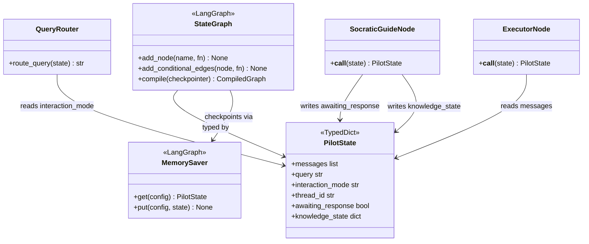

# C4: Code — PilotState

> C4 Index: [../01-index.md](../01-index.md)
> C3 Component (LangGraph Graph): [../../04-c4-leve3-components/02-corvus-pilot/03-langgraph-graph.md](../../04-c4-leve3-components/02-corvus-pilot/03-langgraph-graph.md)
> C3 Index (Corvus Pilot V2): [../../04-c4-leve3-components/02-corvus-pilot/01-index.md](../../04-c4-leve3-components/02-corvus-pilot/01-index.md)

---

## Component

`PilotState` is the shared conversation state that flows through all seven agent nodes in the
Corvus Pilot V2 LangGraph graph. Every node reads from it and may write to it. Changing its
shape requires updating every node function, the Query Router's conditional edge logic, the
MemorySaver checkpoint schema, and the CLI's input/output mapping.

---

## Key Abstractions

### `PilotState`

**Type:** TypedDict (LangGraph state schema)

**Why TypedDict, not dataclass:** LangGraph's `StateGraph` requires the state schema to be
expressed as a `TypedDict` for runtime type annotation introspection. This is a LangGraph
framework constraint, not a design preference.

**Purpose:** Carry the full conversation context — message history, routing intent,
interaction mode, and Socratic tracking state — across all nodes and across multiple turns
of a session (via `MemorySaver` checkpointing keyed by `thread_id`).

**Key elements:**

| Field | Semantics |
|---|---|
| `messages` | Full conversation history as `list[BaseMessage]`. Each node appends; nothing is removed. Consumed by every LLM-calling node. |
| `query` | The current user input string. Set at graph entry; read by the Query Router and all agent nodes. |
| `interaction_mode` | `"direct_answer"` or `"socratic"`. Set at session start by the CLI; propagated unchanged through all turns unless explicitly changed. |
| `thread_id` | Session identifier. Used as the MemorySaver checkpoint key. Changing `thread_id` starts a fresh session. |
| `awaiting_response` | `True` when the Socratic Guide Node has posed a question and is waiting for the Learner's reply. Controls re-routing on the next turn. |
| `knowledge_state` | Dict populated by the Socratic Guide Node with its current assessment of what the Learner knows. `None` until the first Socratic turn. |

**Constraints / invariants:**

- `messages` is append-only across the session lifetime. No node removes or replaces
  existing messages — only appends new `AIMessage` or `HumanMessage` objects.
- `interaction_mode` must not be changed by any agent node. Only the CLI command interface
  may change it. If changed mid-session, the LangGraph Graph resets `awaiting_response=False`
  and `knowledge_state=None`.
- `awaiting_response` and `knowledge_state` are only written by the Socratic Guide Node. All
  other nodes treat them as read-only.
- `thread_id` must be set before calling `graph.invoke()`. The CLI generates it as a UUID
  per user session.

**Extension points:**

Adding a new agent node that requires new per-session state should add a new field to
`PilotState`. The field must have a `None` default to preserve backwards compatibility with
existing `MemorySaver` checkpoints. Document the owning node (the single node responsible
for writing the field) in the field's `TypedDict` annotation comment.

---

### `SessionMemory`

**Type:** LangGraph `MemorySaver` (third-party, not owned)

**Why documented here:** The checkpointing contract is an architectural decision — `PilotState`
fields that are checkpointed must remain serializable across library versions. Breaking this
means existing user sessions are lost on upgrade.

**Purpose:** Persist the full `PilotState` between `graph.invoke()` calls for the same
`thread_id`, enabling multi-turn conversation continuity.

**Constraints / invariants:**

- All values in `PilotState` must be JSON-serializable for `MemorySaver` to checkpoint
  them. `BaseMessage` objects are serialized via LangChain's built-in serializers.
- For production deployments requiring cross-process or persistent sessions, `MemorySaver`
  can be replaced with `SqliteSaver` or a custom checkpointer — the `PilotState` schema
  does not change.

---

## Class / Module Diagram

---

## Design Patterns Applied

### Shared Mutable State (Controlled via TypedDict)

**Where used:** `PilotState` passed through all graph nodes.

**Why:** LangGraph's execution model passes state through the graph as a single shared object.
The design choice here is field ownership — each field is written by exactly one node
(documented above). This prevents concurrent write conflicts and makes the state evolution
traceable.

**Implications for contributors:** When adding a node, document which field(s) it owns (writes
to) and which it only reads. Never write to a field owned by another node.

### Checkpoint-Compatible Schema Versioning

**Where used:** `PilotState` + `MemorySaver`.

**Why:** User sessions span multiple turns and potentially multiple process restarts. The state
schema must remain deserializable from older checkpoints.

**Implications for contributors:** New fields must have `None` as their default to avoid
deserialization failures when loading checkpoints written before the field existed.

---

## Docstring Requirements

`PilotState` field annotations:

- Each field comment must name the owning node (the one that writes it) and describe the
  semantics at session start vs. mid-session.
- `knowledge_state`: document the expected dict schema — keys, value types, and what
  `None` means vs. an empty dict.

Node `__call__` methods:

- Document which `PilotState` fields are read and which are written.
- Document the return value: the full updated `PilotState` dict (LangGraph merges it into
  the checkpoint, so partial dicts are valid return values).
