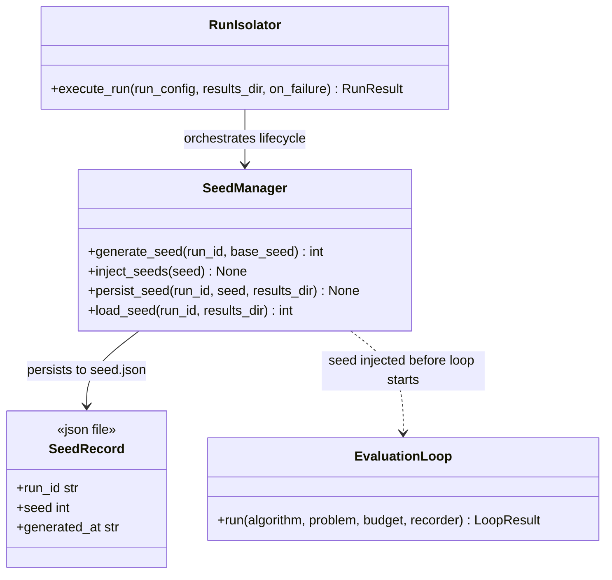

# C4: Code — SeedManager

> C4 Index: [../01-index.md](../01-index.md)
> C3 Component: [../../04-c4-leve3-components/03-experiment-runner/02-seed-manager.md](../../04-c4-leve3-components/03-experiment-runner/02-seed-manager.md)
> C3 Index (Experiment Runner): [../../04-c4-leve3-components/03-experiment-runner/01-index.md](../../04-c4-leve3-components/03-experiment-runner/01-index.md)

---

## Component

`SeedManager` is the reproducibility enforcement boundary of the Experiment Runner. It
generates a unique, deterministic seed for each Run, injects it into all known random-number
sources before any algorithm code executes, and persists it to the filesystem. Changing the
seed derivation formula or injection order would break reproducibility guarantees across the
entire system (MANIFESTO Principle 18).

---

## Key Abstractions

### `SeedManager`

**Type:** Class (stateless after construction)

**Purpose:** Encapsulate the complete reproducibility contract for a single Run subprocess:
derive → inject → persist → (optionally) reload. Any code path that touches randomness in a
Run subprocess must go through this class.

**Key elements:**

| Method | Semantics |
|---|---|
| `generate_seed(run_id, base_seed)` | Derive a unique seed from `run_id` + `base_seed` using SHA-256. Deterministic — same inputs always produce the same seed. |
| `inject_seeds(seed)` | Set `random.seed()`, `numpy.random.seed()`, `torch.manual_seed()` (if importable) to `seed`. Called before algorithm `__init__`. |
| `persist_seed(run_id, seed, results_dir)` | Write `{"run_id", "seed", "generated_at"}` to `{results_dir}/{run_id}/seed.json`. |
| `load_seed(run_id, results_dir)` | Read and return the persisted seed for a resumed Run. Returns the stored value — does not regenerate. |

**Constraints / invariants:**

- `inject_seeds()` MUST be called before the algorithm's `__init__` is invoked. The Run
  Isolator enforces this order: `generate_seed()` → `persist_seed()` → `inject_seeds()` →
  instantiate algorithm → run `EvaluationLoop`.
- `inject_seeds()` sets seeds on ALL importable random sources. Omitting any source
  (e.g., skipping `torch` when it is available) creates a reproducibility gap. The injection
  order is fixed and must not be changed without updating this document and the C3 spec.
- `generate_seed()` must be pure: no side effects, no I/O. It must return the same value
  for the same inputs across Python versions and platforms (SHA-256 is used specifically for
  this cross-platform stability guarantee).
- If `seed.json` already exists for a `run_id` (resume path), `load_seed()` is used instead
  of `generate_seed()`. The Run Isolator checks for existence before calling either.

**Derivation formula (normative):**

```python
import hashlib
digest = hashlib.sha256(f"{base_seed}:{run_id}".encode()).digest()[:4]
seed = int.from_bytes(digest, byteorder="big")  # value in [0, 2^32)
```

Any change to this formula is a breaking change — all previously recorded seeds become
inconsistent with re-generated ones. Document in a dedicated ADR.

**Extension points:**

To support new random libraries (e.g., `jax.random`), add a new injection call to
`inject_seeds()`. The method must check importability at call time (not at module import)
to avoid making the library a hard dependency.

---

## Class / Module Diagram



---

## Design Patterns Applied

### Deterministic Hash-Based Derivation

**Where used:** `SeedManager.generate_seed()`.

**Why:** A simple counter or sequential seed would produce correlated random sequences across
runs. SHA-256 of `(base_seed, run_id)` produces statistically independent seeds regardless of
run ordering, enabling embarrassingly parallel execution without seed collisions.

**Implications for contributors:** Do not use `hash()` (Python's built-in, which is
randomised per-process since Python 3.3). Use `hashlib.sha256` with the exact formula above.

### Filesystem-Backed Idempotency

**Where used:** `persist_seed()` + `load_seed()`.

**Why:** Runs may be interrupted and resumed. The filesystem is the source of truth for which
seed was used. Regenerating the seed on resume would risk inconsistency if the derivation
formula had changed between attempts.

**Implications for contributors:** The Run Isolator must check for `seed.json` existence
before deciding whether to call `generate_seed()` or `load_seed()`. This check is the
Run Isolator's responsibility, not the Seed Manager's.

---

## Docstring Requirements

`SeedManager.generate_seed()`:

- State the exact derivation formula (as above) so contributors can verify consistency.
- State that the result is in `[0, 2^32)` and explain why (numpy requires 32-bit seeds).

`SeedManager.inject_seeds()`:

- List every random source that is set, in the order they are set.
- State the torch conditionality: only injected if `torch` can be imported at call time.
- Document reproducibility contract: after this call returns, the algorithm's `__init__`
  must be the next code executed that uses randomness.

`SeedManager.load_seed()`:

- Document the exception raised if `seed.json` does not exist (the caller is expected to
  check existence first, but document the fallback error for unexpected paths).
