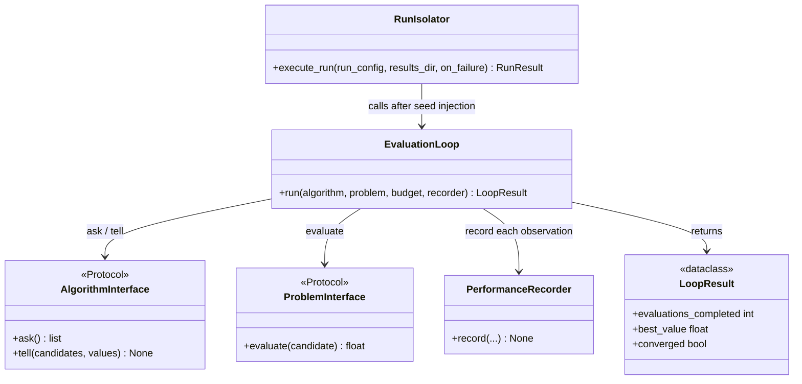

# C4: Code — EvaluationLoop

> C4 Index: [../01-index.md](../01-index.md)
> C3 Component: [../../04-c4-leve3-components/03-experiment-runner/04-evaluation-loop.md](../../04-c4-leve3-components/03-experiment-runner/04-evaluation-loop.md)
> C3 Index (Experiment Runner): [../../04-c4-leve3-components/03-experiment-runner/01-index.md](../../04-c4-leve3-components/03-experiment-runner/01-index.md)

---

## Component

`EvaluationLoop` is the execution contract between the system's infrastructure and the
algorithm/problem pair. It is the only place in the system that calls `algorithm.ask()`,
`problem.evaluate()`, and `algorithm.tell()`. Changing its loop semantics — budget
enforcement, error isolation, best-so-far tracking — changes the observable behaviour of
every benchmarking Run.

---

## Key Abstractions

### `EvaluationLoop`

**Type:** Class

**Purpose:** Drive the ask/tell cycle for exactly `budget` evaluations, record every
observation via the Performance Recorder, and return a `LoopResult` summary. The loop owns
the budget counter — algorithms cannot stop it early except via `StopIteration`.

**Key elements:**

| Method | Semantics |
|---|---|
| `run(algorithm, problem, budget, recorder)` | Execute the full ask/tell cycle. Returns `LoopResult`. |

**The normative loop (invariant — do not change without updating C3 spec and an ADR):**

```
for i in range(budget):
    candidates = algorithm.ask()
    values = [problem.evaluate(c) for c in candidates]
    algorithm.tell(candidates, values)
    recorder.record(iteration=i, candidates=candidates, values=values, ...)
```

**Constraints / invariants:**

- `algorithm.ask()` is called before `problem.evaluate()`. The order is never reversed.
- `recorder.record()` is called after every `algorithm.tell()`, unconditionally — including
  on failed evaluations. The full evaluation history is always recorded.
- The loop runs for exactly `budget` iterations unless the algorithm raises `StopIteration`
  (early convergence). Any other exception from `algorithm.ask()` or `algorithm.tell()` is
  re-raised — algorithm failures abort the Run.
- If `problem.evaluate()` raises an exception, the loop catches it, records the evaluation as
  `status="failed"` with the exception message, and continues to the next iteration. Problem
  failures do not abort the Run.
- `best_so_far` is maintained by the loop, not the algorithm. After each `tell()`, the loop
  updates its internal best-value tracker and passes it to the recorder.
- Wall-clock time is measured per evaluation (time of `problem.evaluate()` call only, not
  `ask()` or `tell()`).

**Extension points:**

There are no extension points. The loop is intentionally closed to subclassing. Any
variation in loop behaviour (e.g., multi-fidelity evaluation, batch evaluation) requires a
new loop class and a corresponding ADR justifying the divergence.

---

### `LoopResult`

**Type:** Dataclass

**Purpose:** Return summary information from a completed loop to the Run Isolator. Used to
update the `Run` entity's status in the JSON Entity Store.

**Key elements:**

| Field | Semantics |
|---|---|
| `evaluations_completed` | Number of evaluations actually performed (≤ `budget`) |
| `best_value` | Best objective value seen across all successful evaluations |
| `converged` | `True` if `StopIteration` was raised by the algorithm before `budget` was reached |

---

## Class / Module Diagram



---

## Design Patterns Applied

### Template Method (Inverted)

**Where used:** The normative loop itself.

**Why:** Rather than subclassing the loop to vary behaviour, the loop is closed and its
three collaborators (`AlgorithmInterface`, `ProblemInterface`, `PerformanceRecorder`) are
injected. Variation lives in the implementations of those protocols, not in the loop.

**Implications for contributors:** If you need a different loop structure for a new
evaluation paradigm (e.g., multi-fidelity), create a new loop class. Do not modify the
existing loop to add conditional paths — each conditional makes the budget semantics
ambiguous.

### Fail-Partial (Problem Errors vs. Algorithm Errors)

**Where used:** Exception handling inside `run()`.

**Why:** Problem evaluation failures are treated as partial data (recorded and continued)
because the algorithm has no way to request a re-evaluation — it already called `ask()`.
Algorithm failures abort the run because a misbehaving algorithm makes all subsequent
observations unreliable.

**Implications for contributors:** Do not catch exceptions from `algorithm.ask()` or
`algorithm.tell()` within the loop. These propagate to the Run Isolator's failure handling
(`on_failure` policy).

---

## Docstring Requirements

`EvaluationLoop.run()`:

- State the exact loop semantics (ask → evaluate → tell → record) in the docstring. The
  order is normative, not incidental.
- Document the two exception categories: problem failures (caught, recorded, continued) vs.
  algorithm failures (re-raised).
- Document the `best_so_far` tracking: the loop maintains it, the algorithm does not.
- Document what "budget" means: exactly `budget` calls to `problem.evaluate()` per
  candidate in the batch, unless `StopIteration` is raised.

`LoopResult`:

- `converged`: document that this field does NOT mean the algorithm found the optimum —
  it means the algorithm signalled it had no more candidates to evaluate.
