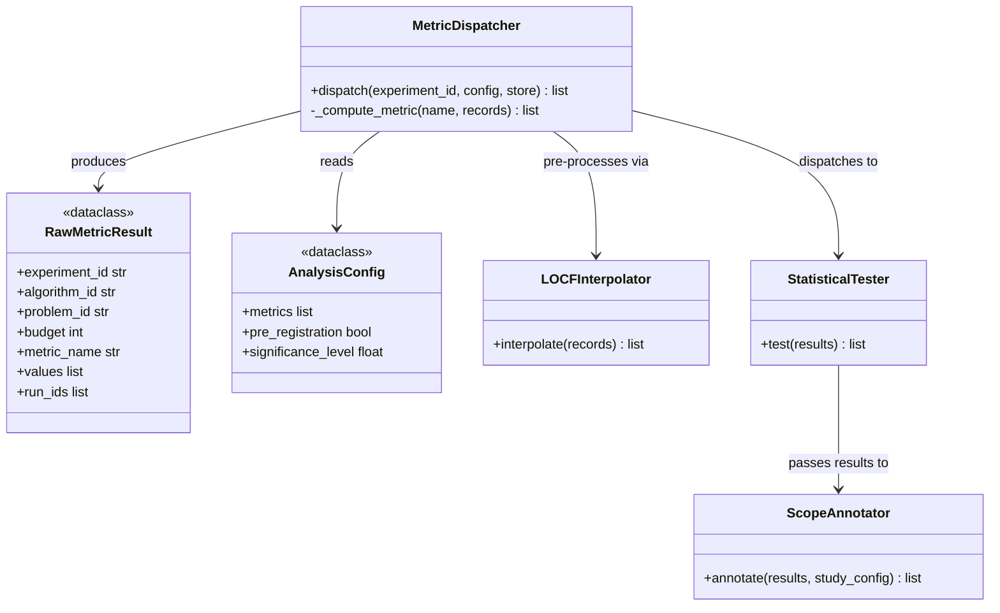

# C4: Code — MetricDispatcher

> C4 Index: [../01-index.md](../01-index.md)
> C3 Component: [../../04-c4-leve3-components/04-analysis-engine/02-metric-dispatcher.md](../../04-c4-leve3-components/04-analysis-engine/02-metric-dispatcher.md)
> C3 Index (Analysis Engine): [../../04-c4-leve3-components/04-analysis-engine/01-index.md](../../04-c4-leve3-components/04-analysis-engine/01-index.md)
> Metric Taxonomy: [../../../03-technical-contracts/03-metric-taxonomy/](../../../03-technical-contracts/03-metric-taxonomy/)

---

## Component

`MetricDispatcher` is the routing abstraction of the Analysis Engine. It maps each metric
name in the `AnalysisConfig` to a concrete computation, then dispatches results to the
Statistical Tester. Extending the system with a new benchmark metric requires changing this
component — it is the single authoritative map from metric name to computation logic.

---

## Key Abstractions

### `MetricDispatcher`

**Type:** Class

**Purpose:** Orchestrate the full analysis pipeline for a completed experiment: load records,
interpolate missing data, compute all configured metrics, and hand off raw results to the
Statistical Tester. It is the entry point for the entire Analysis Engine.

**Key elements:**

| Method | Semantics |
|---|---|
| `dispatch(experiment_id, analysis_config, store)` | Load records, compute metrics, return `list[RawMetricResult]` |

**Constraints / invariants:**

- Before any metric computation, `dispatch()` MUST verify that the requested metrics are
  registered in the metric taxonomy. Unknown metric names raise `UnknownMetricError`.
- If `analysis_config.pre_registration` is `True`, the requested metrics must exactly match
  the pre-registered set for this experiment. Any deviation (added or removed metrics) raises
  `PreRegistrationViolationError` (MANIFESTO Principle 16 — planning precedes execution).
- LOCF interpolation is applied to ALL records before any metric computation. Records that
  are still missing after interpolation are excluded and flagged in the returned results.
- Metrics are computed independently per `(algorithm_id, problem_id)` pair. There is no
  cross-pair state.
- Results are grouped into `RawMetricResult` before being passed to the Statistical Tester.
  The dispatcher does NOT perform statistical testing itself.

**Metric registry (normative):**

The dispatcher uses an internal registry that maps metric name strings to callable
computation functions. This is the extension point for new metrics:

```python
_METRIC_REGISTRY: dict[str, Callable[[list[PerformanceRecord]], list[float]]] = {
    "QUALITY-BEST_VALUE_AT_BUDGET": _compute_best_value_at_budget,
    "ERT":                          _compute_ert,
    "AUC-CONVERGENCE":              _compute_auc_convergence,
}
```

Adding a new metric: add an entry to `_METRIC_REGISTRY` and a corresponding definition in
`docs/03-technical-contracts/03-metric-taxonomy/`. Both changes must be in the same PR.

**Extension points:**

New metrics are added via `_METRIC_REGISTRY`. The callable receives
`list[PerformanceRecord]` for a single `(algorithm_id, problem_id)` pair and returns
`list[float]` — one value per run. This interface must not be changed; all metric
implementations must fit this signature.

---

### `RawMetricResult`

**Type:** Dataclass

**Purpose:** Carry per-metric, per-pair raw values from the dispatcher to the Statistical
Tester. One instance per unique `(experiment_id, algorithm_id, problem_id, metric_name)`.

**Key elements:**

| Field | Semantics |
|---|---|
| `experiment_id` | Parent experiment |
| `algorithm_id` | Algorithm whose runs produced these values |
| `problem_id` | Problem on which the runs were executed |
| `budget` | Budget at which the metric was computed |
| `metric_name` | Must match a key in the metric taxonomy |
| `values` | One float per run — the raw metric value for that run |
| `run_ids` | Corresponding run IDs (parallel list with `values`) |

---

### `AnalysisConfig`

See [../02-cross-cutting/04-study-spec.md](../02-cross-cutting/04-study-spec.md).

---

## Class / Module Diagram



---

## Design Patterns Applied

### Registry Pattern

**Where used:** `_METRIC_REGISTRY` dict inside `MetricDispatcher`.

**Why:** Decouples metric name resolution from the dispatch logic. New metrics are added by
registering a new key, not by modifying the dispatch switch statement. The registry is the
single source of truth for which metric names are valid.

**Implications for contributors:** Do not add `if metric_name == "MY_METRIC"` conditionals
to `dispatch()`. Register the computation callable in `_METRIC_REGISTRY` and add its
definition to the metric taxonomy document.

### Pre-Registration Enforcement

**Where used:** `dispatch()` pre-flight check.

**Why:** MANIFESTO Principle 16 (planning precedes execution) and the scientific validity
requirement that analysis choices must not be made after seeing the data. The dispatcher is
the only place in the system where this constraint can be enforced programmatically.

**Implications for contributors:** Tests that exercise the pre-registration path must set
`analysis_config.pre_registration=True` and verify that `PreRegistrationViolationError` is
raised when metrics deviate from the registered set.

---

## Docstring Requirements

`MetricDispatcher.dispatch()`:

- Document the pre-registration check as the first step — before any data is loaded.
- Document what "excluded and flagged" means for records that remain missing after LOCF:
  the `RawMetricResult` for that pair will have `values=[]` and a corresponding warning
  logged to the session.
- Reference the metric taxonomy document for valid `metric_name` values.

`RawMetricResult.values`:

- Document that this list is parallel to `run_ids` — `values[i]` corresponds to `run_ids[i]`.
- Document the `None` handling: if a run produced no valid records after LOCF, its entry
  in `values` is `float("nan")`, not omitted (to preserve the parallel structure).

Metric computation functions in `_METRIC_REGISTRY`:

- Each function must reference the metric definition in the metric taxonomy by name.
- Each function must document what it returns for a run that produced only failed
  evaluations (`status="failed"` for all records).
