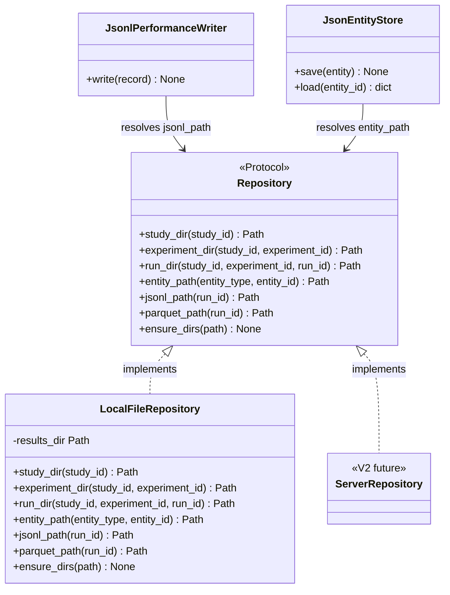

# C4: Code — Repository Protocol

> C4 Index: [../01-index.md](../01-index.md)
> C3 Component (Local File Repository): [../../04-c4-leve3-components/05-results-store/02-local-file-repository.md](../../04-c4-leve3-components/05-results-store/02-local-file-repository.md)
> C3 Index (Results Store): [../../04-c4-leve3-components/05-results-store/01-index.md](../../04-c4-leve3-components/05-results-store/01-index.md)
> ADR: [../../01-adr/adr-001-library-with-server-ready-data-layer.md](../../01-adr/adr-001-library-with-server-ready-data-layer.md)

---

## Component

`Repository` is the path-resolution Protocol that every Results Store component uses to
locate artifacts on the filesystem. It is the V1→V2 swap point: `LocalFileRepository` backs
all storage in V1; a `ServerRepository` can be plugged in for V2 without changing any other
component. Every component that reads or writes study artifacts depends on this abstraction.

---

## Key Abstractions

### `Repository`

**Type:** Protocol (PEP 544 structural subtyping)

**Why Protocol:** The V1→V2 migration requirement (ADR-001) demands that the storage backend
be swappable without modifying library code. Protocol achieves this without forcing a shared
base class onto implementations that may live in separate packages (e.g., a `corvus-server`
package providing `ServerRepository`).

**Purpose:** Provide canonical path resolution for all study artifacts — study directories,
run directories, JSONL files, Parquet files, entity JSON files — so that no component
constructs paths independently.

**Key elements:**

| Method | Semantics |
|---|---|
| `study_dir(study_id)` | Canonical root directory for a study's artifacts |
| `experiment_dir(study_id, experiment_id)` | Canonical directory for an experiment's artifacts |
| `run_dir(study_id, experiment_id, run_id)` | Canonical directory for a single run's artifacts |
| `entity_path(entity_type, entity_id)` | Canonical path for a JSON entity file |
| `jsonl_path(run_id)` | Canonical path for a run's JSONL performance log |
| `parquet_path(run_id)` | Canonical path for a run's Parquet performance file |
| `ensure_dirs(path)` | Create all intermediate directories; idempotent |

**Constraints / invariants:**

- All returned paths must be absolute. Relative paths would break if the working directory
  changes between calls.
- `ensure_dirs()` must be idempotent — calling it on an already-existing path must not raise.
- `jsonl_path(run_id)` and `parquet_path(run_id)` must refer to the same logical dataset
  in two formats. The JSONL is the write-time format; the Parquet is the post-run conversion.
  Their parent directory must be the same `run_dir`.
- The path hierarchy must be stable across library versions. Changing it breaks all
  previously written studies. Any change requires a migration entry in the data format
  contract.

**The canonical V1 directory structure (normative):**

```
{results_dir}/
  studies/{study_id}/study.json
  experiments/{experiment_id}/experiment.json
  runs/{run_id}/
    run.json
    seed.json
    performance_records.jsonl
    performance_records.parquet
    run.log
```

**Extension points:**

`ServerRepository` (V2) must satisfy all method signatures above. It may return URI-based
paths (e.g., `s3://bucket/runs/{run_id}/performance.jsonl`) as long as the calling components
handle URI-based paths. If URI handling requires changes in callers, that is a design
violation — callers must not need to know which backend is in use.

---

### `LocalFileRepository`

**Type:** Class implementing `Repository`

**Purpose:** V1 implementation of `Repository` backed by the local filesystem. Constructed
with a `results_dir: Path` root; all paths are computed relative to it.

**Key elements:**

| Attribute | Semantics |
|---|---|
| `results_dir` | Root directory for all study artifacts — set at construction, immutable |

**Constraints / invariants:**

- `results_dir` must be an absolute path. Relative paths are rejected at construction with
  `ValueError`.
- `LocalFileRepository` holds no open file handles. It is a pure path-computation service.
- Callers are responsible for checking path existence before writing. The repository does
  not guard against overwrites.

---

## Class / Module Diagram



---

## Design Patterns Applied

### Repository Pattern (Path Resolution Variant)

**Where used:** `Repository` Protocol + `LocalFileRepository`.

**Why:** Centralising path resolution into a single Protocol ensures that changing the
directory layout requires exactly one code change — in the `Repository` implementation.
Without this, paths would be scattered across `JsonlPerformanceWriter`, `JsonEntityStore`,
`PerformanceRecorder`, and others.

**Implications for contributors:** Never construct artifact paths manually. Always call
the relevant `Repository` method. If a new artifact type is introduced, add a new method
to the `Repository` Protocol first, then implement it in `LocalFileRepository`.

### Adapter Seam for V1→V2

**Where used:** `Repository` Protocol as the injection point.

**Why:** ADR-001 requires that switching from local file storage (V1) to a platform server
(V2) does not modify library code. The `Repository` Protocol is the seam where this swap
happens. In V1, all components receive a `LocalFileRepository` via dependency injection.
In V2, they receive a `ServerRepository` — no other change required.

**Implications for contributors:** All components that need storage access must accept a
`Repository` argument (constructor injection), not create a `LocalFileRepository` directly.
Hard-coding `LocalFileRepository` inside a component breaks the V1→V2 seam.

---

## Docstring Requirements

`Repository` Protocol methods:

- Each method: document the return type precisely (`pathlib.Path` for V1; state that V2
  implementations may return subclasses or URI-compatible path types).
- `ensure_dirs()`: document the idempotency guarantee and that it creates all intermediate
  directories (equivalent to `mkdir -p`).

`LocalFileRepository.__init__()`:

- Document the `ValueError` raised on relative `results_dir`.
- Document that the directory is not created at construction — callers must call
  `ensure_dirs()` before writing.
