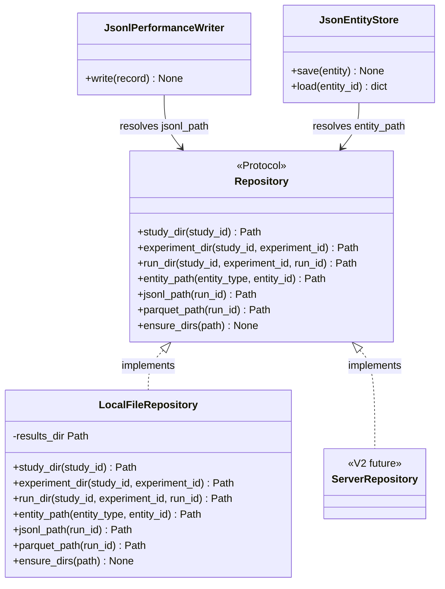

# C4: Code — Repository Protocol

> C4 Index: [../01-index.md](../01-index.md)
> C3 Component (Local File Repository): [../../04-c4-leve3-components/05-results-store/02-local-file-repository.md](../../03-c4-leve2-containers/04-c4-leve3-components/05-results-store/02-local-file-repository.md)
> C3 Index (Results Store): [../../04-c4-leve3-components/05-results-store/01-index.md](../../03-c4-leve2-containers/04-c4-leve3-components/05-results-store/01-index.md)
> ADR: [../../adr/ADR-001-library-with-server-ready-data-layer.md](../../01-adr/adr-001-library-with-server-ready-data-layer.md)

---

## Component

`Repository` is the path-resolution Protocol that every Results Store component uses to
locate artifacts on the filesystem. It is the V1→V2 swap point: `LocalFileRepository` backs
all storage in V1; a `ServerRepository` can be plugged in for V2 without changing any other
component. Every component that reads or writes study artifacts depends on this abstraction.

---

## Key Abstractions

> **Descriptive document (ADR-012).** The authoritative definition is the contract cited
> below. This page explains only how that contract is grouped into a component and why the
> boundary falls where it does. It does not define signatures.

### `RepositoryFactory`

**Type:** Abstract base class, defined in
[`06-repository-interface.md`](../../../../03-technical-contracts/02-interface-contracts/06-repository-interface.md).

**Purpose:** group the seven domain repositories behind one object so that components needing
cross-entity access receive a single dependency. It is the V1 to V2 swap point:
`LocalFileRepository` backs storage in V1, and a `ServerRepository` can replace it without
changing any consumer.

**Surface:** the properties `problems`, `algorithms`, `studies`, `experiments`, `runs`,
`aggregates` and `reports`, each returning the corresponding domain repository. Method
signatures for those repositories are in the contract and are not restated here.

**Constraints / invariants:**

- No method accepts or returns a filesystem path. ADR-001 makes the on-disk layout an
  implementation detail of `LocalFileRepository`; a path-resolution interface would promote
  that layout into the contract and make the V2 swap impossible, which is the opposite of what
  ADR-001 exists to guarantee.
- Entities are addressed by UUID string only (ADR-014). There is no version parameter:
  entities are immutable and a revision is a new entity linked by `superseded_by` (ADR-020).
- Consumer code never traverses the store. Anything a component needs, it obtains through a
  repository property.

## Class / Module Diagram

```mermaid
classDiagram
  class Repository {
    <<Protocol>>
    +study_dir(study_id) Path
    +experiment_dir(study_id, experiment_id) Path
    +run_dir(study_id, experiment_id, run_id) Path
    +entity_path(entity_type, entity_id) Path
    +jsonl_path(run_id) Path
    +parquet_path(run_id) Path
    +ensure_dirs(path) None
  }

  class LocalFileRepository {
    -results_dir Path
    +study_dir(study_id) Path
    +experiment_dir(study_id, experiment_id) Path
    +run_dir(study_id, experiment_id, run_id) Path
    +entity_path(entity_type, entity_id) Path
    +jsonl_path(run_id) Path
    +parquet_path(run_id) Path
    +ensure_dirs(path) None
  }

  class ServerRepository {
    <<V2 future>>
  }

  class JsonlPerformanceWriter {
    +write(record) None
  }

  class JsonEntityStore {
    +save(entity) None
    +load(entity_id) dict
  }

  Repository <|.. LocalFileRepository : implements
  Repository <|.. ServerRepository : implements
  JsonlPerformanceWriter --> Repository : resolves jsonl_path
  JsonEntityStore --> Repository : resolves entity_path
```

---

## Design Patterns Applied

### Repository Pattern (Path Resolution Variant)

**Where used:** `Repository` Protocol + `LocalFileRepository`.

**Why:** Centralising path resolution into a single Protocol ensures that changing the
directory layout requires exactly one code change — in the `Repository` implementation.
Without this, paths would be scattered across `JsonlPerformanceWriter`, `JsonEntityStore`,
`PerformanceRecorder`, and others.

**Implications for contributors:** Never construct artifact paths manually. Always call
the relevant `Repository` method. If a new artifact type is introduced, add a new method
to the `Repository` Protocol first, then implement it in `LocalFileRepository`.

### Adapter Seam for V1→V2

**Where used:** `Repository` Protocol as the injection point.

**Why:** ADR-001 requires that switching from local file storage (V1) to a platform server
(V2) does not modify library code. The `Repository` Protocol is the seam where this swap
happens. In V1, all components receive a `LocalFileRepository` via dependency injection.
In V2, they receive a `ServerRepository` — no other change required.

**Implications for contributors:** All components that need storage access must accept a
`Repository` argument (constructor injection), not create a `LocalFileRepository` directly.
Hard-coding `LocalFileRepository` inside a component breaks the V1→V2 seam.

---

## Docstring Requirements

`Repository` Protocol methods:

- Each method: document the return type precisely (`pathlib.Path` for V1; state that V2
  implementations may return subclasses or URI-compatible path types).
- `ensure_dirs()`: document the idempotency guarantee and that it creates all intermediate
  directories (equivalent to `mkdir -p`).

`LocalFileRepository.__init__()`:

- Document the `ValueError` raised on relative `results_dir`.
- Document that the directory is not created at construction — callers must call
  `ensure_dirs()` before writing.
