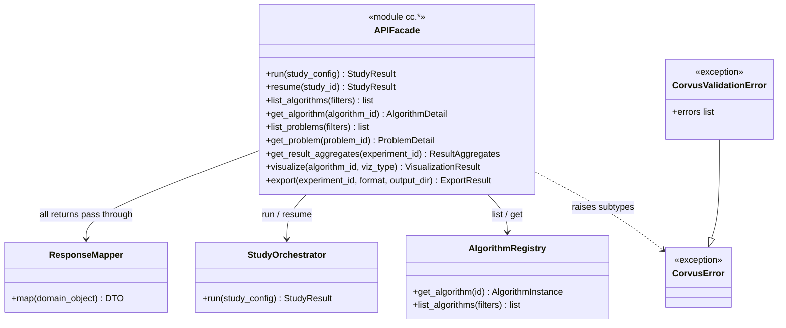

# C4: Code — API Facade

> C4 Index: [../01-index.md](../01-index.md)
> C3 Component: [../../04-c4-leve3-components/10-public-api-cli/02-api-facade.md](../../04-c4-leve3-components/10-public-api-cli/02-api-facade.md)
> C3 Index (Public API + CLI): [../../04-c4-leve3-components/10-public-api-cli/01-index.md](../../04-c4-leve3-components/10-public-api-cli/01-index.md)
> Public API Contract: [../../../03-technical-contracts/04-public-api-contract.md](../../../03-technical-contracts/04-public-api-contract.md)

---

## Component

The API Facade (`cc.*`) is the versioned public surface of the Corvus Corone library. It is
the single entry point for all external callers — the CLI, the Pilot MCP Server, and users
writing Python scripts directly. Changing any `cc.*` function signature is a breaking change.
All internal refactoring must stay behind this facade.

---

## Key Abstractions

### `APIFacade`

**Type:** Module-level functions in `corvus_corone/__init__.py`, implemented in
`corvus_corone/api/facade.py`

**Why module-level functions, not a class:** The `cc.*` pattern (`import corvus_corone as cc;
cc.run(...)`) is a deliberate ergonomic choice — it reads like a domain language, not an
object API. A `CorvusClient` class would impose unnecessary instantiation ceremony for a
stateless facade.

**Purpose:** Validate all inputs at the system boundary, coerce raw user input (dict →
`StudyConfig`), delegate to the correct internal container, and return stable DTO objects
(never raw domain objects) via the Response Mapper.

**Key elements — the `cc.*` surface:**

| Function | Delegates to | Semantics |
|---|---|---|
| `cc.run(study_config)` | Study Orchestrator | Validate, build, and execute a study |
| `cc.resume(study_id)` | Study Orchestrator | Resume an interrupted study by ID |
| `cc.list_algorithms(filters)` | Algorithm Registry | List registered algorithms with optional filters |
| `cc.get_algorithm(algorithm_id)` | Algorithm Registry | Retrieve full algorithm detail |
| `cc.list_problems(filters)` | Problem Repository | List registered problems with optional filters |
| `cc.get_problem(problem_id)` | Problem Repository | Retrieve full problem detail |
| `cc.get_result_aggregates(experiment_id)` | Results Store | Load analysis results for an experiment |
| `cc.get_run_results(run_id)` | Results Store | Load raw performance records for a run |
| `cc.visualize(algorithm_id, viz_type, ...)` | Algorithm Visualization Engine | Render algorithm visualizations |
| `cc.get_algorithm_genealogy(algorithm_id)` | Algorithm Registry | Return algorithm lineage tree |
| `cc.export(experiment_id, format, output_dir)` | Ecosystem Bridge | Export results to COCO / IOHprofiler format |

**Constraints / invariants:**

- The facade is **stateless**. No instance variables. Concurrent `cc.run()` calls with
  different `study_id` values are safe.
- Every function validates its inputs before delegating. On validation failure,
  `CorvusValidationError` is raised with a complete list of errors (not just the first).
- Every function returns a DTO, never a raw domain object. All return values pass through
  `ResponseMapper` before leaving the facade.
- `cc.run()` accepts both `dict` and `StudyConfig` as input. If a dict is passed, it is
  coerced via `StudyConfig.from_dict()` before passing to the Study Orchestrator.
- `cc.visualize()` with `viz_type="all"` returns `list[VisualizationResult]`. All other
  `viz_type` values return a single `VisualizationResult`. This is the only facade function
  with a polymorphic return type — document it prominently.
- The facade must never expose internal exception types. All exceptions raised by internal
  containers are caught and re-raised as subtypes of `CorvusError`.

**Extension points:**

Adding a new public operation: add a new `cc.*` function to both `corvus_corone/__init__.py`
(the public re-export) and `corvus_corone/api/facade.py` (the implementation). Update the
public API contract at `docs/03-technical-contracts/04-public-api-contract.md`. Do not add
operations to `__init__.py` without a corresponding contract entry.

---

### `CorvusError` hierarchy

**Type:** Exception classes

**Purpose:** Provide a stable, typed exception surface for callers. Internal exceptions must
never leak through the facade.

| Exception | When raised |
|---|---|
| `CorvusError` | Base class — catch this to handle any Corvus error |
| `CorvusValidationError` | Input validation failed — includes a list of error messages |
| `StudyNotFoundError` | `cc.resume()` called with an unknown `study_id` |
| `AlgorithmNotFoundError` | `cc.get_algorithm()` or `cc.run()` references an unknown algorithm |
| `ProblemNotFoundError` | `cc.get_problem()` or `cc.run()` references an unknown problem |
| `ExportFormatError` | `cc.export()` called with an unsupported format string |

---

## Class / Module Diagram

---

## Design Patterns Applied

### Facade Pattern

**Where used:** `APIFacade` itself.

**Why:** The library has 11 internal containers with complex interdependencies. The facade
provides a single, simple, stable entry point that hides all of that complexity. External
callers never need to know which container handles their request.

**Implications for contributors:** If an internal container's interface changes, the facade
absorbs the change. External callers are shielded. Test the facade's public contract
separately from the internal container's unit tests.

### Anti-Corruption Layer (Exception Mapping)

**Where used:** Exception wrapping in every `cc.*` function.

**Why:** Internal exceptions (e.g., `StudyBuilder`'s `StudyValidationError`) use names and
structures suited to the internal domain. Letting them propagate to external callers would
couple callers to internal implementation details.

**Implications for contributors:** Every try/except at the facade boundary must catch the
internal exception type and re-raise as the corresponding `CorvusError` subtype. Never use
bare `except Exception` — that loses type information for callers using `isinstance()` checks.

### DTO Boundary (Response Mapper)

**Where used:** All `cc.*` return values pass through `ResponseMapper`.

**Why:** Internal domain objects (e.g., `AlgorithmInstance`, `StudyConfig`) contain
mutable fields and internal references that must not be exposed. DTOs are value objects
with a stable, versioned schema.

**Implications for contributors:** Never return a domain object from a `cc.*` function.
Add a new DTO and a corresponding `ResponseMapper` mapping if a new function requires a
new return type.

---

## Docstring Requirements

Every `cc.*` function:

- Parameters: document accepted types (e.g., `dict | StudyConfig` for `cc.run()`),
  valid values, and which validation errors they can trigger.
- Return type: document the DTO schema by reference to
  `docs/03-technical-contracts/04-public-api-contract.md`.
- Raises: list every `CorvusError` subtype the function can raise, with the condition
  that triggers each.
- Thread safety: state that the function is stateless and concurrent calls with different
  IDs are safe.

`cc.visualize()` specifically:

- Document the `viz_type="all"` polymorphic return type prominently — this is the most
  common source of caller confusion.
- List all valid `viz_type` strings by reference to the metric taxonomy.
