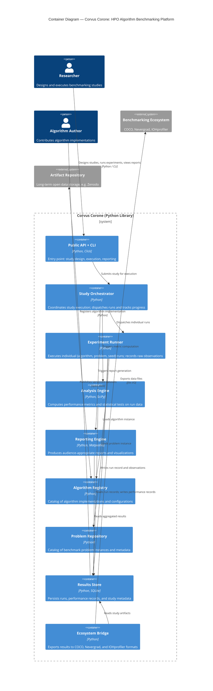

# C2: Containers — Corvus Corone: HPO Algorithm Benchmarking Platform

<!--
STORY ROLE: "What are the major moving parts?"
Decomposes the single black box from C1 into deployable/runnable units.
This is where architecture decisions become visible for the first time.

NARRATIVE POSITION:
  C1 (WHO and WHAT world) → C2 → (WHAT are the parts and HOW do they communicate)
  → C3 (WHAT is inside each part) → SRS (WHAT must each part do)

CONNECTS TO:
  ← C1                    : the system boundary from there is decomposed here
  → C3                    : each container here is zoomed into in a C3 document
  → SRS §4                : each container maps to one or more functional requirement groups
  → specs/data-format.md  : data flowing between containers must conform to schemas there
  → architecture/adr/     : technology choices for each container should have a corresponding ADR
-->

---

## Container Diagram

---

## Containers

<!--
  For each container, provide a section with the following structure.
  Copy and repeat this block for each container identified in the diagram.
-->

### [Container Name]

<!--
  Responsibility:
    One sentence. What is this container's single concern?
    Hint: if you need "and" to describe it, consider splitting into two containers.

  Technology:
    What runtime, language, framework, or storage engine?
    Why this choice? → Create an ADR in architecture/adr/ for non-obvious decisions.

  Interfaces exposed:
    What does this container offer to others?
    (REST API, CLI command, Python library, file system path, message topic, etc.)
    → Formal interface definitions belong in specs/interface-contracts.md

  Dependencies:
    Which other containers does this container call or depend on?
    List them with the reason for the dependency.

  Data owned:
    What persisted data lives in or is managed by this container?
    → Data schemas belong in specs/data-format.md

  Actors served:
    Which actors from C1 interact with this container directly?

  Relevant SRS section:
    Which functional requirement group in SRS §4 does this container implement?
-->

---

## Key End-to-End Flows

<!--
  Describe the most architecturally significant flows — those that cross multiple containers.
  These flows make the architecture "come alive" and reveal integration points.

  For each flow:
    - Name: a short, human-readable label (e.g., "Run a benchmarking study")
    - Trigger: what initiates this flow? (researcher action, scheduled job, API call)
    - Steps: numbered sequence of container interactions
    - Data exchanged at each step: reference specs/data-format.md entity names
    - End state: what is different in the system after this flow completes?

  Hint — flows to consider:
    1. "Design and execute a benchmarking study" (main researcher workflow)
    2. "Register a new benchmark problem" (contributor workflow)
    3. "Register a new algorithm implementation" (algorithm author workflow)
    4. "Generate a study report" (practitioner workflow)
    5. "Export results to IOHprofiler / COCO" (interoperability workflow)
    6. "Reproduce a published study" (reproducibility workflow)

  Each flow here should correspond to a use case in SRS §3.
-->
