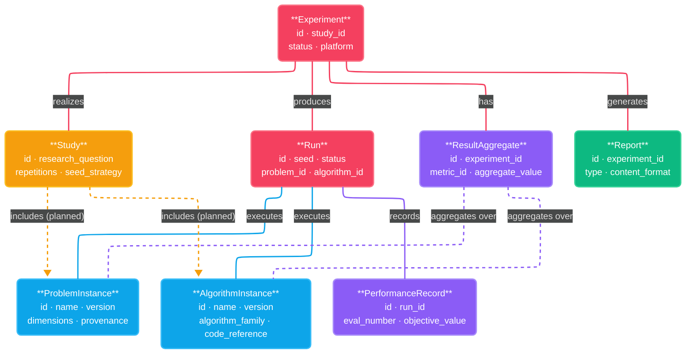

# Data Format Specification

<!--
STORY ROLE: The "common language" of the system.
Every component, every external integration, every stored artifact speaks this language.
This document defines the vocabulary that makes interoperability and reproducibility possible.
Without agreed-upon schemas, MANIFESTO Principles 19–22 (Reproducibility) are aspirational.

NARRATIVE POSITION:
  SRS §7 (interface requirements) → Data Format Spec → (concrete schemas and formats)
  → specs/interface-contracts.md : interfaces operate on the entities defined here
  → specs/metric-taxonomy.md     : metric values are stored in Result Aggregate entities here

CONNECTS TO:
  ← SRS §4, §7             : requirements that drove these format decisions
  ← MANIFESTO Principles 7, 8, 19–22 : directly operationalized by this document
  → specs/interface-contracts.md : method signatures use entity types from here
  → specs/metric-taxonomy.md     : metric definitions must match Result Aggregate fields here
  → community/versioning-governance.md : how schema versions are managed and deprecated
  → architecture/adr/            : format choices (e.g., JSON vs HDF5) should have ADRs

GLOSSARY: All entity names used here are defined in docs/GLOSSARY.md.
Use exact glossary terms — do not introduce synonyms.
-->

---

## 1. Entity Overview

### Server-Compatibility Design Constraint

> **Architectural decision (ADR-001):** All entity schemas in this document are designed to be server-compatible from V1. This is a hard constraint, not a preference.

This means every entity definition in §2 MUST satisfy all of the following:

| Requirement | Rationale |
|---|---|
| **Globally unique ID (UUID format)** | Entity references use IDs, not local file paths. The same ID is valid in local file storage (V1) and in a server database (V2) without migration. |
| **JSON-serializable primary schema** | No binary-only fields in the canonical entity representation. JSON is required for REST API compatibility (V2) and for COCO/IOHprofiler/Nevergrad interoperability (NFR-INTEROP-01). |
| **Cross-entity references by ID only** | No field may reference another entity by file path or local directory structure. All foreign keys are entity IDs. |
| **No file system assumptions** | Entity schemas do not encode directory layout, file naming, or path separators. Storage layout is an implementation detail of the `Repository` (see `interface-contracts.md`). |

Bulk data storage (e.g., high-volume Performance Records) may use efficient binary formats (Parquet, HDF5) as a secondary representation, but the primary schema remains JSON. This is a separate ADR decision (`TODO: REF-TASK-0024`).

---

## 2. Entity Definitions

### 2.1 Problem Instance

> See GLOSSARY: [Problem Instance](../GLOSSARY.md#problem-instance)

| Name | Type | Required | Notes |
| --- | --- | --- | --- |
| id | int | yes | Problem Instance ID |
| name | string | yes | Human-readable name |
| version | string | yes | Version of this record. Structure is described in validation rules |
| provenance | string | yes | Source of this problem (e.g., `real_ml_task`, `synthetic`, `adapted_from_coco`) |
| dimensions | int | yes | Number of hyperparameters in the search space |
| variables | list[object] | yes | List of variable descriptors; each entry has `name`, `type` (`continuous`/`integer`/`categorical`), and `bounds` or `choices` |
| dependencies | list[object] | no | Known interactions between variables (e.g., conditional activation); empty list if none |
| objective.type | string | yes | `minimize` or `maximize` |
| objective.noise_level | string | yes | `deterministic` or `stochastic`; if stochastic, include characterization in notes |
| objective.known_optimum | float | no | Known optimal objective value; `null` if unknown |
| evaluation.budget_type | string | yes | `evaluation_count`, `wall_time`, or `combined` |
| evaluation.default_budget | int or float | yes | Recommended budget for this problem expressed in units of `budget_type` |
| landscape_characteristics | list[string] | no | Known properties of the objective landscape (e.g., `multimodal`, `separable`, `noisy`) |
| real_or_synthetic | string | yes | `real` or `synthetic` |
| domain | string | no | ML or optimization domain this problem represents (e.g., `neural_architecture_search`, `hyperparameter_tuning`) |
| source_reference | string | no | Citation or URL of the paper or system this problem originates from |
| created_by | string | yes | Author or system that registered this problem instance |
| created_at | datetime | yes | ISO 8601 UTC timestamp of creation |
| last_updated | datetime | yes | ISO 8601 UTC timestamp of last modification |

**Validation rules:**
- `dimensions` must equal `len(variables)`
- For `continuous` and `integer` variables, `bounds[0]` must be strictly less than `bounds[1]`
- For `categorical` variables, `choices` must contain at least 2 distinct values
- `objective.known_optimum` is required if `real_or_synthetic` is `synthetic` (synthetic problems are expected to have a known optimum)
- `source_reference` is required if `provenance` is `adapted_from_*` or `real_ml_task`
- `version` must be updated on every field change: `X` increments on schema-breaking changes, `Y` on additions, `Z` on corrections

### 2.2 Algorithm Instance

> See GLOSSARY: [Algorithm Instance](../GLOSSARY.md#algorithm-instance)

| Name | Type | Required | Notes |
| --- | --- | --- | --- |
| id | int | yes | Algorithm Instance ID |
| name | string | yes | Human-readable name for this specific configuration eg. `NSGANet`, `Grid vs Random` |
| version | string | yes | Version of this record. Structure is described in validation rules |
| algorithm_family | string | yes | The abstract Algorithm this is an instance of (e.g., `Random Search`, `TPE`, `CMA-ES`) |
| hyperparameters | map[string, any] | yes | Key-value map of configuration parameter name → value. All hyperparameters must be fully specified |
| configuration_justification | string | yes | Why this configuration was chosen (required for fairness, Principle 10) |
| code_reference | string | yes | Pointer to the Implementation artifact (git commit SHA or pinned package version) |
| language | string | yes | Programming language of the implementation (e.g., `python`) |
| framework | string | yes | Library or framework used (e.g., `optuna`, `scikit-optimize`) |
| framework_version | string | yes | Pinned version of the framework |
| known_assumptions | list[string] | yes | Problem properties this algorithm assumes (e.g., `continuous search space`, `noise-free evaluations`) |
| contributed_by | string | yes | Author or system that registered this algorithm instance |
| created_at | datetime | yes | ISO 8601 UTC timestamp of creation |

**Validation rules:**
- All keys in `hyperparameters` must match the algorithm's declared parameter schema
- `code_reference` must be resolvable and version-pinned (no floating references such as branch names)
- Two Algorithm Instances with identical `hyperparameters` and `code_reference` but different `id` are distinct records and must not be deduplicated silently
- `version` must be updated on every field change: `X` increments on schema-breaking changes, `Y` on additions, `Z` on corrections

### 2.3 Study
> See GLOSSARY: [Study / Benchmarking Study](../GLOSSARY.md#study--benchmarking-study)

| Name | Type | Required | Notes |
| --- | --- | --- | --- |
| id | int | yes | Study ID |
| name | string | yes | Title of the study |
| version | string | yes | Version of this study, updated automatically after each change. Structure is described in validation rules |
| research_question | string | yes | The motivating research question; free text |
| research_question_tags | list[string] | List of structured tags for research question (e.g., `topic:generalization`, `domain:NLP`) |
| problem_instance_ids | list[int] | yes | Ordered list of Problem Instance IDs included in this study, with pinned versions |
| algorithm_instance_ids | list[int] | yes | Ordered list of Algorithm Instance IDs included in this study, with pinned versions |
| experimental_design.repetitions | int | yes | Number of independent runs per (problem, algorithm) pair. Must be declared before data collection begins |
| experimental_design.seed_strategy | string | yes | How seeds are generated and assigned (e.g., `sequential`, `random`, `latin-hypercube`) |
| experimental_design.budget_allocation | string | yes | How the evaluation budget is distributed across runs |
| experimental_design.stopping_criteria | string | yes | What terminates a single run (e.g., `budget_exhausted`, `convergence_threshold`) |
| pre_registered_hypotheses | list[string] | no | Hypotheses to be tested, declared before data collection begins (Principle 16) |
| sampling_strategy | string | yes | Identifier of the PerformanceRecord sampling strategy (e.g., `log_scale_plus_improvement`); governs when the Runner writes records. Must be locked before execution begins. See `docs/02-design/02-architecture/01-adr/adr-002-performance-recording-strategy.md` |
| log_scale_schedule | object | yes | Parameters of the log-scale scheduled trigger. Fields: `base_points: list[int]` (default `[1, 2, 5]`), `multiplier_base: int` (default `10`). Produces checkpoints at `base_points[i] × multiplier_base^j` up to the run budget. Must be locked before execution begins |
| improvement_epsilon | float \| null | yes | Minimum improvement required to trigger an improvement record. `null` means strict inequality (any improvement triggers a record). Non-null values must be scientifically justified and appear in the Report limitations section (FR-21). Must be locked before execution begins |
| max_records_per_run | int \| null | no | Optional hard cap on PerformanceRecords per Run. `null` means no cap. If set, improvement records stop when the cap is reached; scheduled records continue. A `cap_reached_at_evaluation` field is set on the affected Run and a limitations note is added to the Report automatically (FR-21) |
| created_by | string | yes | Author (may be a non person) that created this study |
| created_at | datetime | yes | ISO 8601 UTC timestamp of creation |

**Validation rules:**
- `problem_instance_ids` must contain at least 1 entry
- `algorithm_instance_ids` must contain at least 1 entries
- `experimental_design.repetitions` must be ≥ 1 and must not be modified after any Run referencing this Study has been created
- `sampling_strategy`, `log_scale_schedule`, and `improvement_epsilon` must not be modified after any Run referencing this Study has been created
- `version` must be updated on every field change: `X` increments on schema-breaking changes, `Y` on additions, `Z` on corrections

### 2.4 Experiment

> See GLOSSARY: [Experiment](../GLOSSARY.md#experiment)

| Name | Type | Required | Notes |
| --- | --- | --- | --- |
| id | int | yes | Experiment ID |
| study_id | int | yes | ID of the Study this Experiment realizes |
| status | string | yes | `planned`, `running`, `completed`, or `failed` |
| execution_environment.platform | string | yes | Operating system and version (e.g., `Ubuntu 22.04`) |
| execution_environment.hardware | string | yes | Hardware description (e.g., CPU model, RAM, GPU if applicable) |
| execution_environment.language_version | string | yes | Programming language version used eg. `Python` |
| run_ids | list[int] | yes | IDs of all Runs produced by this Experiment; empty until Runs are created |
| started_at | datetime | no | ISO 8601 UTC timestamp when execution began; `null` while `status` is `planned` |
| completed_at | datetime | no | ISO 8601 UTC timestamp when execution finished; `null` until `status` is `completed` or `failed` |

**Validation rules:**
- `study_id` must reference an existing Study
- `completed_at` must be after `started_at` when both are set
- `len(run_ids)` must equal `study.experimental_design.repetitions × len(study.problem_instance_ids) × len(study.algorithm_instance_ids)` when `status` is `completed`
- A `failed` Experiment must still record all Run IDs created before failure

### 2.5 Run

> See GLOSSARY: [Run](../GLOSSARY.md#run)

| Name | Type | Required | Notes |
| --- | --- | --- | --- |
| id | int | yes | Run ID |
| experiment_id | int | yes | ID of the Experiment this Run belongs to |
| study_id | int | yes | ID of the Study this Run belongs to (denormalized for query convenience) |
| problem_instance_id | int | yes | ID of the Problem Instance executed in this Run |
| algorithm_instance_ids | list[int] | yes | IDs of the Algorithm Instance executed in this Run |
| seed | int | yes | Exact integer seed used; must be reproducible |
| budget_used | float | yes | Actual evaluations or time consumed, in units of `Study.experimental_design.budget_type` |
| status | string | yes | `completed`, `failed`, or `budget_exhausted` |
| failure_reason | string | no | Required when `status` is `failed`; describes what caused the failure |
| cap_reached_at_evaluation | int \| null | no | Set when `Study.max_records_per_run` was hit during this Run. Records the `evaluation_number` at which improvement logging stopped. `null` if no cap was hit. When set, the generated Report automatically includes a limitations note (FR-21) |
| started_at | datetime | yes | ISO 8601 UTC timestamp when this Run began |
| completed_at | datetime | no | ISO 8601 UTC timestamp when this Run ended; `null` if still running |

**Validation rules:**
- `seed` must be unique within an Experiment for a given `(problem_instance_id, algorithm_instance_id)` pair
- `failure_reason` is required when `status` is `failed`, otherwise `None`
- `completed_at` must be after `started_at` when set
- `problem_instance_id` and `algorithm_instance_id` must reference IDs declared in the parent Study

### 2.6 Performance Record

> See GLOSSARY: [Performance Record](../GLOSSARY.md#performance-record)

| Name | Type | Required | Notes |
| --- | --- | --- | --- |
| id | int | yes | Performance Record ID |
| run_id | int | yes | ID of the Run this record belongs to |
| evaluation_number | int | yes | Number of objective evaluations completed so far in this Run |
| elapsed_time | float | yes | Wall-clock seconds elapsed since Run start |
| objective_value | float | yes | Current best objective value observed up to this evaluation |
| current_solution | map[string, any] | no | The solution (hyperparameter configuration) achieving `objective_value`; may be omitted to reduce storage |
| is_improvement | bool | yes | `true` if `objective_value` is strictly better than all previous records in this Run (subject to `Study.improvement_epsilon`) |
| trigger_reason | string | yes | Why this record was written. One of: `scheduled`, `improvement`, `end_of_run`, `both` (scheduled + improvement), `scheduled_end_of_run`, `improvement_end_of_run`, `all` (all three). Populated automatically by the Runner base class; see [ADR-002](../02-design/02-architecture/01-adr/adr-002-performance-recording-strategy.md) |

**Validation rules:**
- `evaluation_number` must be monotonically increasing within a Run
- `elapsed_time` must be monotonically non-decreasing within a Run
- `is_improvement` must be `true` for the first record of every Run
- Every Run must have exactly one record where `trigger_reason` contains `end_of_run` and `evaluation_number == run.budget_used`
- `trigger_reason` must be consistent with `is_improvement`: any value containing `improvement` requires `is_improvement=true`; `scheduled` or `end_of_run` alone permit `is_improvement=false`
- Not every evaluation requires a record — the recording strategy is governed by `Study.sampling_strategy`; see [ADR-002](../02-design/02-architecture/01-adr/adr-002-performance-recording-strategy.md)

### 2.7 Result Aggregate

> See GLOSSARY: [Result Aggregate](../GLOSSARY.md#result-aggregate)

| Name | Type | Required | Notes |
| --- | --- | --- | --- |
| id | int | yes | Result Aggregate ID |
| experiment_id | int | yes | ID of the Experiment this aggregate belongs to |
| problem_instance_id | int | yes | ID of the Problem Instance being aggregated over |
| algorithm_instance_id | int | yes | ID of the Algorithm Instance being aggregated over |
| n_runs | int | yes | Number of Runs aggregated; must equal the count of `completed` Runs for this `(experiment, problem, algorithm)` combination |
| metrics | map[string, object] | yes | Map of `metric_name → AggregateValue`; metric names must exactly match names in `docs/03-technical-contracts/03-metric-taxonomy.md` |
| anytime_curves | list[object] | yes | Summarized performance curves: mean ± spread of `objective_value` at each `evaluation_number` across all aggregated Runs |

`AggregateValue` is an open structure — the required field is `n_successful`; all other statistics are metric-defined:

| Name | Type | Required | Notes |
| --- | --- | --- | --- |
| n_successful | int | yes | Number of Runs that contributed (excludes `failed` Runs); required for every metric type |
| statistics | map[string, float] | yes | Open map of statistic name → value. Allowed keys per metric type are defined in `docs/03-technical-contracts/03-metric-taxonomy.md`. Examples: `mean`, `std`, `median`, `q25`, `q75`, `min`, `max`, `success_rate`, `ecdf_auc`, `p10`, `p90` |

This keeps the schema forward-compatible: adding a new statistic for a new metric type requires no schema change here — only an update to `metric-taxonomy.md`.

**Validation rules:**
- All keys in `metrics` must exactly match metric names defined in `docs/03-technical-contracts/03-metric-taxonomy.md` — this is a hard contract
- For each `AggregateValue`, the keys in `statistics` must match the set declared for that metric type in `metric-taxonomy.md`
- `n_runs` must equal `n_successful` + count of excluded failed Runs; it must not silently drop failures
- `anytime_curves` must cover the same `evaluation_number` range as the underlying Performance Records

### 2.8 Report

> See GLOSSARY: [Report](../GLOSSARY.md#report)

| Name | Type | Required | Notes |
| --- | --- | --- | --- |
| id | int | yes | Report ID |
| experiment_id | int | yes | ID of the Experiment this Report was generated from |
| type | string | yes | `researcher` or `practitioner` |
| generated_at | datetime | yes | ISO 8601 UTC timestamp when the Report was produced |
| generated_by | string | yes | System version or component that produced this Report |
| limitations | string | yes | Mandatory limitations section: scope conditions of all conclusions, characteristics not covered, absence of global rankings (FR-21) |
| content_format | string | yes | Format of the report artifact (e.g., `pdf`, `html`, `markdown`) |
| artifact_reference | string | yes | Pointer to the stored report artifact (path or ID, resolved by the Repository) |

**Validation rules:**
- Every completed Experiment must have exactly one `researcher` Report and one `practitioner` Report (FR-20)
- `limitations` must be non-empty — a Report without a limitations section is invalid
- `artifact_reference` must be resolvable at the time the Report record is created

---

## 3. File Formats and Storage

<!--
  For each entity type, specify:
    - Primary storage format (JSON / JSONL / Parquet / HDF5 / CSV / other)
    - Why this format? → create an ADR if the choice is non-obvious
    - Schema file location (JSON Schema, Avro schema, Pydantic model, etc.)
    - Compression / encoding for large data (PerformanceRecord can be voluminous)
    - File naming conventions and directory structure

  Hint — considerations:
    - Human readability vs. performance (JSON vs. Parquet)
    - Tool ecosystem: what can COCO/IOHprofiler/Nevergrad already read?
    - Long-term archival: open formats preferred (Principle 22)
-->

---

## 4. Interoperability Mappings

<!--
  For each external platform the system integrates with (from C1):

  ### [Platform Name] (e.g., IOHprofiler, COCO, Nevergrad)

  Direction: export / import / both

  Mapping table:
    | Our Entity / Field          | Their Entity / Field        | Notes / Losses            |
    |-----------------------------|-----------------------------|---------------------------|
    | Run.seed                    | [their equivalent]          | exact match / approximate |
    | PerformanceRecord.eval_num  | [their equivalent]          | ...                       |

  Data loss / gain:
    What information is lost when converting to their format?
    What information do we gain when importing from their format?
    → Reference SRS NFR-INTEROP for acceptance criteria

  Version compatibility:
    Which versions of their format do we support?
    → Link to ADR if a compatibility decision was made
-->

---

## 5. Validation Rules (Cross-Entity)

<!--
  Invariants that span multiple entities — cannot be expressed as per-field rules.

  Examples of invariants to consider:
    - Every Run.problem_instance_id must reference a Problem Instance with the same version
      as declared in the parent Study
    - Seeds within an Experiment must be unique per (problem, algorithm) pair
    - A Result Aggregate's n_runs must equal the count of completed Runs for that combination
    - Every Performance Record's evaluation_number must be monotonically increasing within a Run

  For each invariant:
    - State it precisely
    - When is it checked? (at write time, at read time, in analysis)
    - What is the consequence of violation? (reject, warn, flag)
-->

---

## 6. Schema Versioning

<!--
  How are schema versions managed?
    → policy: community/versioning-governance.md §1

  What constitutes a breaking schema change?
    (adding a required field, renaming a field, changing a type)

  How are old-format files handled?
    (migration scripts, compatibility shims, rejection with clear error)

  Where are schema files stored and how are they versioned?
    (alongside code, in a separate schema registry, etc.)
-->
