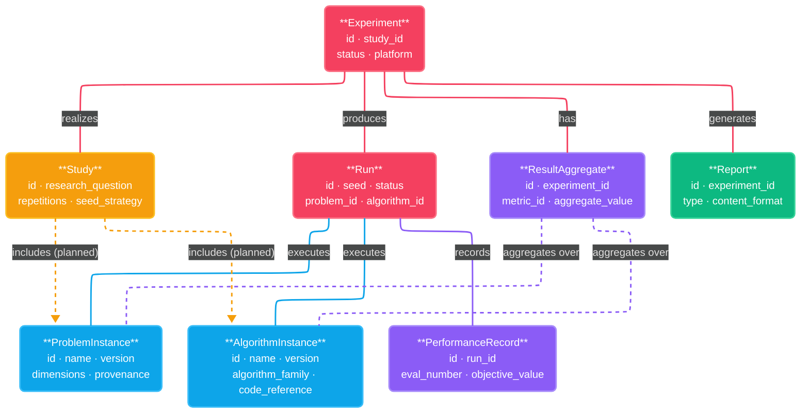

# Data Format Specification

<!--
STORY ROLE: The "common language" of the system.
Every component, every external integration, every stored artifact speaks this language.
This document defines the vocabulary that makes interoperability and reproducibility possible.
Without agreed-upon schemas, MANIFESTO Principles 19–22 (Reproducibility) are aspirational.

NARRATIVE POSITION:
  SRS §7 (interface requirements) → Data Format Spec → (concrete schemas and formats)
  → specs/interface-contracts.md : interfaces operate on the entities defined here
  → specs/metric-taxonomy.md     : metric values are stored in Result Aggregate entities here

CONNECTS TO:
  ← SRS §4, §7             : requirements that drove these format decisions
  ← MANIFESTO Principles 7, 8, 19–22 : directly operationalized by this document
  → specs/interface-contracts.md : method signatures use entity types from here
  → specs/metric-taxonomy.md     : metric definitions must match Result Aggregate fields here
  → community/versioning-governance.md : how schema versions are managed and deprecated
  → architecture/adr/            : format choices (e.g., JSON vs HDF5) should have ADRs

GLOSSARY: All entity names used here are defined in docs/GLOSSARY.md.
Use exact glossary terms — do not introduce synonyms.
-->

---

## 1. Entity Overview

### Server-Compatibility Design Constraint

> **Architectural decision (ADR-001):** All entity schemas in this document are designed to be server-compatible from V1. This is a hard constraint, not a preference.

This means every entity definition in §2 MUST satisfy all of the following:

| Requirement | Rationale |
|---|---|
| **Globally unique ID (UUID format)** | Entity references use IDs, not local file paths. The same ID is valid in local file storage (V1) and in a server database (V2) without migration. |
| **JSON-serializable primary schema** | No binary-only fields in the canonical entity representation. JSON is required for REST API compatibility (V2) and for COCO/IOHprofiler/Nevergrad interoperability (NFR-INTEROP-01). |
| **Cross-entity references by ID only** | No field may reference another entity by file path or local directory structure. All foreign keys are entity IDs. |
| **No file system assumptions** | Entity schemas do not encode directory layout, file naming, or path separators. Storage layout is an implementation detail of the `Repository` (see `interface-contracts.md`). |

Bulk data storage (e.g., high-volume Performance Records) uses **Parquet with snappy compression** as a secondary representation for Runs exceeding 1,000 records (ADR-010). The primary JSON schema remains canonical and is never removed. See §3.3 for the operational specification.

---

## Contents

| Section | File | Status |
|---|---|---|
| §2.1 Problem Instance | [02-problem-instance.md](02-problem-instance.md) | ✅ Formal schema |
| §2.2 Algorithm Instance | [03-algorithm-instance.md](03-algorithm-instance.md) | ✅ Formal schema |
| §2.3 Study | [04-study.md](04-study.md) | ✅ Formal schema |
| §2.4 Experiment | [05-experiment.md](05-experiment.md) | ✅ Formal schema |
| §2.5 Run | [06-run.md](06-run.md) | ✅ Formal schema |
| §2.6 Performance Record | [07-performance-record.md](07-performance-record.md) | ✅ Formal schema |
| §2.7 Result Aggregate | [08-result-aggregate.md](08-result-aggregate.md) | ✅ Formal schema |
| §2.8 Report | [09-report.md](09-report.md) | ✅ Formal schema |
| §3 File Formats and Storage | [10-file-formats.md](10-file-formats.md) | ✅ §3.1 IOHprofiler export, §3.2 LocalFileRepository layout, §3.3 Parquet bulk format complete |
| §4 Interoperability Mappings | [11-interoperability-mappings.md](11-interoperability-mappings.md) | ✅ §4.1 COCO, §4.2 IOHprofiler, §4.3 Nevergrad complete |
| §5 Validation Rules (Cross-Entity) | [12-cross-entity-validation.md](12-cross-entity-validation.md) | ✅ 17 rules across 8 entity pairs |
| §6 Schema Versioning | [13-schema-versioning.md](13-schema-versioning.md) | 🚧 Pending |
