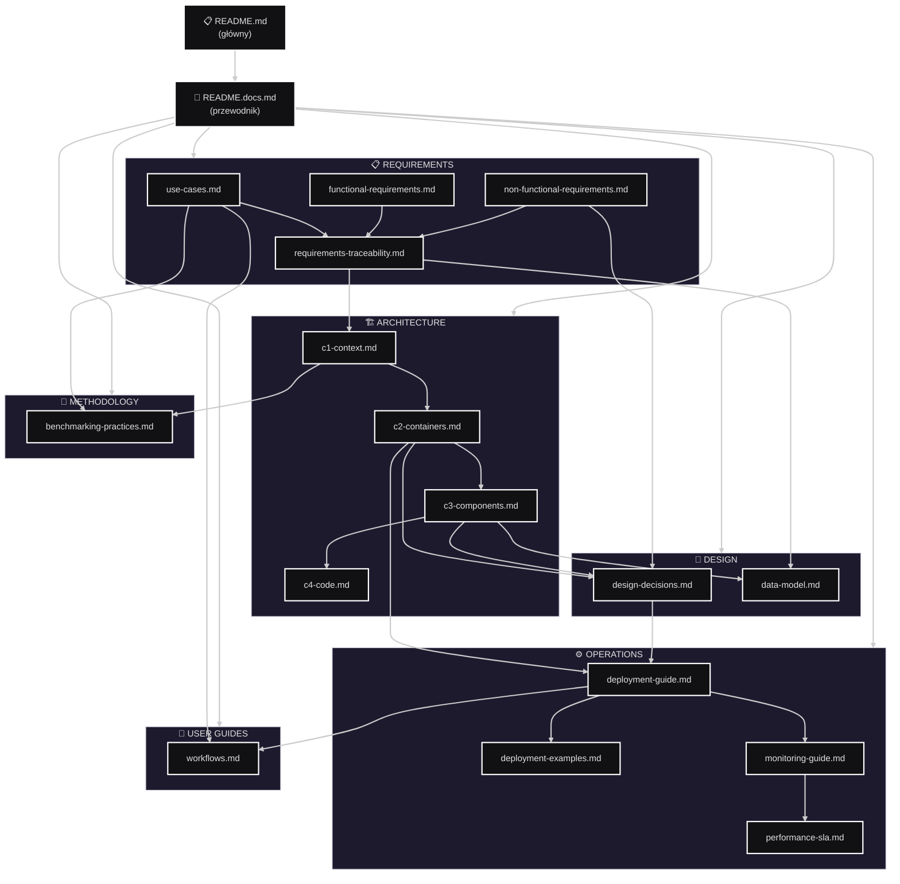

# Document Map - Corvus Corone

> **Mapa zależności między dokumentami w projekcie**

---

## 🗺️ Struktura dokumentacji



---

## 📚 Zależności między dokumentami

### 🔗 Główne ścieżki dokumentacji

#### **Ścieżka 1: Wymagania → Architektura**
```
use-cases.md → functional-requirements.md → requirements-traceability.md → c1-context.md → c2-containers.md → c3-components.md
```

#### **Ścieżka 2: Architektura → Implementacja**
```
c2-containers.md → design-decisions.md → data-model.md → deployment-guide.md
```

#### **Ścieżka 3: Operations & Deployment**
```
deployment-guide.md → deployment-examples.md → monitoring-guide.md → performance-sla.md
```

### 📖 Cross-references między dokumentami

| Dokument źródłowy | Referencje do |
|-------------------|---------------|
| **README.md** | README.docs.md, use-cases.md, c1-context.md, deployment-guide.md |
| **README.docs.md** | Wszystkie inne dokumenty (hub) |
| **use-cases.md** | functional-requirements.md, c1-context.md |
| **functional-requirements.md** | requirements-traceability.md |
| **non-functional-requirements.md** | design-decisions.md (ADR-005, ADR-006) |
| **requirements-traceability.md** | Wszystkie wymagania i UC, c1-context.md |
| **c1-context.md** | functional-requirements.md, non-functional-requirements.md, c2-containers.md |
| **c2-containers.md** | c1-context.md, c3-components.md, deployment-guide.md |
| **c3-components.md** | c2-containers.md, c4-code.md, design-decisions.md |
| **design-decisions.md** | non-functional-requirements.md, c2-containers.md |
| **data-model.md** | requirements-traceability.md, c3-components.md |
| **deployment-guide.md** | c2-containers.md, monitoring-guide.md |
| **monitoring-guide.md** | deployment-guide.md, design-decisions.md (ADR-006) |

---

## 🎯 Ścieżki czytania dla różnych ról

### **👨‍💼 Decision Maker / Manager**
1. [README.md](../README.md) - Przegląd projektu
2. [use-cases.md](requirements/use-cases.md) - Scenariusze biznesowe
3. [c1-context.md](architecture/c1-context.md) - Przegląd systemu
4. [design-decisions.md](design/design-decisions.md) - Kluczowe decyzje
5. [performance-sla.md](operations/performance-sla.md) - SLA i benchmarks

### **👨‍💻 Developer / Architect**
1. [README.docs.md](README.docs.md) - Przewodnik
2. [requirements-traceability.md](requirements/requirements-traceability.md) - Pełne mapowanie
3. [c1-context.md](architecture/c1-context.md) → [c2-containers.md](architecture/c2-containers.md) → [c3-components.md](architecture/c3-components.md)
4. [design-decisions.md](design/design-decisions.md) - ADR-y
5. [data-model.md](design/data-model.md) - Model danych

### **🔧 DevOps / SRE**
1. [deployment-guide.md](operations/deployment-guide.md) - Wdrożenie
2. [deployment-examples.md](operations/deployment-examples.md) - Przykłady
3. [monitoring-guide.md](operations/monitoring-guide.md) - Monitoring
4. [c2-containers.md](architecture/c2-containers.md) - Architektura kontenerów
5. [performance-sla.md](operations/performance-sla.md) - Performance

### **🔬 Researcher / Data Scientist**
1. [use-cases.md](requirements/use-cases.md) - Przypadki użycia
2. [benchmarking-practices.md](methodology/benchmarking-practices.md) - Metodologie
3. [workflows.md](user-guides/workflows.md) - Przepływy pracy
4. [c1-context.md](architecture/c1-context.md) - Kontekst systemu

---

## ✅ Checklist spójności dokumentacji

### **Terminologia**
- [ ] Jednolite nazewnictwo komponentów
- [x] Konsekwentne używanie terminów technicznych
- [x] Glossary dostępne w README.docs.md

### **Cross-references**
- [x] Wszystkie dokumenty mają sekcję "Powiązane dokumenty"
- [x] Linki między powiązanymi sekcjami działają
- [x] Requirements Traceability Matrix kompletna

### **Architektura**
- [x] Model C4 spójny na wszystkich poziomach
- [x] Nazewnictwo kontenerów jednolite C2↔C3
- [x] ADR-y uzasadniają decyzje architekturalne

### **Deployment**
- [x] PC vs Cloud opcje spójne we wszystkich dokumentach
- [x] Message Broker choice konsekwentny
- [x] Security policies zsynchronizowane

---

*Ostatnia aktualizacja: 2025-11-20*