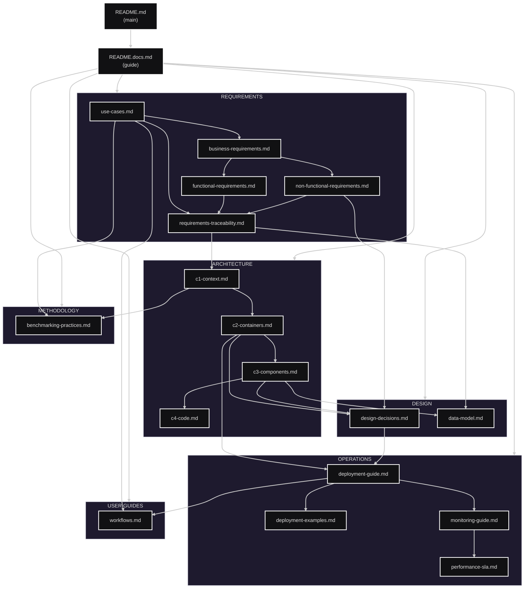

# Document Map

> **Map of dependencies between documents in the project**

---

## Documentation Structure



---

## Dependencies Between Documents

### Main Documentation Paths

#### **Path 1: Requirements → Architecture**
```
use-cases.md → business-requirements.md → functional-requirements.md → requirements-traceability.md → c1-context.md → c2-containers.md → c3-components.md
```

#### **Path 2: Architecture → Implementation**
```
c2-containers.md → design-decisions.md → data-model.md → deployment-guide.md
```

#### **Path 3: Operations & Deployment**
```
deployment-guide.md → deployment-examples.md → monitoring-guide.md → performance-sla.md
```

### Cross-references between documents

| Source Document | References to |
|-------------------|---------------|
| **README.md** | README.docs.md, use-cases.md, c1-context.md, deployment-guide.md |
| **README.docs.md** | All other documents (hub) |
| **use-cases.md** | business-requirements.md, functional-requirements.md, c1-context.md |
| **business-requirements.md** | functional-requirements.md, non-functional-requirements.md |
| **functional-requirements.md** | requirements-traceability.md |
| **non-functional-requirements.md** | design-decisions.md (ADR-005, ADR-006) |
| **requirements-traceability.md** | All requirements and UC, c1-context.md |
| **c1-context.md** | functional-requirements.md, non-functional-requirements.md, c2-containers.md |
| **c2-containers.md** | c1-context.md, c3-components.md, deployment-guide.md |
| **c3-components.md** | c2-containers.md, c4-code.md, design-decisions.md |
| **design-decisions.md** | non-functional-requirements.md, c2-containers.md |
| **data-model.md** | requirements-traceability.md, c3-components.md |
| **deployment-guide.md** | c2-containers.md, monitoring-guide.md |
| **monitoring-guide.md** | deployment-guide.md, design-decisions.md (ADR-006) |

---

## Reading paths for different roles

### **Decision Maker / Manager**
1. [README.md](../README.md) - Project overview
2. [use-cases.md](requirements/use-cases.md) - Scenariusze biznesowe
3. [c1-context.md](architecture/c1-context.md) - System overview
4. [design-decisions.md](design/design-decisions.md) - Key decisions
5. [performance-sla.md](operations/performance-sla.md) - SLA i benchmarks

### **Developer / Architect**
1. [README.docs.md](README.docs.md) - Guide
2. [requirements-traceability.md](requirements/requirements-traceability.md) - Complete mapping
3. [c1-context.md](architecture/c1-context.md) → [c2-containers.md](architecture/c2-containers.md) → [c3-components.md](architecture/c3-components.md)
4. [design-decisions.md](design/design-decisions.md) - ADRs
5. [data-model.md](design/data-model.md) - Data model

### **DevOps / SRE**
1. [deployment-guide.md](operations/deployment-guide.md) - Deployment
2. [deployment-examples.md](operations/deployment-examples.md) - Examples
3. [monitoring-guide.md](operations/monitoring-guide.md) - Monitoring
4. [c2-containers.md](architecture/c2-containers.md) - Container Architecture
5. [performance-sla.md](operations/performance-sla.md) - Performance

### **Researcher / Data Scientist**
1. [use-cases.md](requirements/use-cases.md) - Use Cases
2. [benchmarking-practices.md](methodology/benchmarking-practices.md) - Metodologie
3. [workflows.md](user-guides/workflows.md) - Workflows
4. [c1-context.md](architecture/c1-context.md) - System context
