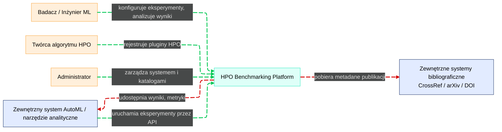

# Kontekst systemu - Corvus Corone (C4-1)

> **System benchmarkowania algorytmów HPO (Hyperparameter Optimization)**

---

## Założenia projektowe

**Docelowa skala:** Pojedynczy zespół badawczy / małe laboratorium (kilku–kilkunastu użytkowników równoległych), ale z możliwością rozrostu do większego klastra.

**Stack technologiczny:** Dominujący stack ML to Python (scikit-learn, PyTorch, TensorFlow, XGBoost itd.), ale architektura nie jest do niego twardo przywiązana.

**Deployment:** **PC-first (docker-compose, single-node)** z prostą ścieżką do **cloud / K8s**.

**Autoryzacja:** Klasyczne role **Badacz / Twórca pluginu / Administrator**, integracja z zewnętrznym IdP w przyszłości.

**Zakres:** Benchmarki dotyczą głównie trenowania modeli ML, ale architektura nie zakłada konkretnej domeny – można ją rozszerzyć na inne typy zadań optymalizacyjnych.

---

## Diagram kontekstu

---

## Użytkownicy i systemy zewnętrzne

### Badacz / Inżynier ML
**Główni użytkownicy systemu**
- Definiuje benchmarki, konfiguruje eksperymenty
- Uruchamia eksperymenty lokalnie / w chmurze
- Analizuje wyniki, porównuje algorytmy HPO
- Eksportuje dane do zewnętrznych narzędzi analitycznych

### Twórca algorytmu HPO (Plugin Author)
**Deweloperzy algorytmów**
- Implementuje algorytmy HPO jako pluginy w oparciu o SDK
- Rejestruje i wersjonuje własne algorytmy
- Testuje je na istniejących benchmarkach

### Administrator systemu
**Zarządza infrastrukturą i konfiguracją**
- Zarządza deploymentem (PC / chmura)
- Konfiguruje zasoby, uprawnienia, integracje (IdP, monitoring)
- Dodaje / zatwierdza wbudowane algorytmy HPO i benchmarki „kanoniczne"
- Obejmuje role: Administrator lokalny (PC/lab) i DevOps/SRE (chmura/K8s)

### Zewnętrzny system AutoML / narzędzie analityczne
**Integracje systemowe**
- Wywołuje API w celu uruchamiania eksperymentów
- Pobiera wyniki benchmarków do dalszej analizy (BI, Jupyter, AutoML pipeline)

### Źródła bibliograficzne (zewnętrzne systemy)
**Usługi bibliograficzne**
- CrossRef, arXiv, DOI resolver
- Umożliwiają walidację i uzupełnianie metadanych publikacji

---

## System centralny

### HPO Benchmarking Platform

**Główny system wspierający:**
- Projektowanie benchmarków
- Uruchamianie eksperymentów HPO
- Śledzenie eksperymentów i runów
- Analizę wyników i raportowanie
- Zarządzanie algorytmami HPO (wbudowane + pluginy)
- Zarządzanie referencjami do publikacji

---

## Wymagania funkcjonalne

> **📋 Szczegółowe wymagania funkcjonalne**: [Functional Requirements](../requirements/functional-requirements.md)

System musi spełniać kluczowe wymagania funkcjonalne (R1-R15):

- **R1-R4**: Katalogi algorytmów i benchmarków, wsparcie pluginów, wersjonowanie
- **R5-R7**: Konfiguracja i orkiestracja eksperymentów, panel śledzenia
- **R8-R11**: Analiza wyników, porównywanie, artefakty, raportowanie
- **R12-R15**: API, SDK, eksport danych, multi-environment deployment

Pełne kryteria akceptacji i implementacja w dedykowanym dokumencie wymagań.

---

## Wymagania niefunkcjonalne

> **📋 Szczegółowe wymagania niefunkcjonalne**: [Non-functional Requirements](../requirements/non-functional-requirements.md)

System musi spełniać kluczowe wymagania niefunkcjonalne:

- **RNF1-RNF3**: Skalowalność, Niezawodność, Bezpieczeństwo
- **RNF4-RNF6**: Obserwowalność, Rozszerzalność, Cloud-ready deployment  
- **RNF7-RNF10**: Reprodukowalność, Użyteczność, Backup/DR, Performance

Pełne kryteria akceptacji i implementacja w dedykowanym dokumencie wymagań.

---

## Jak architektura wspiera dobre praktyki benchmarkingu

### Cele benchmarkingu G1–G5 a architektura systemu

Przypomnienie celów benchmarkingu HPO:

- **G1** – Ocena wydajności algorytmu  
- **G2** – Porównanie algorytmów między sobą  
- **G3** – Analiza wrażliwości / robustności  
- **G4** – Ekstrapolacja / generalizacja wyników  
- **G5** – Wsparcie teorii i rozwoju algorytmów  

**Mapowanie celów na komponenty architektury:**

| Cel benchmarku | Opis / rola w systemie | Powiązane kontenery / usługi | Kluczowe komponenty |
|----------------|------------------------|------------------------------|---------------------|
| **G1 – Ocena** | Ocena jakości pojedynczych algorytmów HPO na dobrze zdefiniowanych benchmarkach i metrykach | Experiment Orchestrator, Worker Runtime, Experiment Tracking Service, Metrics Analysis Service | MetricCalculator, RunLifecycleManager, ExperimentConfigManager, TrackingAPI |
| **G2 – Porównanie** | Porównanie wielu algorytmów HPO (w tym autorskich) na tych samych benchmarkach i metrykach | Metrics Analysis Service, Web UI (ComparisonViewUI), Experiment Tracking Service | AggregationEngine, StatisticalTestsEngine, ComparisonViewUI |
| **G3 – Wrażliwość** | Analiza wrażliwości wyników na zmiany konfiguracji, seedów, instancji benchmarków i parametrów | Experiment Orchestrator, Benchmark Definition Service, Metrics Analysis Service | ExperimentPlanBuilder, BenchmarkRepository, MetricCalculator |
| **G4 – Ekstrapolacja** | Badanie zachowania algorytmów HPO na zróżnicowanych instancjach problemu (skalowalność, trudność, rozmiar) | Benchmark Definition Service, Experiment Orchestrator, Worker Runtime | ProblemInstanceManager, BenchmarkVersioning |
| **G5 – Teoria i rozwój** | Wsparcie rozwoju nowych algorytmów HPO oraz powiązanie wyników z teorią i literaturą naukową | Publication Service, Algorithm Registry, Plugin SDK / Plugin Runtime | ReferenceCatalog, ReferenceLinker, IAlgorithmPlugin SDK, AlgorithmMetadataStore |

### Checklist dobrych praktyk benchmarkingu

| ID | Dobra praktyka | Powiązane komponenty systemu | Wsparcie architektury |
|----|----------------|------------------------------|----------------------|
| 1 | Jasno określone cele eksperymentu (G1–G5) | Web UI (ExperimentDesignerUI), Experiment Orchestrator | Kreator eksperymentów z jasnymi celami i metrykami |
| 2 | Dobrze zdefiniowane problemy / instancje benchmarku | Benchmark Definition Service, BenchmarkRepository, ProblemInstanceManager | Katalog benchmarków z metadanymi i wersjowaniem |
| 3 | Świadomy dobór algorytmów / konfiguracji | Algorithm Registry, AlgorithmMetadataStore, CompatibilityChecker | Rejestr algorytmów z opisami i sprawdzaniem kompatybilności |
| 4 | Dobrze zdefiniowane miary wydajności | Metrics Analysis Service, MetricCalculator | Standardowe i niestandardowe metryki z walidacją |
| 5 | Plan eksperymentu (design), w tym budżety i powtórzenia | Experiment Orchestrator, ExperimentPlanBuilder, RunScheduler | Automatyczne planowanie macierzy eksperymentów |
| 6 | Analiza wyników i prezentacja | Metrics Analysis Service, Web UI (ComparisonViewUI, dashboardy) | Interaktywne dashboardy z testami statystycznymi |
| 7 | Pełna reprodukowalność | ReproducibilityManager, LineageTracker, Results Store, Object Storage | Snapshoty środowiska, seedy, wersjonowanie |  
| 8 | Powiązanie wyników z literaturą naukową | Publication Service, ReferenceLinker | Katalog publikacji z automatycznym linkowaniem |
| 9 | Iteracyjne projektowanie i testowanie algorytmów HPO | Algorithm SDK / Plugin Runtime, Algorithm Registry | SDK dla pluginów z cyklem życia od draftu do produkcji |
| 10 | Elastyczne wdrożenie (PC-first, cloud-ready) | Wszystkie usługi z obsługą konteneryzacji | Docker Compose (PC) + Kubernetes (cloud) |

---

## Powiązane dokumenty

- **Następny poziom**: [Kontenery (C4-2)](c2-containers.md)
- **Implementacja**: [Komponenty (C4-3)](c3-components.md)
- **Użytkowanie**: [Przypadki użycia](../requirements/use-cases.md)
- **Wdrożenie**: [Deployment Guide](../operations/deployment-guide.md)
