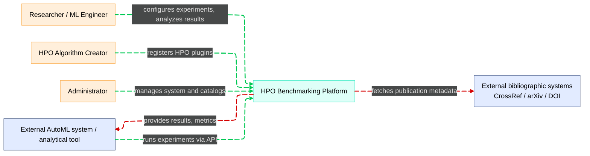

# System Context

> **HPO (Hyperparameter Optimization) Algorithm Benchmarking System**

---

## Design Assumptions

**Target Scale:** Single research team / small laboratory (several to dozen concurrent users), but with the ability to scale to a larger cluster.

**Technology Stack:** Dominant ML stack is Python (scikit-learn, PyTorch, TensorFlow, XGBoost, etc.), but the architecture is not tightly coupled to it.

**Deployment:** **PC-first (docker-compose, single-node)** with a simple path to **cloud / K8s**.

**Authorization:** Classic roles **Researcher / Plugin Creator / Administrator**, with future integration with external IdP.

**Scope:** Benchmarks primarily concern ML model training, but the architecture doesn't assume a specific domain – it can be extended to other types of optimization tasks.

---

## Context Diagram

---

## Users and External Systems

### Researcher / ML Engineer
**Primary system users**
- Defines benchmarks, configures experiments
- Runs experiments locally / in the cloud
- Analyzes results, compares HPO algorithms
- Exports data to external analytical tools

### HPO Algorithm Creator (Plugin Author)
**Algorithm developers**
- Implements HPO algorithms as plugins based on SDK
- Registers and versions own algorithms
- Tests them on existing benchmarks

### System Administrator
**Manages infrastructure and configuration**
- Manages deployment (PC / cloud)
- Configures resources, permissions, integrations (IdP, monitoring)
- Adds / approves built-in HPO algorithms and "canonical" benchmarks
- Includes roles: Local Administrator (PC/lab) and DevOps/SRE (cloud/K8s)

### External AutoML system / analytical tool
**System integrations**
- Calls API to run experiments
- Retrieves benchmark results for further analysis (BI, Jupyter, AutoML pipeline)

### Bibliographic sources (external systems)
**Bibliographic services**
- CrossRef, arXiv, DOI resolver
- Enable validation and completion of publication metadata

---

## Central System

### HPO Benchmarking Platform

**Main system supporting:**
- Benchmark design
- Running HPO experiments
- Tracking experiments and runs
- Results analysis and reporting
- Managing HPO algorithms (built-in + plugins)
- Managing publication references

---

## Business Requirements

> **Detailed business requirements**: [Business Requirements](../requirements/business-requirements.md)

System must fulfill key business requirements supporting strategic goals:

- **BR1**: Version control, statistical rigor, publication support
- **BR4-BR6**: Production readiness, decision support, enterprise features
- **BR7**: Multi-language SDK, documentation, plugin certification
- **BR9**: Auto-scaling, monitoring, disaster recovery

Full acceptance criteria and strategic alignment detailed in the dedicated business requirements document.

---

## Functional Requirements

> **Detailed functional requirements**: [Functional Requirements](../requirements/functional-requirements.md)

System must fulfill key functional requirements (R1-R15):

- **R1-R4**: Algorithm and benchmark catalogs, plugin support, versioning
- **R5-R7**: Experiment configuration and orchestration, tracking panel
- **R8-R11**: Results analysis, comparison, artifacts, reporting
- **R12-R15**: API, SDK, data export, multi-environment deployment

Full acceptance criteria and implementation detailed in the dedicated requirements document.

---

## Non-functional Requirements

> **Detailed non-functional requirements**: [Non-functional Requirements](../requirements/non-functional-requirements.md)

System must fulfill key non-functional requirements:

- **RNF1-RNF3**: Scalability, Reliability, Security
- **RNF4-RNF6**: Observability, Extensibility, Cloud-ready deployment  
- **RNF7-RNF10**: Reproducibility, Usability, Backup/DR, Performance

Full acceptance criteria and implementation in dedicated requirements document.

---

## How Architecture Supports Good Benchmarking Practices

### Benchmarking Goals G1–G5 vs System Architecture

Reminder of HPO benchmarking goals:

- **G1** – Algorithm performance evaluation  
- **G2** – Comparison of algorithms  
- **G3** – Sensitivity / robustness analysis  
- **G4** – Extrapolation / generalization of results  
- **G5** – Support for theory and algorithm development  

**Mapping goals to architecture components:**

| Benchmark Goal | Description / role in system | Related containers / services | Key components |
|----------------|------------------------------|------------------------------|----------------|
| **G1 – Evaluation** | Quality assessment of individual HPO algorithms on well-defined benchmarks and metrics | Experiment Orchestrator, Worker Runtime, Experiment Tracking Service, Metrics Analysis Service | MetricCalculator, RunLifecycleManager, ExperimentConfigManager, TrackingAPI |
| **G2 – Comparison** | Comparison of multiple HPO algorithms (including custom ones) on the same benchmarks and metrics | Metrics Analysis Service, Web UI (ComparisonViewUI), Experiment Tracking Service | AggregationEngine, StatisticalTestsEngine, ComparisonViewUI |
| **G3 – Sensitivity** | Sensitivity analysis of results to changes in configuration, seeds, benchmark instances and parameters | Experiment Orchestrator, Benchmark Definition Service, Metrics Analysis Service | ExperimentPlanBuilder, BenchmarkRepository, MetricCalculator |
| **G4 – Extrapolation** | Study of HPO algorithm behavior on diverse problem instances (scalability, difficulty, size) | Benchmark Definition Service, Experiment Orchestrator, Worker Runtime | ProblemInstanceManager, BenchmarkVersioning |
| **G5 – Theory and development** | Support for developing new HPO algorithms and linking results to theory and scientific literature | Publication Service, Algorithm Registry, Plugin SDK / Plugin Runtime | ReferenceCatalog, ReferenceLinker, IAlgorithmPlugin SDK, AlgorithmMetadataStore |

### Good Benchmarking Practices Checklist

| ID | Good Practice | Related System Components | Architecture Support |
|----|---------------|---------------------------|---------------------|
| 1 | Clearly defined experiment goals (G1–G5) | Web UI (ExperimentDesignerUI), Experiment Orchestrator | Experiment wizard with clear goals and metrics |
| 2 | Well-defined problems / benchmark instances | Benchmark Definition Service, BenchmarkRepository, ProblemInstanceManager | Benchmark catalog with metadata and versioning |
| 3 | Conscious algorithm / configuration selection | Algorithm Registry, AlgorithmMetadataStore, CompatibilityChecker | Algorithm registry with descriptions and compatibility checking |
| 4 | Well-defined performance measures | Metrics Analysis Service, MetricCalculator | Standard and custom metrics with validation |
| 5 | Experiment plan (design), including budgets and repetitions | Experiment Orchestrator, ExperimentPlanBuilder, RunScheduler | Automatic experiment matrix planning |
| 6 | Results analysis and presentation | Metrics Analysis Service, Web UI (ComparisonViewUI, dashboards) | Interactive dashboards with statistical tests |
| 7 | Full reproducibility | ReproducibilityManager, LineageTracker, Results Store, Object Storage | Environment snapshots, seeds, versioning |  
| 8 | Linking results to scientific literature | Publication Service, ReferenceLinker | Publication catalog with automatic linking |
| 9 | Iterative design and testing of HPO algorithms | Algorithm SDK / Plugin Runtime, Algorithm Registry | Plugin SDK with lifecycle from draft to production |
| 10 | Flexible deployment (PC-first, cloud-ready) | All services with containerization support | Docker Compose (PC) + Kubernetes (cloud) |

---

## Related Documents

- **Next level**: [Containers (C4-2)](c2-containers.md)
- **Components**: [Components (C4-3)](c3-components.md)
- **Code**: [Code (C4-4)](c4-code.md)
- **Usage**: [Use Cases](../requirements/use-cases.md)
- **Deployment**: [Deployment Guide](../operations/deployment-guide.md)
