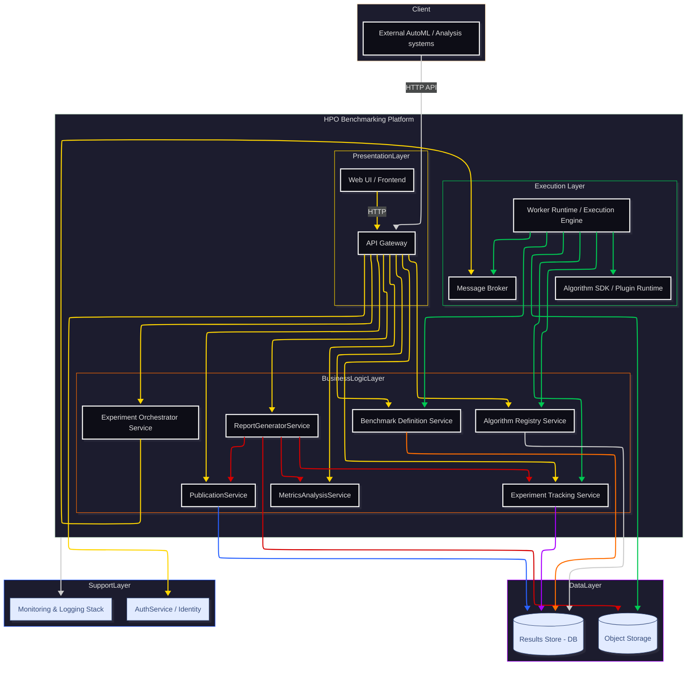

# Containers

> **Decomposition of HPO Benchmarking Platform system into containers (applications, services, databases)**

---

## Container Architecture Diagram

---

## Container Overview

### 🎨 Presentation Layer
- **Web UI (Frontend)** - User interface React/Vue/Angular
- **API Gateway** - Single HTTP/REST/GraphQL entry point

### 🧠 Business Logic Layer (Core Services)
- **Experiment Orchestrator** - Experiment orchestration and planning
- **Experiment Tracking** - Run and metrics tracking
- **MetricsAnalysisService** - Results analysis and aggregation
- **Benchmark Definition Service** - Benchmark and problem definitions
- **Algorithm Registry Service** - HPO algorithm catalog
- **PublicationService** - Publication and reference management
- **ReportGeneratorService** - Report generation

### ⚡ Execution Layer
- **Worker Runtime** - Individual run execution
- **Algorithm SDK/Plugin Runtime** - Algorithm plugin execution
- **Message Broker** - Task and event queuing

### 💾 Data Layer
- **Results Store (Database)** - Relational database (PostgreSQL)
- **File/Object Storage** - Artifacts, datasets, models

### 🔧 Support Layer
- **Auth Service** - Authorization and authentication
- **Monitoring & Logging** - Observability and diagnostics

---

## Detailed Container Description

| Container | Layer | Responsibilities | Communication | PC vs Cloud | Role in benchmarking |
|----------|---------|-------------------|-------------|--------------|---------------------|
| **Web UI (Frontend)** | **Presentation** | • Interface for benchmark and experiment definition • HPO algorithm catalog viewing • Experiment tracking panel • Results comparison • Publication management • Report generation • Basic administration | • REST/GraphQL/WebSocket z **API Gateway** (sync) | **PC:** local container or static files **Cloud:** frontend (CDN/storage) | Presentation of experiment goals, configuration, results and statistics |
| **API Gateway / Backend API** | **Presentation** | • Single entry point for Web UI and external systems • Request routing to domain services • Authorization/authentication • Rate limiting, CORS | • Z klientami: HTTP REST/GraphQL (sync) • Z usługami: HTTP/gRPC (sync) + Message Broker (async) | **PC:** single container (monolith/gateway) **Cloud:** API Gateway + microservices | Central integration point and function exposure |
| **Experiment Orchestrator Service** | **Business Logic** | • Accepting experiment definitions • Plan validation (algorithms, instances) • Creating run plans (algorithm × instance × seed) • Assigning runs to workers • Experiment state management • Reproducibility control | • Sync: z API Gateway • Async: do Worker Runtime (Message Broker) • Events: RunCompleted/RunFailed | **PC:** single instance **Cloud:** scalable microservice, HA | Implements **experiment plan** and budget control |
| **Worker Runtime / Execution Engine** | **Execution** | • Executing individual runs • Loading benchmark and instances • Running HPO algorithm • Reporting metrics • Error handling and retry | • Async: odbiór zadań z Message Broker • Sync/Async: zapisy do Tracking Service • Dostęp do Object Storage | **PC:** 1-N workers (docker-compose) **Cloud:** worker pods, autoscaling | Ensures reproducibility and comparability of runs |
| **Benchmark Definition Service** | **Business Logic** | • Storing benchmark definitions • Benchmark versioning • Dataset and problem lists • Metrics, known optimum/best-known | • Sync: API for Orchestrator and Web UI | **PC/Cloud:** single container | Implements problem instance selection
| **Algorithm Registry Service** | **Business Logic** | • HPO algorithm registry (built-in + plugins) • Metadata: name, type, parameters • Algorithm versioning • Compatibility validation | • Sync: API for Web UI, Orchestrator, Plugin Runtime | **PC/Cloud:** single container/service | Conscious algorithm and configuration selection |
| **Algorithm SDK / Plugin Runtime** | **Execution** | • Loading and isolating plugins • Plugin API contract • Input/output validation • Results reporting | • Locally with Worker Runtime • API or language calls | **PC/Cloud:** same code, different environment | Easy algorithm addition in unified environment |
| **Experiment Tracking Service** | **Business Logic** | • API for logging runs, metrics, tags • Relationships: experiment→run→algorithm→benchmark • Parameter change history • Search and filtering | • Sync: API for Worker Runtime, Orchestrator, Web UI | **PC:** 1 container **Cloud:** scalable microservice | Tracking panel, results analysis, reproducibility |
| **MetricsAnalysisService** | **Business Logic** | • Results aggregation • Complex metrics (time to error level) • Statistical tests • Comparative charts | • Sync: API for Web UI • Async: listening to RunCompleted events | **PC:** 1 container **Cloud:** scalable microservice | **Analysis and presentation of benchmark results** |
| **PublicationService** | **Business Logic** | • Publication catalog (DOI, BibTeX) • Links to algorithms/benchmarks • Bibliography generation • CrossRef/arXiv integration | • Sync: API for Web UI, other services • Sync/Async: calls to bibliographic systems | **PC/Cloud:** integration service | Links results to scientific literature |
| **Results Store (Database)** | **Data** | • Domain data: Experiments, Runs, Metrics • Algorithms, Benchmarks, Publications • Relationships and configurations • ACID transactions | • Internal: through DAO from domain services • Orchestrator: only indirectly through API | **PC:** local PostgreSQL **Cloud:** managed database | Central repository for reproducibility |
| **Object Storage** | **Data** | • Large artifacts: datasets, models • File logs • Generated reports • Versioning and lifecycle | • S3/File API from workers and services | **PC:** local disk/MinIO **Cloud:** S3/GCS/Azure Blob | Reproducible artifact storage |
| **Message Broker (RabbitMQ/Redis)** | **Execution** | • Run task queue • System events • RunStarted/Completed/Failed • ExperimentCompleted | • Async: messages between services • Pub/Sub pattern | **PC:** RabbitMQ (primary), Redis (fallback) **Cloud:** Managed RabbitMQ or Redis Streams | Flexible experiment plan and scaling |
| **Monitoring & Logging Stack** | **Support** | • **Metrics:** Prometheus + Thanos (long-term) • **Logging:** ELK Stack (Elasticsearch/Logstash/Kibana) • **Tracing:** Jaeger distributed tracing • **Dashboards:** Grafana unified visualization • Business KPIs and SLA monitoring | • OpenTelemetry instrumentation • Fluentd log shipping • AlertManager notifications | **PC:** Prometheus+Grafana+basic logging **Cloud:** Full observability stack with clustering | Three pillars observability (metrics/logs/traces) |
| **Auth Service** | **Support** | • OAuth2/OIDC authentication • RBAC with role hierarchy (admin/plugin-author/researcher/viewer) • JWT token management (15min TTL) • MFA for privileged operations • API keys for programmatic access | • Sync: OAuth2 flows, token validation • Integration with external IdP | **PC:** built-in IdP with local accounts **Cloud:** SAML/OIDC integration | Multi-tenant access control and compliance |
| **ReportGeneratorService** | **Business Logic** | • HTML/PDF/LaTeX reports • Data aggregation from multiple sources • Templates and styling • Bibliography and citations | • Sync: API from Web UI and Orchestrator • Data fetch from Tracking/Results Store | **PC/Cloud:** Python/Node.js service | Consistent, repeatable benchmark reports |

---

## Communication Patterns

### 🔄 Synchronous (Request/Response)
- **Web UI ↔ API Gateway**: REST/GraphQL
- **API Gateway ↔ Core Services**: HTTP/gRPC
- **Worker ↔ Tracking Service**: REST API
- **Services ↔ Results Store**: Database queries

### ⚡ Asynchronous (Event-driven)
- **Orchestrator → Workers**: Task queue (RabbitMQ primary, Redis fallback)
- **Workers → Analytics**: RunCompleted events
- **System events**: ExperimentStarted/Completed/Failed (via Event Bus)
- **Notifications**: Alerts, status updates

### 📊 Batch Processing
- **Metrics aggregation**: Scheduled batch jobs
- **Report generation**: On-demand/scheduled
- **Data export**: Bulk operations

---

## Scaling and Availability

### 📈 Scaling strategies

| Layer | PC | Cloud | Bottlenecks |
|---------|-------|-------|-------------|
| **Frontend** | 1 instance | CDN + multiple replicas | N/A (stateless) |
| **API Gateway** | 1 container | Load balancer + replicas | Rate limiting |
| **Core Services** | 1 each | Auto-scaling groups | Database connections |
| **Workers** | 1-N containers | HPA based on queue length | CPU/Memory intensive |
| **Database** | Single instance | Read replicas, sharding | Concurrent writes |
| **Object Storage** | Local disk/MinIO | Distributed storage | Network I/O |

### 🛡️ High Availability (HA)

**Critical components:**
- **Results Store**: Master-slave replication
- **Message Broker**: Clustered setup
- **API Gateway**: Load balancing
- **Workers**: Stateless, easy replacement

**Recovery strategies:**
- **Database**: Point-in-time recovery, backups
- **Object Storage**: Cross-region replication
- **Services**: Health checks, auto-restart
- **Workers**: Retry policies, dead letter queues

---

## Container Monitoring

### 📊 Key Metrics
- **Performance**: CPU, Memory, Network, Disk I/O
- **Business**: Run duration, success/failure rates
- **System**: Queue lengths, connection pools
- **Custom**: Algorithm-specific metrics

### 🚨 Alerting
- **Infrastructure**: Container down, resource exhaustion
- **Application**: High error rates, long-running jobs
- **Business**: Experiment failures, data quality issues

### 📈 Dashboards
- **System overview**: All containers health
- **Experiment tracking**: Active runs, queue status
- **Performance**: Latency, throughput per service
- **Business**: Benchmark results, algorithm comparisons

---

## Related Documents

- **Previous level**: [Context (C4-1)](c1-context.md)
- **Next level**: [Components (C4-3)](c3-components.md)
- **Implementation details**: [Code (C4-4)](c4-code.md)
- **Requirements**: [Functional Requirements](../requirements/functional-requirements.md), [Use Cases](../requirements/use-cases.md)
- **Deployment**: [Deployment Guide](../operations/deployment-guide.md)
- **Monitoring**: [Monitoring Guide](../operations/monitoring-guide.md)
