# Komponenty - Corvus Corone (C4-3)

> **Szczegóły implementacyjne głównych kontenerów systemu HPO Benchmarking Platform**

---

## Diagram komponentów

```mermaid
---
config:
  layout: elk
  theme: redux-dark
---
flowchart TB
 subgraph WebUI["Web UI (kontener)"]
        WebUI_Designer["ExperimentDesignerUI"]
        WebUI_Tracking["TrackingDashboardUI"]
        WebUI_Comparison["ComparisonViewUI"]
        WebUI_BenchCatalog["BenchmarkCatalogUI"]
        WebUI_AlgoCatalog["AlgorithmCatalogUI"]
        WebUI_Publications["PublicationManagerUI"]
        WebUI_Admin["AdminSettingsUI"]
  end
 subgraph APIGateway["API Gateway / Backend API (kontener)"]
        APIGateway_Public["Public API"]
        APIGateway_Auth["AuthN/AuthZ"]
        APIGateway_Routing["Routing"]
  end
 subgraph PresentationLayer["🎨 Warstwa prezentacji"]
        WebUI
        APIGateway
  end
 subgraph ExperimentOrchestrator["Experiment Orchestrator Service (kontener)"]
        Orchestrator_Config["ExperimentConfigManager"]
        Orchestrator_Plan["ExperimentPlanBuilder"]
        Orchestrator_Scheduler["RunScheduler"]
        Orchestrator_State["ExperimentStateStore"]
        Orchestrator_Reprod["ReproducibilityManager"]
        Orchestrator_Events["EventPublisher"]
  end
 subgraph BenchmarkDefinitionService["Benchmark Definition Service (kontener)"]
        Bench_Repo["BenchmarkRepository"]
        Bench_Instances["ProblemInstanceManager"]
        Bench_Versioning["BenchmarkVersioning"]
  end
 subgraph AlgorithmRegistryService["Algorithm Registry Service (kontener)"]
        Algo_Metadata["AlgorithmMetadataStore"]
        Algo_Versions["AlgorithmVersionManager"]
        Algo_Compat["CompatibilityChecker"]
  end
 subgraph ExperimentTrackingService["Experiment Tracking Service (kontener)"]
        Track_API["TrackingAPI"]
        Track_Runs["RunLifecycleManager"]
        Track_Search["TaggingAndSearchEngine"]
        Track_Lineage["LineageTracker"]
  end
 subgraph MetricsAnalysisService["MetricsAnalysisService (kontener)"]
        Metrics_Calc["MetricCalculator"]
        Metrics_Agg["AggregationEngine"]
        Metrics_Stats["StatisticalTestsEngine"]
        Metrics_Query["VisualizationQueryAdapter"]
  end
 subgraph PublicationService["PublicationService (kontener)"]
        Pub_Catalog["ReferenceCatalog"]
        Pub_Citation["CitationFormatter"]
        Pub_Linker["ReferenceLinker"]
        Pub_External["ExternalBibliographyClient"]
  end
 subgraph ReportGeneratorService["ReportGeneratorService (kontener)"]
        Report_Template["ReportTemplateEngine"]
        Report_Assembler["ReportAssembler"]
        Report_Exporter["ReportExporter"]
        Report_Metadata["ReportMetadataStore"]
  end
 subgraph BusinessLogicLayer["🧠 Warstwa logiki biznesowej"]
        ExperimentOrchestrator
        BenchmarkDefinitionService
        AlgorithmRegistryService
        ExperimentTrackingService
        MetricsAnalysisService
        PublicationService
        ReportGeneratorService
  end
 subgraph WorkerRuntime["Worker Runtime / Execution Engine (kontener)"]
        Worker_Executor["RunExecutor"]
        Worker_DataLoader["DatasetLoader"]
        Worker_Reporter["MetricReporter"]
        Worker_Uploader["ArtifactUploader"]
  end
 subgraph PluginRuntime["Algorithm SDK / Plugin Runtime (kontener)"]
        Plugin_Interface["IAlgorithmPlugin"]
        Plugin_Loader["PluginLoader"]
        Plugin_Sandbox["SandboxManager"]
        Plugin_Validator["PluginValidator"]
  end
 subgraph MessageBroker["Message Broker (kontener)"]
        Broker_RunQueue["RunJobQueue"]
        Broker_EventBus["EventBus"]
  end
 subgraph ExecutionLayer["⚡ Warstwa wykonawcza"]
        WorkerRuntime
        PluginRuntime
        MessageBroker
  end
 subgraph ResultsStore["Results Store (kontener)"]
        DAO_Experiments["ExperimentDAO"]
        DAO_Runs["RunDAO"]
        DAO_Metrics["MetricDAO"]
        DAO_Algorithms["AlgorithmDAO"]
        DAO_Benchmarks["BenchmarkDAO"]
        DAO_Publications["PublicationDAO"]
        DAO_Links["LinkDAO"]
  end
 subgraph ObjectStorage["File / Object Storage (kontener)"]
        Storage_Client["ObjectStorageClient"]
        Storage_Artifacts["ArtifactRepository"]
        Storage_Datasets["DatasetRepository"]
  end
 subgraph DataLayer["💾 Warstwa danych"]
        ResultsStore
        ObjectStorage
  end
 subgraph AuthServiceC["Auth Service (kontener)"]
        Auth_TokenValidation["TokenValidation"]
        Auth_RoleMapping["RoleMapping"]
  end
 subgraph MonitoringStack["Monitoring & Logging Stack (kontener)"]
        Monitoring_LogCollector["LogCollector"]
        Monitoring_MetricsCollector["MetricsCollector"]
        Monitoring_Dashboard["MonitoringDashboard"]
        Monitoring_Alerting["AlertingEngine"]
  end
 subgraph SupportLayer["🔧 Warstwa wsparcia"]
        AuthServiceC
        MonitoringStack
  end
    WebUI_Designer --> APIGateway_Public
    WebUI_Tracking --> APIGateway_Public
    WebUI_Comparison --> APIGateway_Public
    WebUI_BenchCatalog --> APIGateway_Public
    WebUI_AlgoCatalog --> APIGateway_Public
    WebUI_Publications --> APIGateway_Public
    APIGateway_Public --> Orchestrator_Config & Track_API & Metrics_Query & Pub_Catalog & Bench_Repo & Algo_Metadata & Report_Assembler
    Orchestrator_Config --> Bench_Repo & Algo_Metadata
    Orchestrator_Plan --> Bench_Instances
    Orchestrator_Scheduler --> Broker_RunQueue
    Broker_RunQueue --> Worker_Executor
    Orchestrator_State --> Track_API
    Orchestrator_Events --> Broker_EventBus
    Worker_Executor --> Plugin_Interface & Track_Runs
    Worker_Uploader --> Storage_Artifacts
    Worker_DataLoader --> Storage_Datasets
    Track_API --> DAO_Experiments
    Track_Runs --> DAO_Runs
    Track_Search --> DAO_Experiments
    Track_Lineage --> DAO_Links
    Metrics_Calc --> DAO_Metrics
    Metrics_Agg --> DAO_Metrics
    Pub_Catalog --> DAO_Publications
    Pub_Linker --> DAO_Links
    Report_Assembler --> Track_API & Metrics_Agg & Pub_Catalog
    Report_Exporter --> Storage_Artifacts
    Bench_Instances --> Storage_Datasets
    Monitoring_LogCollector --> Worker_Executor
    Monitoring_MetricsCollector --> Orchestrator_State & APIGateway_Public
    Auth_TokenValidation --> APIGateway_Auth
    Auth_RoleMapping --> WebUI_Designer
    classDef presentationLayer fill:#FFE0B2,stroke:#FF6D00,stroke-width:2px
    classDef businessLayer fill:#FFF3E0,stroke:#FF9800,stroke-width:2px
    classDef executionLayer fill:#E8F5E8,stroke:#4CAF50,stroke-width:2px
    classDef dataLayer fill:#F3E5F5,stroke:#9C27B0,stroke-width:2px
    classDef supportLayer fill:#E3F2FD,stroke:#2196F3,stroke-width:2px
    style BusinessLogicLayer stroke:#FFD600
    style SupportLayer stroke:#D50000
    style PresentationLayer stroke:#FF6D00
    style ExecutionLayer stroke:#00C853
    style DataLayer stroke:#2962FF
```



Poniżej znajduje się opis komponentów podzielony ze względu na kontenery do których przynależą.

---

## 3.1 Experiment Orchestrator Service

**Odpowiedzialny za:** Orkiestrację eksperymentów, planowanie runów, zarządzanie stanem

| Komponent | Odpowiedzialności | Interakcje |
|-----------|-------------------|-------------|
| **ExperimentConfigManager** | • Waliduje konfigurację eksperymentu<br>• Sprawdza zgodność algorytmów z benchmarkami<br>• Waliduje budżety i limity zasobów | ↔ Benchmark Definition Service<br>↔ Algorithm Registry |
| **ExperimentPlanBuilder** | • Tworzy plan runów (macierz konfiguracji)<br>• Algorytm × instancja × seed × budżet<br>• Optymalizuje kolejność wykonania | ← ExperimentConfigManager<br>→ RunScheduler |
| **RunScheduler** | • Przekłada plan na zadania w kolejce<br>• Zarządza priorytetami<br>• Obsługuje retry i cancel | ← ExperimentPlanBuilder<br>→ Message Broker<br>↔ Worker Runtime |
| **ExperimentStateStore** | • Zarządzanie stanem eksperymentów<br>• Statusy runów: PENDING, RUNNING, FAILED, COMPLETED<br>• **Brak własnej bazy** - wszystkie dane przez API Tracking Service | ↔ Experiment Tracking Service<br>↔ Web UI (dashboardy) |
| **ReproducibilityManager** | • Zarządzanie seedami<br>• Wersje obrazów, snapshoty konfiguracji<br>• Zapewnienie odtwarzalności | ↔ Experiment Tracking Service<br>↔ Results Store (pośrednio) |
| **EventPublisher** | • Publikuje zdarzenia systemowe<br>• ExperimentStarted/Completed/Failed<br>• Integration events | → Message Broker/Event Bus<br>→ Monitoring, Web UI, ReportGenerator |

### API Experiment Orchestrator Service

**Walidacja konfiguracji:**
```json
POST /api/v1/experiments/validate
{
  "benchmarks": ["benchmark_id_1", "benchmark_id_2"],
  "algorithms": ["algorithm_id_1", "algorithm_id_2"],
  "budget_config": {
    "max_evaluations": 100,
    "time_limit_minutes": 60
  },
  "seeds": [42, 123, 456]
}
```

**Uruchomienie eksperymentu:**
```json
POST /api/v1/experiments/{experiment_id}/start
{
  "priority": "NORMAL",
  "retry_policy": {
    "max_retries": 3,
    "retry_delay_seconds": 30
  }
}
```

---

## 3.2 Benchmark Definition Service

**Odpowiedzialny za:** Definicje benchmarków, instancje problemowe, wersjonowanie

| Komponent | Odpowiedzialności | Interakcje |
|-----------|-------------------|-------------|
| **BenchmarkRepository** | • CRUD benchmarków<br>• Metadane i opisy<br>• Linkowanie z publikacjami | ↔ Results Store (BenchmarkDAO)<br>↔ Experiment Orchestrator |
| **ProblemInstanceManager** | • Zarządza instancjami (dataset + konfiguracja)<br>• Mapping na datasety w Object Storage<br>• Sprawdzanie kompatybilności z algorytmami | ↔ DatasetRepository<br>↔ Algorithm Registry |
| **BenchmarkVersioning** | • Wersjonowanie benchmarków<br>• Oznaczanie wersji kanonicznych<br>• Migration paths między wersjami | ↔ BenchmarkRepository<br>↔ ExperimentConfigManager |

---

## 3.3 Algorithm Registry Service

**Odpowiedzialny za:** Katalog algorytmów HPO, wersjonowanie, kompatybilność

| Komponent | Odpowiedzialności | Interakcje |
|-----------|-------------------|-------------|
| **AlgorithmMetadataStore** | • Opis algorytmu: nazwa, typ, parametry<br>• Powiązania z publikacjami<br>• Wymagania środowiskowe | ↔ Results Store (AlgorithmDAO)<br>↔ Web UI (AlgorithmCatalogUI) |
| **AlgorithmVersionManager** | • Wersje implementacji algorytmów<br>• Status: draft, approved, deprecated<br>• Approval workflow | ↔ PluginLoader/PluginValidator<br>↔ Experiment Orchestrator |
| **CompatibilityChecker** | • Sprawdza kompatybilność algorytmu z benchmarkami<br>• Analiza wymagań zasobowych<br>• Problem type matching | ↔ Benchmark Definition Service |

### API Algorithm Registry

**Rejestracja algorytmu:**
```json
POST /api/v1/algorithms
{
  "name": "Custom Bayesian Optimizer",
  "type": "BAYESIAN",
  "parameter_space": {
    "acquisition_function": {
      "type": "categorical",
      "values": ["EI", "UCB", "PI"]
    }
  },
  "compatible_problem_types": ["CLASSIFICATION", "REGRESSION"]
}
```

**Zarządzanie wersjami:**
```json
POST /api/v1/algorithms/{algorithm_id}/versions
{
  "version": "1.1.0",
  "plugin_location": "s3://plugins/custom-bayes-opt-v1.1.0.whl",
  "changelog": "Fixed memory leak, improved convergence"
}
```

---

## 3.4 Algorithm SDK / Plugin Runtime

**Odpowiedzialny za:** Uruchamianie pluginów algorytmów, sandboxing, walidacja

| Komponent | Odpowiedzialności | Interakcje |
|-----------|-------------------|-------------|
| **IAlgorithmPlugin** | • Interfejs pluginu<br>• Metody: `suggest()`, `observe()`, `init()`<br>• Kontrakt input/output | Implementowany przez pluginy<br>Wywoływany przez SandboxManager |
| **PluginLoader** | • Ładuje pluginy (wheel, Python modules, gRPC)<br>• Dependency resolution<br>• Version management | ↔ AlgorithmVersionManager<br>↔ ObjectStorageClient |
| **SandboxManager** | • **Container isolation:** gVisor/Kata Containers dla strong isolation (patrz ADR-005)<br>• **Security policies:** Seccomp profiles, AppArmor/SELinux policies<br>• **Resource limits:** CPU/Memory/Disk quotas per plugin (1000m CPU, 2Gi RAM max)<br>• **Runtime monitoring:** Falco syscall monitoring, blocked syscalls<br>• **Filesystem:** Read-only root filesystem, write tylko /tmp<br>• **Network policies:** Deny all egress, allow API calls only<br>• **Image security:** Vulnerability scanning, distroless base images | ↔ Worker Runtime<br>↔ PluginLoader<br>↔ Security Policy Engine<br>↔ Container Runtime (gVisor/Kata) |
| **PluginValidator** | • Sprawdza implementację pluginu<br>• Testowy run<br>• Interface compliance | ↔ IAlgorithmPlugin<br>↔ Algorithm Registry |

---

## 3.5 Experiment Tracking Service

**Odpowiedzialny za:** Śledzenie runów, metryk, powiązań, historia eksperymentów

| Komponent | Odpowiedzialności | Interakcje |
|-----------|-------------------|-------------|
| **TrackingAPI** | • Publiczne API do logowania<br>• Runy, metryki, artefakty, tagi<br>• Real-time i batch updates | ← Worker Runtime/pluginy/Web UI<br>↔ RunLifecycleManager, DAO-y |
| **RunLifecycleManager** | • Tworzy runy, aktualizuje statusy<br>• Lifecycle management<br>• Event emission | ↔ Experiment Orchestrator<br>↔ Results Store (RunDAO)<br>↔ EventPublisher |
| **TaggingAndSearchEngine** | • Filtrowanie i tagowanie<br>• Full-text search<br>• Query optimization | ↔ Results Store<br>↔ Web UI (dashboardy) |
| **LineageTracker** | • Powiązania: eksperyment→run→algorytm→benchmark<br>• Data lineage<br>• Provenance tracking | ↔ Results Store (LinkDAO)<br>↔ PublicationService<br>↔ ReportGenerator |

### API Experiment Tracking

**Logowanie runu:**
```json
POST /api/v1/runs
{
  "experiment_id": "exp_123",
  "algorithm_version_id": "alg_v1.2.3",
  "benchmark_instance_id": "bench_inst_456",
  "seed": 42
}
```

**Logowanie metryk:**
```json
POST /api/v1/runs/{run_id}/metrics
{
  "metrics": [
    {
      "name": "best_score",
      "value": 0.9234,
      "step": 10,
      "timestamp": "2025-11-18T14:35:00Z"
    }
  ]
}
```

---

## 3.6 MetricsAnalysisService

**Odpowiedzialny za:** Agregacja wyników, analizy statystyczne, wizualizacje

| Komponent | Odpowiedzialności | Interakcje |
|-----------|-------------------|-------------|
| **MetricCalculator** | • Oblicza metryki z surowych wyników<br>• Accuracy, regret, convergence rate<br>• Custom metrics | ↔ TrackingAPI/MetricDAO<br>↔ AggregationEngine |
| **AggregationEngine** | • Agreguje wyniki po benchmarkach/algorytmach<br>• Statistical summaries<br>• Ranking computations | ↔ MetricCalculator<br>↔ StatisticalTestsEngine |
| **StatisticalTestsEngine** | • Testy statystyczne (Friedman/Nemenyi)<br>• Significance testing<br>• Effect size calculations | ↔ AggregationEngine<br>↔ ReportGenerator<br>↔ Web UI |
| **VisualizationQueryAdapter** | • Przygotowuje dane do wykresów<br>• Chart data formatting<br>• Interactive queries | ← Web UI<br>↔ MetricDAO, AggregationEngine |

---

## 3.7 PublicationService

**Odpowiedzialny za:** Zarządzanie publikacjami, bibliografia, cytowania

| Komponent | Odpowiedzialności | Interakcje |
|-----------|-------------------|-------------|
| **ReferenceCatalog** | • Baza publikacji (metadane, DOIs)<br>• CRUD operations<br>• Search and filtering | ↔ Results Store (PublicationDAO)<br>↔ Web UI |
| **CitationFormatter** | • Generuje cytowania i BibTeX<br>• Multiple citation styles<br>• Export formats | ↔ ReferenceCatalog<br>↔ ReportGenerator |
| **ReferenceLinker** | • Łączy publikacje z algorytmami/benchmarkami<br>• Relationship management<br>• Impact tracking | ↔ LineageTracker<br>↔ Results Store (LinkDAO) |
| **ExternalBibliographyClient** | • Integracja z CrossRef/arXiv/DOI<br>• Metadata enrichment<br>• Auto-import | → External services<br>↔ ReferenceCatalog |

---

## 3.8 Results Store

**Odpowiedzialny za:** Warstwa dostępu do danych (DAO pattern)

| Komponent | Odpowiedzialności | Interakcje |
|-----------|-------------------|-------------|
| **ExperimentDAO** | • Dostęp do danych eksperymentów<br>• CRUD + queries<br>• Filtering, sorting | ↔ Experiment Tracking Service<br>↔ Web UI (pośrednio) |
| **RunDAO** | • Dostęp do danych runów<br>• Status management<br>• Metrics linking | ↔ RunLifecycleManager<br>↔ MetricsAnalysisService |
| **MetricDAO** | • Dostęp do danych metryk<br>• Time series queries<br>• Aggregation support | ↔ TrackingAPI<br>↔ MetricCalculator |
| **AlgorithmDAO** | • Dostęp do danych algorytmów<br>• Version management<br>• Metadata queries | ↔ AlgorithmMetadataStore |
| **BenchmarkDAO** | • Dostęp do danych benchmarków<br>• Instance management<br>• Compatibility queries | ↔ BenchmarkRepository |
| **PublicationDAO** | • Dostęp do danych publikacji<br>• Citation management<br>• Search support | ↔ ReferenceCatalog |
| **LinkDAO** | • Powiązania między encjami<br>• Relationship queries<br>• Lineage tracking | ↔ LineageTracker<br>↔ ReferenceLinker |

---

## 3.9 Web UI

**Odpowiedzialny za:** Interfejsy użytkownika (wszystkie interakcje przez API Gateway)

| Komponent | Odpowiedzialności | Cel używania |
|-----------|-------------------|--------------|
| **ExperimentDesignerUI** | • Kreator konfiguracji eksperymentów<br>• Wizard workflow<br>• Validation feedback | Badacze konfigurujący eksperymenty |
| **TrackingDashboardUI** | • Panel eksperymentów/runów<br>• Real-time monitoring<br>• Status tracking | Monitoring postępu eksperymentów |
| **ComparisonViewUI** | • Wykresy i porównania algorytmów<br>• Statistical analysis<br>• Interactive visualizations | Analiza wyników benchmarków |
| **BenchmarkCatalogUI** | • Katalog benchmarków<br>• Browse i search<br>• Metadata viewing | Wybór instancji problemowych |
| **AlgorithmCatalogUI** | • Katalog algorytmów<br>• Version management<br>• Compatibility checking | Dobór algorytmów HPO |
| **PublicationManagerUI** | • Zarządzanie publikacjami<br>• Bibliography management<br>• Citation tools | Linki do literatury naukowej |
| **AdminSettingsUI** | • Panel administracyjny<br>• System configuration<br>• User management | Konfiguracja systemu |

---

## 3.10 File / Object Storage

**Odpowiedzialny za:** Przechowywanie artefaktów, datasetów, modeli

| Komponent | Odpowiedzialności | Interakcje |
|-----------|-------------------|-------------|
| **ObjectStorageClient** | • Niskopoziomowy klient (S3/MinIO/GCS)<br>• Upload/download operations<br>• Authentication handling | Używany przez inne komponenty storage |
| **ArtifactRepository** | • Warstwa logiczna nad ObjectStorageClient<br>• Konwencje ścieżek<br>• Versioning support | ← Worker Runtime<br>↔ TrackingAPI<br>↔ ReportGenerator |
| **DatasetRepository** | • Datasety w Object Storage<br>• Lokalizacja i wersjonowanie<br>• Access control | ↔ ProblemInstanceManager<br>↔ Worker Runtime |

---

## 3.11 ReportGeneratorService

**Odpowiedzialny za:** Generowanie raportów z wyników eksperymentów

| Komponent | Odpowiedzialności | Interakcje |
|-----------|-------------------|-------------|
| **ReportTemplateEngine** | • Szablony raportów (HTML/PDF/LaTeX)<br>• Template management<br>• Customization support | ↔ ReportAssembler<br>↔ Web UI |
| **ReportAssembler** | • Składa dane z wielu źródeł<br>• Data aggregation<br>• Content generation | ↔ TrackingAPI<br>↔ MetricsAnalysisService<br>↔ PublicationService |
| **ReportExporter** | • Generuje pliki raportu<br>• Multiple formats<br>• URL generation | ↔ ArtifactRepository<br>↔ Web UI |
| **ReportMetadataStore** | • Metadane raportów<br>• Report catalog<br>• Access tracking | ↔ Results Store<br>↔ Web UI |

---

## 3.12 Message Broker

**Odpowiedzialny za:** Kolejkowanie zadań i zdarzeń systemowych

| Komponent | Odpowiedzialności | Główne powiązania |
|-----------|-------------------|-------------------|
| **RunJobQueue** | • Kolejka zadań runów eksperymentów<br>• Priority handling<br>• Dead letter queue | ← RunScheduler<br>→ Worker Runtime |
| **EventBus** | • Kanał zdarzeń domenowych<br>• Pub/Sub pattern<br>• Event routing | ← EventPublisher<br>→ Web UI, Monitoring |

---

## 3.13 Worker Runtime / Execution Engine

**Odpowiedzialny za:** Wykonywanie pojedynczych runów eksperymentów

| Komponent | Odpowiedzialności | Główne powiązania |
|-----------|-------------------|-------------------|
| **RunExecutor** | • Koordynuje przebieg runu<br>• Plugin orchestration<br>• Error handling | ← RunJobQueue<br>→ Plugin Runtime<br>→ Tracking |
| **DatasetLoader** | • Ładuje datasety z Object Storage<br>• Data preparation<br>• Cache management | ← Benchmark Definition Service<br>→ RunExecutor |
| **MetricReporter** | • Wysyła metryki do Tracking Service<br>• Real-time/batch reporting<br>• Retry logic | → Experiment Tracking<br>→ MetricsAnalysisService |
| **ArtifactUploader** | • Upload modeli i artefaktów<br>• Progress tracking<br>• URL generation | → File/Object Storage |

---

## 3.14 API Gateway / Backend API

**Odpowiedzialny za:** Punkt wejścia HTTP/REST/GraphQL

| Komponent | Odpowiedzialności | Główne powiązania |
|-----------|-------------------|-------------------|
| **REST/GraphQL API** | • Publiczne API backendu<br>• Request routing<br>• Response formatting | ← Web UI, external systems<br>→ Domain services |
| **AuthN/AuthZ** | • Uwierzytelnianie i autoryzacja<br>• Token validation<br>• RBAC enforcement | ↔ Auth Service<br>↔ Web UI |
| **Routing** | • Mapowanie endpointów na usługi<br>• Load balancing<br>• Circuit breaker | → Orchestrator, Tracking, Metrics, Catalogs |

---

## 3.15 Auth Service

**Odpowiedzialny za:** Autoryzacja i integracja tożsamości

| Komponent | Odpowiedzialności | Główne powiązania |
|-----------|-------------------|-------------------|
| **TokenValidation** | • Walidacja tokenów dostępowych<br>• JWT handling<br>• Session management | ← API Gateway, Web UI |
| **RoleMapping** | • Mapowanie użytkowników na role<br>• Permission checking<br>• RBAC implementation | → All services using roles/permissions |

---

## 3.16 Monitoring & Logging Stack

**Odpowiedzialny za:** Obserwowalność systemu, metryki, alertowanie

| Komponent | Odpowiedzialności | Główne powiązania |
|-----------|-------------------|-------------------|
| **LogCollector** | • Zbiera logi z kontenerów<br>• Log aggregation<br>• Structured logging | ← All containers (Orchestrator, API, Workers, etc.) |
| **MetricsCollector** | • Zbiera metryki techniczne i domenowe<br>• Prometheus-style metrics<br>• Custom metrics | ← Orchestrator, Workers, API Gateway, Results Store |
| **MonitoringDashboard** | • UI do przeglądania metryk<br>• Custom dashboards<br>• Query interface | ↔ Administrator, Researchers |
| **AlertingEngine** | • Definiowanie reguł alertów<br>• Notification delivery<br>• Escalation policies | ← Metrics/LogCollector<br>→ External channels (email, Slack) |

---

## Powiązane dokumenty

- **Poprzedni poziom**: [Kontenery (C4-2)](c2-containers.md)
- **Następny poziom**: [Kod (C4-4)](c4-code.md)
- **Kontekst**: [Kontekst (C4-1)](c1-context.md)
- **Wymagania**: [Functional Requirements](../requirements/functional-requirements.md), [Use Cases](../requirements/use-cases.md)
- **Deployment**: [Deployment Guide](../operations/deployment-guide.md)
- **Design decisions**: [Design Decisions](../design/design-decisions.md)
