# Kod - Corvus Corone (C4-4)

> **Szczegóły implementacyjne kluczowych komponentów systemu HPO Benchmarking Platform na poziomie kodu**

---

## Diagramy klas komponentów systemu

### 4.1 Experiment Orchestrator - Class Diagram

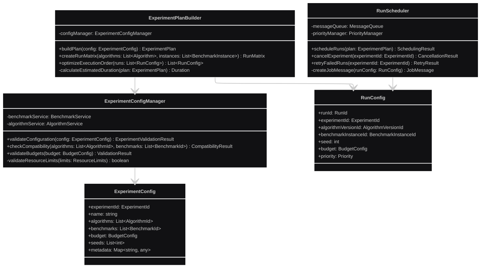

### 4.2 Algorithm Plugin Runtime - Class Diagram

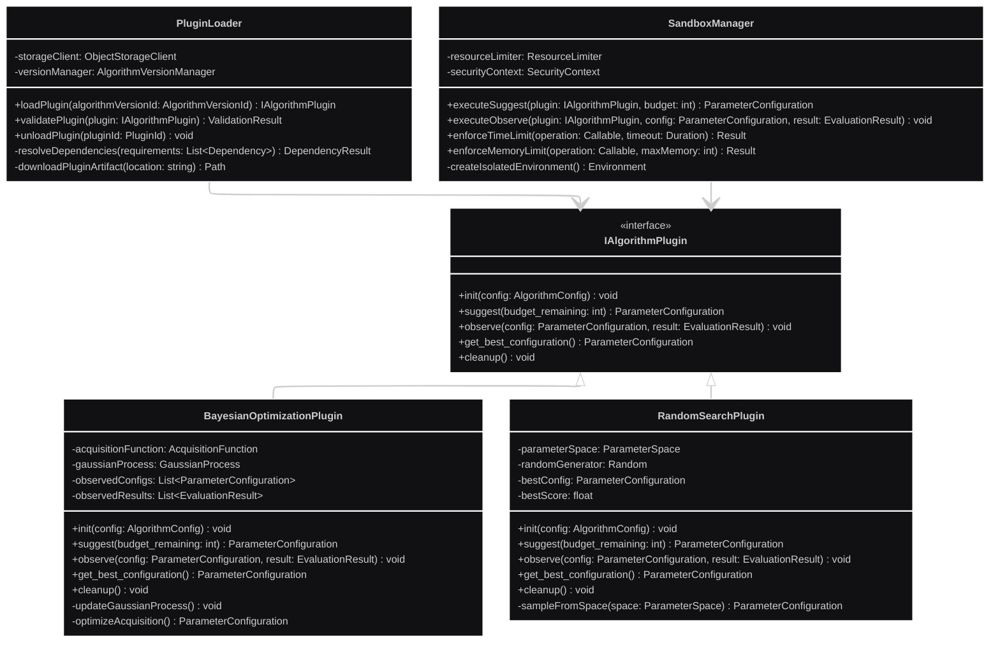

### 4.3 Tracking Service - Class Diagram

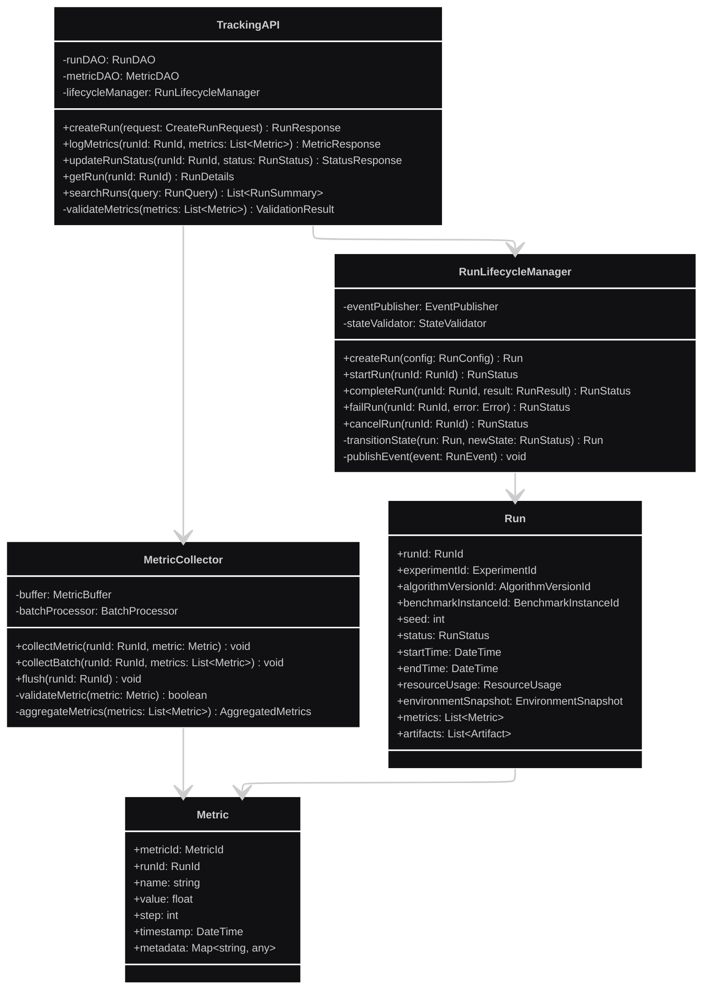

### 4.4 Benchmark Definition Service - Class Diagram

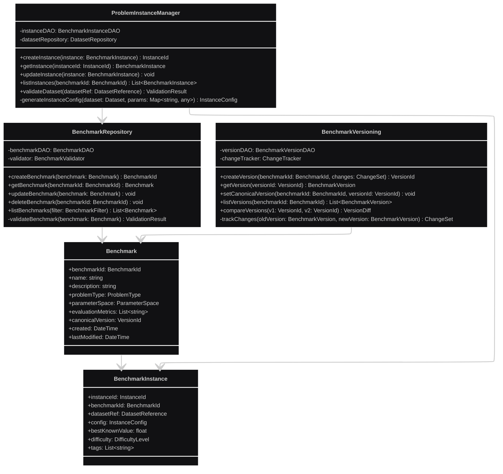

### 4.5 Algorithm Registry Service - Class Diagram

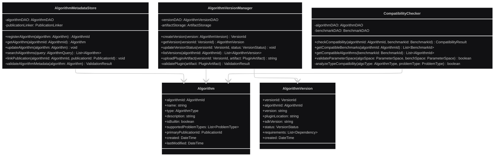

### 4.6 Worker Runtime - Class Diagram

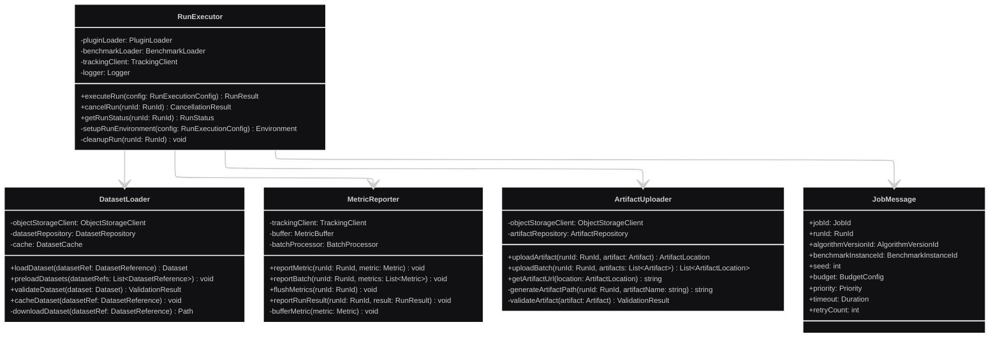

### 4.7 Metrics Analysis Service - Class Diagram

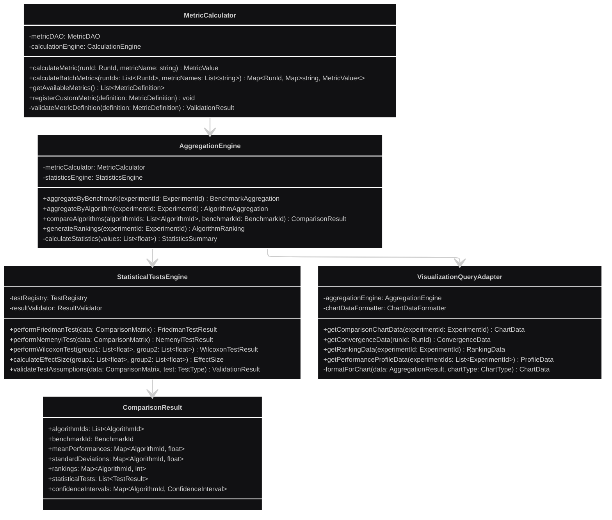

### 4.8 Publication Service - Class Diagram

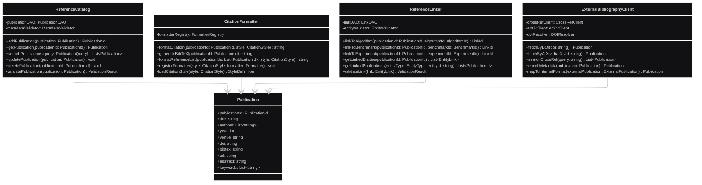

### 4.9 Report Generator Service - Class Diagram

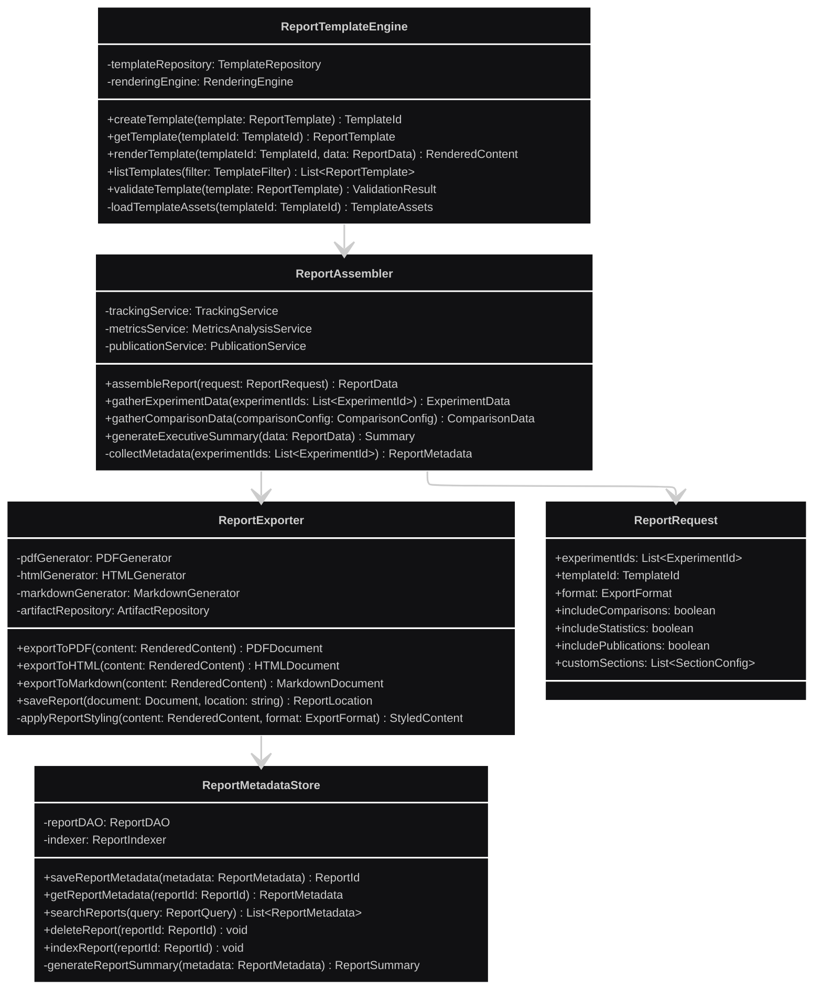

### 4.10 Results Store (Data Access Layer) - Class Diagram

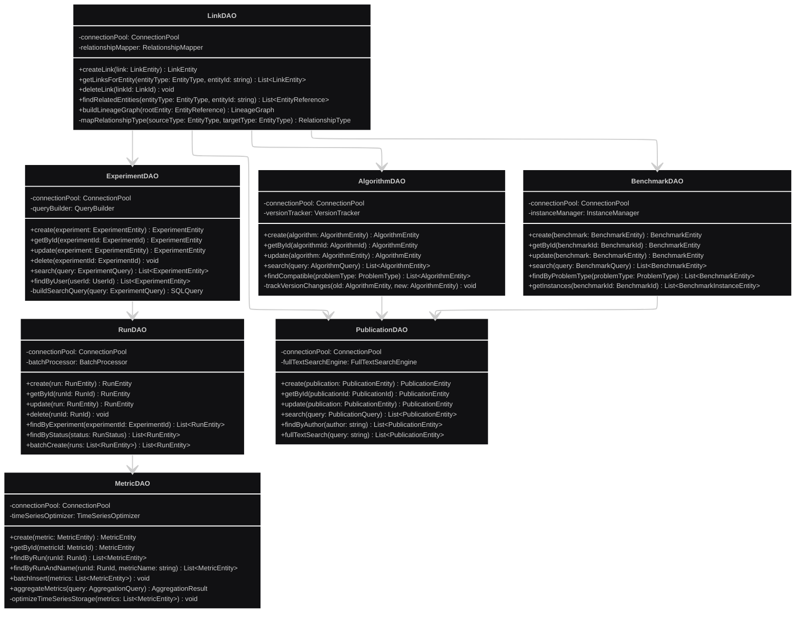

### 4.11 Object Storage - Class Diagram

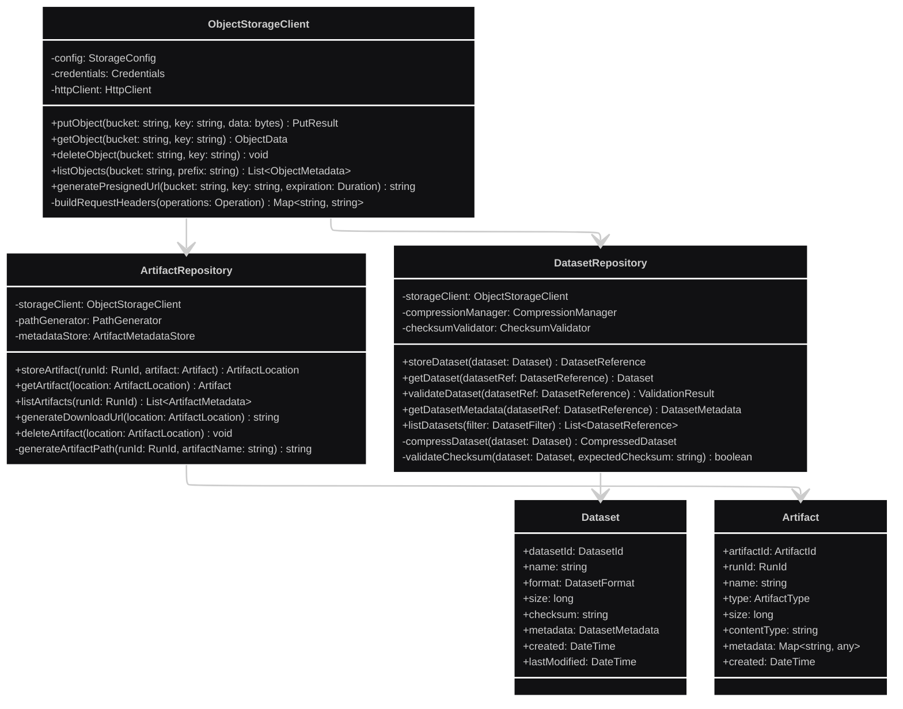

### 4.12 Web UI Components - Class Diagram

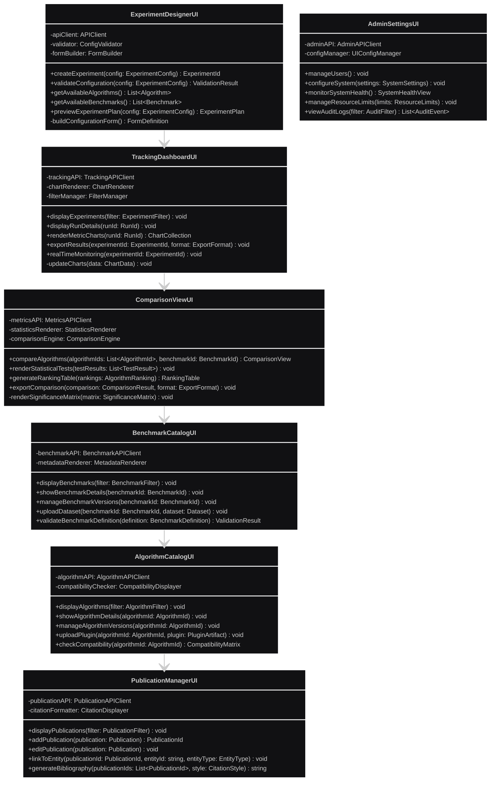

### 4.13 Message Broker - Class Diagram

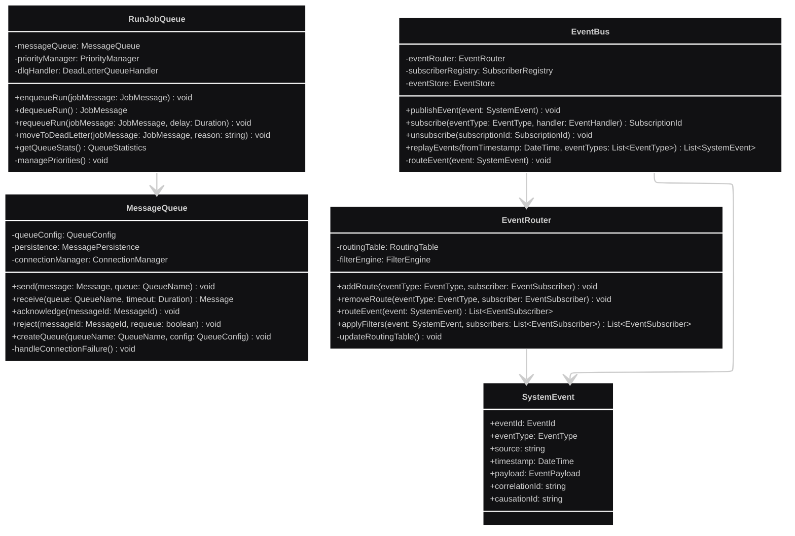

### 4.14 Authentication & Authorization - Class Diagram

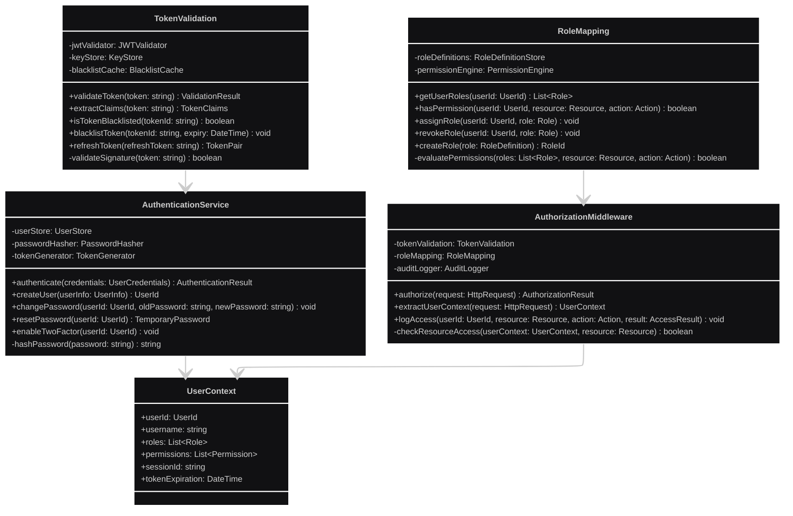

### 4.15 Monitoring & Logging - Class Diagram

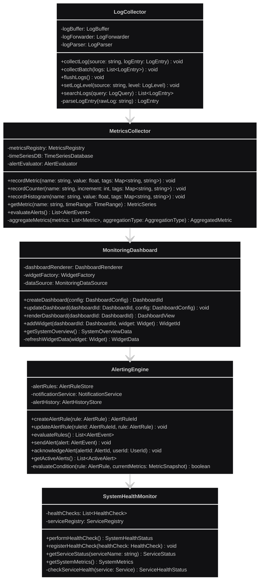

---

## Model danych (ERD)

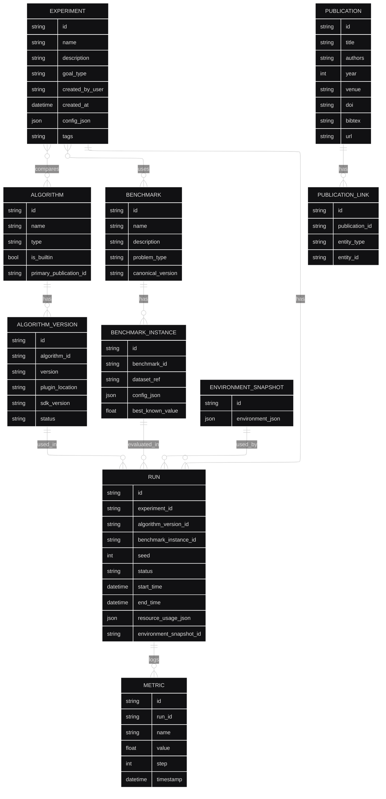

---

## Interfejsy API - implementacja

### 4.4 Python SDK dla pluginów algorytmów

```python
from abc import ABC, abstractmethod
from typing import Dict, Any, List, Optional
from dataclasses import dataclass
from datetime import datetime
import json

@dataclass
class ParameterConfiguration:
    """Konfiguracja parametrów dla pojedynczej ewaluacji"""
    parameters: Dict[str, Any]
    configuration_id: Optional[str] = None
    
    def to_dict(self) -> Dict[str, Any]:
        return {
            'parameters': self.parameters,
            'configuration_id': self.configuration_id
        }

@dataclass
class EvaluationResult:
    """Wynik ewaluacji konfiguracji parametrów"""
    objective_value: float
    additional_metrics: Dict[str, float]
    evaluation_time: float
    success: bool
    error_message: Optional[str] = None
    
    def to_dict(self) -> Dict[str, Any]:
        return {
            'objective_value': self.objective_value,
            'additional_metrics': self.additional_metrics,
            'evaluation_time': self.evaluation_time,
            'success': self.success,
            'error_message': self.error_message
        }

@dataclass
class AlgorithmConfig:
    """Konfiguracja algorytmu HPO"""
    algorithm_params: Dict[str, Any]
    parameter_space: Dict[str, Any]
    optimization_direction: str  # 'minimize' or 'maximize'
    random_seed: Optional[int] = None
    
class IAlgorithmPlugin(ABC):
    """Interfejs dla pluginów algorytmów HPO"""
    
    @abstractmethod
    def init(self, config: AlgorithmConfig) -> None:
        """
        Inicjalizacja algorytmu z podaną konfiguracją
        
        Args:
            config: Konfiguracja algorytmu i przestrzeni parametrów
        """
        pass
    
    @abstractmethod
    def suggest(self, budget_remaining: int) -> ParameterConfiguration:
        """
        Zasugeruj następną konfigurację parametrów do ewaluacji
        
        Args:
            budget_remaining: Pozostały budżet ewaluacji
            
        Returns:
            Konfiguracja parametrów do przetestowania
        """
        pass
    
    @abstractmethod
    def observe(self, config: ParameterConfiguration, result: EvaluationResult) -> None:
        """
        Zaobserwuj wynik ewaluacji konfiguracji
        
        Args:
            config: Konfiguracja która została przetestowana
            result: Wynik ewaluacji tej konfiguracji
        """
        pass
    
    @abstractmethod
    def get_best_configuration(self) -> ParameterConfiguration:
        """
        Zwróć najlepszą dotychczas znalezioną konfigurację
        
        Returns:
            Najlepsza konfiguracja parametrów
        """
        pass
    
    @abstractmethod
    def cleanup(self) -> None:
        """Oczyść zasoby algorytmu"""
        pass

# Przykład implementacji - Random Search
class RandomSearchPlugin(IAlgorithmPlugin):
    """Implementacja algorytmu Random Search"""
    
    def __init__(self):
        self.config: Optional[AlgorithmConfig] = None
        self.best_config: Optional[ParameterConfiguration] = None
        self.best_score: Optional[float] = None
        self.observed_configs: List[ParameterConfiguration] = []
        self.observed_results: List[EvaluationResult] = []
        
    def init(self, config: AlgorithmConfig) -> None:
        self.config = config
        self.best_config = None
        self.best_score = None
        self.observed_configs = []
        self.observed_results = []
        
        # Ustaw generator losowy
        if config.random_seed is not None:
            import random
            random.seed(config.random_seed)
            import numpy as np
            np.random.seed(config.random_seed)
    
    def suggest(self, budget_remaining: int) -> ParameterConfiguration:
        import random
        
        parameters = {}
        for param_name, param_config in self.config.parameter_space.items():
            if param_config['type'] == 'uniform':
                parameters[param_name] = random.uniform(
                    param_config['low'], 
                    param_config['high']
                )
            elif param_config['type'] == 'choice':
                parameters[param_name] = random.choice(param_config['choices'])
            elif param_config['type'] == 'int':
                parameters[param_name] = random.randint(
                    param_config['low'], 
                    param_config['high']
                )
                
        return ParameterConfiguration(
            parameters=parameters,
            configuration_id=f"random_{len(self.observed_configs)}"
        )
    
    def observe(self, config: ParameterConfiguration, result: EvaluationResult) -> None:
        self.observed_configs.append(config)
        self.observed_results.append(result)
        
        if result.success:
            is_better = False
            if self.best_score is None:
                is_better = True
            elif self.config.optimization_direction == 'minimize':
                is_better = result.objective_value < self.best_score
            else:  # maximize
                is_better = result.objective_value > self.best_score
                
            if is_better:
                self.best_score = result.objective_value
                self.best_config = config
    
    def get_best_configuration(self) -> ParameterConfiguration:
        if self.best_config is None:
            raise RuntimeError("No successful evaluations observed yet")
        return self.best_config
    
    def cleanup(self) -> None:
        self.observed_configs.clear()
        self.observed_results.clear()
```

### 4.5 TrackingAPI Client SDK

```python
import requests
from typing import List, Dict, Any, Optional
from dataclasses import dataclass, asdict
from datetime import datetime

@dataclass
class CreateRunRequest:
    experiment_id: str
    algorithm_version_id: str
    benchmark_instance_id: str
    seed: int
    environment_snapshot_id: Optional[str] = None

@dataclass
class MetricData:
    name: str
    value: float
    step: int
    timestamp: Optional[datetime] = None
    metadata: Optional[Dict[str, Any]] = None

class TrackingClient:
    """Klient do komunikacji z Tracking Service"""
    
    def __init__(self, base_url: str, api_key: Optional[str] = None):
        self.base_url = base_url.rstrip('/')
        self.api_key = api_key
        self.session = requests.Session()
        
        if api_key:
            self.session.headers.update({'Authorization': f'Bearer {api_key}'})
    
    def create_run(self, request: CreateRunRequest) -> str:
        """
        Utwórz nowy run eksperymentu
        
        Returns:
            run_id: Identyfikator utworzonego runu
        """
        response = self.session.post(
            f"{self.base_url}/api/v1/runs",
            json=asdict(request)
        )
        response.raise_for_status()
        return response.json()['run_id']
    
    def log_metrics(self, run_id: str, metrics: List[MetricData]) -> None:
        """Zaloguj metryki dla runu"""
        metrics_data = []
        for metric in metrics:
            metric_dict = asdict(metric)
            if metric_dict['timestamp']:
                metric_dict['timestamp'] = metric.timestamp.isoformat()
            metrics_data.append(metric_dict)
        
        response = self.session.post(
            f"{self.base_url}/api/v1/runs/{run_id}/metrics",
            json={'metrics': metrics_data}
        )
        response.raise_for_status()
    
    def update_run_status(self, run_id: str, status: str) -> None:
        """Zaktualizuj status runu"""
        response = self.session.patch(
            f"{self.base_url}/api/v1/runs/{run_id}/status",
            json={'status': status}
        )
        response.raise_for_status()
    
    def complete_run(self, run_id: str, final_result: Dict[str, Any]) -> None:
        """Oznacz run jako ukończony z finalnym wynikiem"""
        response = self.session.post(
            f"{self.base_url}/api/v1/runs/{run_id}/complete",
            json={'result': final_result}
        )
        response.raise_for_status()

# Przykład użycia TrackingClient
def example_usage():
    tracking = TrackingClient("http://localhost:8080", api_key="your-api-key")
    
    # Utwórz run
    run_request = CreateRunRequest(
        experiment_id="exp_123",
        algorithm_version_id="bayesian_opt_v1.0",
        benchmark_instance_id="rosenbrock_2d",
        seed=42
    )
    run_id = tracking.create_run(run_request)
    
    # Loguj metryki podczas eksperymentu
    metrics = [
        MetricData(name="best_score", value=0.85, step=10),
        MetricData(name="current_score", value=0.82, step=10),
        MetricData(name="evaluation_time", value=1.5, step=10)
    ]
    tracking.log_metrics(run_id, metrics)
    
    # Zakończ run
    tracking.complete_run(run_id, {
        "final_best_score": 0.92,
        "total_evaluations": 100,
        "convergence_achieved": True
    })
```

### 4.6 Worker Runtime - implementacja runu

```python
import asyncio
import logging
from typing import Dict, Any, Optional
from dataclasses import dataclass
import time

@dataclass
class RunExecutionConfig:
    run_id: str
    algorithm_version_id: str
    benchmark_instance_id: str
    seed: int
    budget: Dict[str, Any]
    timeout_seconds: int = 3600

class RunExecutor:
    """Executor odpowiedzialny za wykonanie pojedynczego runu"""
    
    def __init__(self, 
                 plugin_loader: 'PluginLoader',
                 benchmark_loader: 'BenchmarkLoader', 
                 tracking_client: TrackingClient,
                 logger: logging.Logger):
        self.plugin_loader = plugin_loader
        self.benchmark_loader = benchmark_loader
        self.tracking_client = tracking_client
        self.logger = logger
    
    async def execute_run(self, config: RunExecutionConfig) -> Dict[str, Any]:
        """
        Wykonaj pojedynczy run eksperymentu
        
        Returns:
            Wynik wykonania runu z metrykami
        """
        run_id = config.run_id
        start_time = time.time()
        
        try:
            # 1. Załaduj plugin algorytmu
            self.logger.info(f"Loading algorithm plugin: {config.algorithm_version_id}")
            algorithm_plugin = await self.plugin_loader.load_plugin(
                config.algorithm_version_id
            )
            
            # 2. Załaduj benchmark
            self.logger.info(f"Loading benchmark: {config.benchmark_instance_id}")
            benchmark = await self.benchmark_loader.load_benchmark(
                config.benchmark_instance_id
            )
            
            # 3. Inicjalizuj algorytm
            algorithm_config = AlgorithmConfig(
                algorithm_params=benchmark.get_default_algorithm_params(),
                parameter_space=benchmark.get_parameter_space(),
                optimization_direction=benchmark.get_optimization_direction(),
                random_seed=config.seed
            )
            algorithm_plugin.init(algorithm_config)
            
            # 4. Wykonaj pętlę optymalizacji
            evaluation_count = 0
            max_evaluations = config.budget.get('max_evaluations', 100)
            best_score = None
            
            while evaluation_count < max_evaluations:
                # Zasugeruj konfigurację
                suggested_config = algorithm_plugin.suggest(
                    max_evaluations - evaluation_count
                )
                
                # Ewaluuj konfigurację
                evaluation_result = await benchmark.evaluate(
                    suggested_config.parameters
                )
                
                # Przekaż wynik algorytmowi
                algorithm_plugin.observe(suggested_config, evaluation_result)
                
                # Zaloguj metryki
                metrics = [
                    MetricData(
                        name="objective_value",
                        value=evaluation_result.objective_value,
                        step=evaluation_count
                    ),
                    MetricData(
                        name="evaluation_time",
                        value=evaluation_result.evaluation_time,
                        step=evaluation_count
                    )
                ]
                
                # Dodaj dodatkowe metryki
                for metric_name, metric_value in evaluation_result.additional_metrics.items():
                    metrics.append(MetricData(
                        name=metric_name,
                        value=metric_value,
                        step=evaluation_count
                    ))
                
                await self.tracking_client.log_metrics(run_id, metrics)
                
                # Aktualizuj najlepszy wynik
                if best_score is None or evaluation_result.objective_value > best_score:
                    best_score = evaluation_result.objective_value
                
                evaluation_count += 1
                
                # Sprawdź timeout
                if time.time() - start_time > config.timeout_seconds:
                    self.logger.warning(f"Run {run_id} timed out after {config.timeout_seconds}s")
                    break
            
            # 5. Pobierz najlepszą konfigurację
            best_config = algorithm_plugin.get_best_configuration()
            
            # 6. Przygotuj wynik
            execution_result = {
                "success": True,
                "total_evaluations": evaluation_count,
                "best_score": best_score,
                "best_configuration": best_config.to_dict(),
                "execution_time": time.time() - start_time,
                "terminated_reason": "budget_exhausted" if evaluation_count >= max_evaluations else "timeout"
            }
            
            # 7. Oznacz run jako ukończony
            await self.tracking_client.complete_run(run_id, execution_result)
            
            return execution_result
            
        except Exception as e:
            self.logger.error(f"Run {run_id} failed: {str(e)}")
            
            # Oznacz run jako nieudany
            await self.tracking_client.update_run_status(run_id, "FAILED")
            
            return {
                "success": False,
                "error": str(e),
                "execution_time": time.time() - start_time
            }
        
        finally:
            # Oczyść zasoby
            if 'algorithm_plugin' in locals():
                algorithm_plugin.cleanup()
            if 'benchmark' in locals():
                await benchmark.cleanup()
```

---

## Wzorce architektoniczne

### 🏗️ Architektura
- **Styl:** Microservices z możliwością pakowania w monolit modułowy (PC)
- **Communication:** REST/GraphQL + gRPC między usługami
- **Messaging:** Message Broker (RabbitMQ/Kafka) dla asynchronicznych operacji

### 💾 Technologie
- **Database:** PostgreSQL (Results Store)
- **Object Storage:** S3/MinIO (artefakty, datasety)
- **Containerization:** Docker + docker-compose (PC) / Kubernetes (Cloud)
- **Plugins:** Python SDK z interfejsem IAlgorithmPlugin

### 🔄 Reprodukowalność
- **Configuration snapshots:** Pełna konfiguracja eksperymentu (JSON)
- **Version tracking:** Datasety, algorytmy, pluginy, obrazy kontenerów
- **Seed management:** Losowe seedy dla każdego runu
- **Environment snapshots:** Opis środowiska uruchomieniowego
- **Code references:** Commit hash/tag repozytorium lub wersja pluginu

---

## Wzorce projektowe w implementacji

### 4.7 Strategy Pattern - Algorytmy HPO

```python
from abc import ABC, abstractmethod
from enum import Enum

class OptimizationStrategy(Enum):
    RANDOM_SEARCH = "random_search"
    BAYESIAN_OPTIMIZATION = "bayesian_optimization"  
    GENETIC_ALGORITHM = "genetic_algorithm"
    GRID_SEARCH = "grid_search"

class AlgorithmFactory:
    """Factory do tworzenia instancji algorytmów HPO"""
    
    _algorithms = {
        OptimizationStrategy.RANDOM_SEARCH: RandomSearchPlugin,
        OptimizationStrategy.BAYESIAN_OPTIMIZATION: BayesianOptimizationPlugin,
        # Inne algorytmy...
    }
    
    @classmethod
    def create_algorithm(cls, strategy: OptimizationStrategy) -> IAlgorithmPlugin:
        """Utwórz instancję algorytmu na podstawie strategii"""
        if strategy not in cls._algorithms:
            raise ValueError(f"Unsupported optimization strategy: {strategy}")
        
        algorithm_class = cls._algorithms[strategy]
        return algorithm_class()
    
    @classmethod
    def register_algorithm(cls, strategy: OptimizationStrategy, 
                          algorithm_class: type) -> None:
        """Zarejestruj nowy algorytm"""
        cls._algorithms[strategy] = algorithm_class
```

### 4.8 Observer Pattern - Event System

```python
from abc import ABC, abstractmethod
from typing import List, Dict, Any
from enum import Enum

class EventType(Enum):
    RUN_STARTED = "run_started"
    RUN_COMPLETED = "run_completed"
    RUN_FAILED = "run_failed"
    EXPERIMENT_COMPLETED = "experiment_completed"

class Event:
    """Klasa bazowa dla zdarzeń systemowych"""
    
    def __init__(self, event_type: EventType, data: Dict[str, Any]):
        self.event_type = event_type
        self.data = data
        self.timestamp = datetime.now()

class EventObserver(ABC):
    """Interfejs dla obserwatorów zdarzeń"""
    
    @abstractmethod
    async def handle_event(self, event: Event) -> None:
        pass

class EventPublisher:
    """Publisher zdarzeń systemowych"""
    
    def __init__(self):
        self.observers: Dict[EventType, List[EventObserver]] = {}
    
    def subscribe(self, event_type: EventType, observer: EventObserver) -> None:
        """Subskrybuj zdarzenia danego typu"""
        if event_type not in self.observers:
            self.observers[event_type] = []
        self.observers[event_type].append(observer)
    
    def unsubscribe(self, event_type: EventType, observer: EventObserver) -> None:
        """Usuń subskrypcję"""
        if event_type in self.observers:
            self.observers[event_type].remove(observer)
    
    async def publish(self, event: Event) -> None:
        """Opublikuj zdarzenie do wszystkich obserwatorów"""
        if event.event_type in self.observers:
            for observer in self.observers[event.event_type]:
                try:
                    await observer.handle_event(event)
                except Exception as e:
                    # Log error but don't stop other observers
                    logging.error(f"Observer {observer} failed to handle event: {e}")

# Przykład implementacji obserwatora
class MetricsCollectorObserver(EventObserver):
    """Obserwator zbierający metryki z zdarzeń"""
    
    def __init__(self, metrics_service: 'MetricsService'):
        self.metrics_service = metrics_service
    
    async def handle_event(self, event: Event) -> None:
        if event.event_type == EventType.RUN_COMPLETED:
            # Zbierz metryki z ukończonego runu
            run_id = event.data['run_id']
            execution_time = event.data['execution_time']
            
            await self.metrics_service.record_metric(
                'run_execution_time', 
                execution_time,
                tags={'run_id': run_id}
            )
```

### 4.9 Repository Pattern - Dostęp do danych

```python
from abc import ABC, abstractmethod
from typing import List, Optional, Dict, Any
import asyncpg
from dataclasses import dataclass

@dataclass
class RunEntity:
    run_id: str
    experiment_id: str
    algorithm_version_id: str
    benchmark_instance_id: str
    seed: int
    status: str
    start_time: Optional[datetime] = None
    end_time: Optional[datetime] = None
    resource_usage: Optional[Dict[str, Any]] = None

class IRunRepository(ABC):
    """Interfejs repozytorium dla encji Run"""
    
    @abstractmethod
    async def create(self, run: RunEntity) -> RunEntity:
        pass
    
    @abstractmethod
    async def get_by_id(self, run_id: str) -> Optional[RunEntity]:
        pass
    
    @abstractmethod
    async def update(self, run: RunEntity) -> RunEntity:
        pass
    
    @abstractmethod
    async def find_by_experiment(self, experiment_id: str) -> List[RunEntity]:
        pass

class PostgreSQLRunRepository(IRunRepository):
    """Implementacja repozytorium dla PostgreSQL"""
    
    def __init__(self, connection_pool: asyncpg.Pool):
        self.pool = connection_pool
    
    async def create(self, run: RunEntity) -> RunEntity:
        async with self.pool.acquire() as conn:
            await conn.execute("""
                INSERT INTO runs (run_id, experiment_id, algorithm_version_id, 
                                benchmark_instance_id, seed, status, start_time)
                VALUES ($1, $2, $3, $4, $5, $6, $7)
            """, run.run_id, run.experiment_id, run.algorithm_version_id,
                run.benchmark_instance_id, run.seed, run.status, run.start_time)
        
        return run
    
    async def get_by_id(self, run_id: str) -> Optional[RunEntity]:
        async with self.pool.acquire() as conn:
            row = await conn.fetchrow("""
                SELECT run_id, experiment_id, algorithm_version_id,
                       benchmark_instance_id, seed, status, start_time, 
                       end_time, resource_usage_json
                FROM runs WHERE run_id = $1
            """, run_id)
            
            if row:
                return RunEntity(
                    run_id=row['run_id'],
                    experiment_id=row['experiment_id'],
                    algorithm_version_id=row['algorithm_version_id'],
                    benchmark_instance_id=row['benchmark_instance_id'],
                    seed=row['seed'],
                    status=row['status'],
                    start_time=row['start_time'],
                    end_time=row['end_time'],
                    resource_usage=row['resource_usage_json']
                )
            return None
    
    async def update(self, run: RunEntity) -> RunEntity:
        async with self.pool.acquire() as conn:
            await conn.execute("""
                UPDATE runs 
                SET status = $2, end_time = $3, resource_usage_json = $4
                WHERE run_id = $1
            """, run.run_id, run.status, run.end_time, run.resource_usage)
        
        return run
    
    async def find_by_experiment(self, experiment_id: str) -> List[RunEntity]:
        async with self.pool.acquire() as conn:
            rows = await conn.fetch("""
                SELECT run_id, experiment_id, algorithm_version_id,
                       benchmark_instance_id, seed, status, start_time,
                       end_time, resource_usage_json
                FROM runs WHERE experiment_id = $1
                ORDER BY start_time
            """, experiment_id)
            
            return [RunEntity(
                run_id=row['run_id'],
                experiment_id=row['experiment_id'],
                algorithm_version_id=row['algorithm_version_id'],
                benchmark_instance_id=row['benchmark_instance_id'],
                seed=row['seed'],
                status=row['status'],
                start_time=row['start_time'],
                end_time=row['end_time'],
                resource_usage=row['resource_usage_json']
            ) for row in rows]
```

---

## Deployment patterns

### 🖥️ PC-First (Development/Small teams)
```yaml
# docker-compose.yml przykład
services:
  web-ui: # Static files / Node.js dev server
  api-gateway: # Single backend container
  orchestrator: # Single instance
  worker: # 1-N containers
  postgres: # Local database
  minio: # Local object storage
  rabbitmq: # Message broker
```

### ☁️ Cloud-Ready (Production/Scale)
```yaml
# Kubernetes example
- API Gateway: Load balanced, multiple replicas
- Core Services: Microservices, auto-scaling
- Workers: Job-based pods, HPA
- Database: Managed PostgreSQL (RDS/CloudSQL)
- Object Storage: S3/GCS/Azure Blob
- Message Broker: Managed (SQS/Pub-Sub/EventHub)
```

---

## Bezpieczeństwo na poziomie kodu

### 🔐 Input Validation

```python
from pydantic import BaseModel, validator
from typing import Dict, Any, List

class ExperimentConfigValidator(BaseModel):
    """Walidator konfiguracji eksperymentu"""
    
    experiment_id: str
    name: str
    algorithms: List[str]
    benchmarks: List[str]
    budget: Dict[str, Any]
    seeds: List[int]
    
    @validator('experiment_id')
    def validate_experiment_id(cls, v):
        if not v or len(v) < 3:
            raise ValueError('Experiment ID must be at least 3 characters')
        return v
    
    @validator('algorithms')
    def validate_algorithms(cls, v):
        if not v:
            raise ValueError('At least one algorithm must be specified')
        return v
    
    @validator('budget')
    def validate_budget(cls, v):
        if 'max_evaluations' not in v or v['max_evaluations'] <= 0:
            raise ValueError('Budget must specify positive max_evaluations')
        return v

# Użycie walidatora
def validate_experiment_config(config_data: Dict[str, Any]) -> ExperimentConfigValidator:
    try:
        return ExperimentConfigValidator(**config_data)
    except Exception as e:
        raise ValueError(f"Invalid experiment configuration: {e}")
```

### 🛡️ Plugin Security

```python
import subprocess
import tempfile
import os
from typing import Any, Dict
import resource

class SecurePluginExecutor:
    """Bezpieczne wykonywanie pluginów w izolowanym środowisku"""
    
    def __init__(self, max_memory_mb: int = 512, max_cpu_time_s: int = 300):
        self.max_memory = max_memory_mb * 1024 * 1024  # Convert to bytes
        self.max_cpu_time = max_cpu_time_s
    
    def set_resource_limits(self):
        """Ustaw limity zasobów dla procesu"""
        # Limit pamięci
        resource.setrlimit(resource.RLIMIT_AS, (self.max_memory, self.max_memory))
        
        # Limit czasu CPU
        resource.setrlimit(resource.RLIMIT_CPU, (self.max_cpu_time, self.max_cpu_time))
        
        # Limit liczby plików
        resource.setrlimit(resource.RLIMIT_NOFILE, (100, 100))
    
    def execute_plugin_method(self, plugin_code: str, method_name: str, 
                            args: Dict[str, Any]) -> Any:
        """Wykonaj metodę pluginu w bezpiecznym środowisku"""
        
        # Utwórz tymczasowy plik z kodem pluginu
        with tempfile.NamedTemporaryFile(mode='w', suffix='.py', delete=False) as f:
            f.write(plugin_code)
            plugin_file = f.name
        
        try:
            # Wykonaj plugin w subprocess z ograniczeniami
            cmd = ['python', plugin_file, method_name, str(args)]
            
            result = subprocess.run(
                cmd,
                capture_output=True,
                text=True,
                timeout=self.max_cpu_time,
                preexec_fn=self.set_resource_limits
            )
            
            if result.returncode != 0:
                raise RuntimeError(f"Plugin execution failed: {result.stderr}")
            
            return result.stdout
            
        finally:
            # Usuń tymczasowy plik
            os.unlink(plugin_file)
```

---

## Powiązane dokumenty

- **Poprzedni poziom**: [Komponenty (C4-3)](c3-components.md)
- **Kontekst**: [Kontekst (C4-1)](c1-context.md), [Kontenery (C4-2)](c2-containers.md)
- **Wymagania**: [Functional Requirements](../requirements/functional-requirements.md), [Use Cases](../requirements/use-cases.md)
- **Design**: [Data Model](../design/data-model.md), [Design Decisions](../design/design-decisions.md)
- **Deployment**: [Deployment Guide](../operations/deployment-guide.md)
