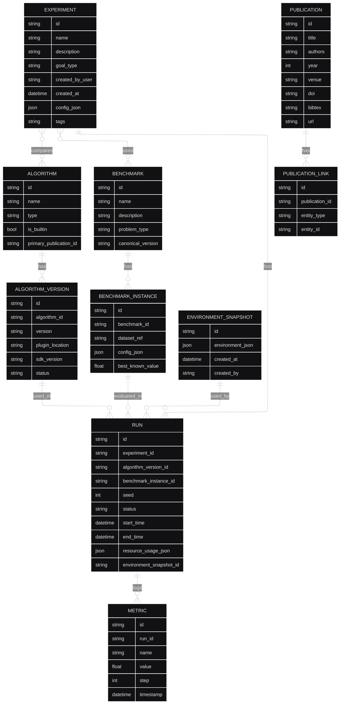

# Model danych - Corvus Corone

> **Dokument**: Szczegółowy model danych systemu benchmarkowego HPO  
> **Wersja**: 1.0  
> **Data**: 2025-11-19  
> **Status**: ✅ Complete

## 1. Wprowadzenie

Model danych dla systemu Corvus Corone został zaprojektowany z myślą o:
- **Reprodukowalności** eksperymentów benchmarkowych
- **Śledzeniu pochodzenia** (lineage) wyników 
- **Wersjonowaniu** algorytmów i benchmarków
- **Skalowaniu** od PC do chmury
- **Integralności** referencyjnej danych

## 2. Diagram ERD



## 3. Szczegóły encji

### 3.1. EXPERIMENT
**Opis**: Główna jednostka organizacyjna - zbiór runów porównujących algorytmy na benchmarkach

| Pole | Typ | Opis |
|------|-----|------|
| `id` | string | Unikalny identyfikator (UUID) |
| `name` | string | Nazwa eksperymentu (max 255 znaków) |
| `description` | text | Szczegółowy opis celu eksperymentu |
| `goal_type` | enum | `COMPARISON`, `PARAMETER_TUNING`, `ABLATION_STUDY` |
| `created_by_user` | string | ID użytkownika (FK do systemu auth) |
| `created_at` | datetime | Timestamp utworzenia |
| `config_json` | json | Konfiguracja eksperymentu (budżety, limity, seedy) |
| `tags` | string | Tagi oddzielone przecinkami dla kategoryzacji |

**Indeksy**: 
- PRIMARY KEY (`id`)
- INDEX (`created_by_user`, `created_at`)
- INDEX (`tags`) - dla wyszukiwania

### 3.2. RUN
**Opis**: Pojedynczy przebieg algorytmu na instancji benchmarku

| Pole | Typ | Opis |
|------|-----|------|
| `id` | string | Unikalny identyfikator runu (UUID) |
| `experiment_id` | string | FK do EXPERIMENT |
| `algorithm_version_id` | string | FK do ALGORITHM_VERSION |
| `benchmark_instance_id` | string | FK do BENCHMARK_INSTANCE |
| `seed` | int | Seed losowy dla reprodukowalności |
| `status` | enum | `PENDING`, `RUNNING`, `COMPLETED`, `FAILED`, `CANCELLED` |
| `start_time` | datetime | Czas rozpoczęcia |
| `end_time` | datetime | Czas zakończenia (NULL jeśli w trakcie) |
| `resource_usage_json` | json | Zużycie CPU/RAM/GPU/czas |
| `environment_snapshot_id` | string | FK do ENVIRONMENT_SNAPSHOT |

**Indeksy**: 
- PRIMARY KEY (`id`)
- INDEX (`experiment_id`, `status`)
- INDEX (`algorithm_version_id`)
- INDEX (`benchmark_instance_id`)

### 3.3. METRIC
**Opis**: Metryki logowane podczas runu (np. accuracy, loss, czas trenowania)

| Pole | Typ | Opis |
|------|-----|------|
| `id` | string | Unikalny identyfikator (UUID) |
| `run_id` | string | FK do RUN |
| `name` | string | Nazwa metryki (np. 'accuracy', 'best_score') |
| `value` | float | Wartość metryki |
| `step` | int | Krok/iteracja (opcjonalne, dla metryk czasowych) |
| `timestamp` | datetime | Kiedy metryka została zalogowana |

**Indeksy**: 
- PRIMARY KEY (`id`)
- INDEX (`run_id`, `name`)
- INDEX (`run_id`, `step`)

### 3.4. ALGORITHM
**Opis**: Definicja algorytmu HPO (może mieć wiele wersji)

| Pole | Typ | Opis |
|------|-----|------|
| `id` | string | Unikalny identyfikator (UUID) |
| `name` | string | Nazwa algorytmu (np. 'Random Forest TPE') |
| `type` | enum | `BAYESIAN`, `EVOLUTIONARY`, `GRID_SEARCH`, `RANDOM_SEARCH`, `GRADIENT_BASED`, `OTHER` |
| `is_builtin` | boolean | Czy algorytm jest wbudowany w system |
| `primary_publication_id` | string | FK do głównej publikacji opisującej algorytm |

**Indeksy**: 
- PRIMARY KEY (`id`)
- UNIQUE (`name`)
- INDEX (`type`)

### 3.5. ALGORITHM_VERSION
**Opis**: Konkretna wersja implementacji algorytmu

| Pole | Typ | Opis |
|------|-----|------|
| `id` | string | Unikalny identyfikator wersji (UUID) |
| `algorithm_id` | string | FK do ALGORITHM |
| `version` | string | Wersja semantyczna (np. '1.2.3') |
| `plugin_location` | string | URL/path do pliku pluginu (dla pluginów) |
| `sdk_version` | string | Wersja SDK użyta do stworzenia pluginu |
| `status` | enum | `DRAFT`, `UNDER_REVIEW`, `APPROVED`, `DEPRECATED` |

**Indeksy**: 
- PRIMARY KEY (`id`)
- UNIQUE (`algorithm_id`, `version`)
- INDEX (`status`)

### 3.6. BENCHMARK
**Opis**: Definicja benchmarku (zbiór instancji problemowych)

| Pole | Typ | Opis |
|------|-----|------|
| `id` | string | Unikalny identyfikator (UUID) |
| `name` | string | Nazwa benchmarku (np. 'UCI Classification Suite') |
| `description` | text | Opis benchmarku i jego celu |
| `problem_type` | enum | `CLASSIFICATION`, `REGRESSION`, `CLUSTERING`, `REINFORCEMENT_LEARNING` |
| `canonical_version` | string | Wersja kanoniczna/rekomendowana |

**Indeksy**: 
- PRIMARY KEY (`id`)
- UNIQUE (`name`)
- INDEX (`problem_type`)

### 3.7. BENCHMARK_INSTANCE
**Opis**: Konkretna instancja problemu w benchmarku

| Pole | Typ | Opis |
|------|-----|------|
| `id` | string | Unikalny identyfikator (UUID) |
| `benchmark_id` | string | FK do BENCHMARK |
| `dataset_ref` | string | Referencja do datasetu (URL/path) |
| `config_json` | json | Konfiguracja problemu (split ratio, preprocessing, etc.) |
| `best_known_value` | float | Najlepszy znany wynik (opcjonalne) |

**Indeksy**: 
- PRIMARY KEY (`id`)
- INDEX (`benchmark_id`)

### 3.8. PUBLICATION
**Opis**: Publikacje naukowe powiązane z algorytmami/benchmarkami

| Pole | Typ | Opis |
|------|-----|------|
| `id` | string | Unikalny identyfikator (UUID) |
| `title` | string | Tytuł publikacji |
| `authors` | string | Lista autorów |
| `year` | int | Rok publikacji |
| `venue` | string | Venue (konferencja/czasopismo) |
| `doi` | string | Digital Object Identifier |
| `bibtex` | text | Pełny wpis BibTeX |
| `url` | string | URL do publikacji |

**Indeksy**: 
- PRIMARY KEY (`id`)
- UNIQUE (`doi`) WHERE doi IS NOT NULL
- INDEX (`year`)
- FULLTEXT (`title`, `authors`)

### 3.9. PUBLICATION_LINK
**Opis**: Powiązania publikacji z algorytmami, benchmarkami, eksperymentami

| Pole | Typ | Opis |
|------|-----|------|
| `id` | string | Unikalny identyfikator (UUID) |
| `publication_id` | string | FK do PUBLICATION |
| `entity_type` | enum | `ALGORITHM`, `BENCHMARK`, `EXPERIMENT` |
| `entity_id` | string | ID powiązanej encji |

**Indeksy**: 
- PRIMARY KEY (`id`)
- UNIQUE (`publication_id`, `entity_type`, `entity_id`)
- INDEX (`entity_type`, `entity_id`)

### 3.10. ENVIRONMENT_SNAPSHOT
**Opis**: Snapshot środowiska dla reprodukowalności

| Pole | Typ | Opis |
|------|-----|------|
| `id` | string | Unikalny identyfikator (UUID) |
| `environment_json` | json | Szczegóły środowiska |
| `created_at` | datetime | Kiedy snapshot został utworzony |
| `created_by` | string | Kto utworzył snapshot |

**Struktura `environment_json`**:
```json
{
  "container_images": {
    "worker": "corvus-worker:1.2.3",
    "system": "corvus-core:1.2.3"
  },
  "python_packages": {
    "numpy": "1.21.0",
    "scikit-learn": "1.0.2",
    "pytorch": "1.10.0"
  },
  "system_info": {
    "os": "Ubuntu 20.04",
    "python_version": "3.9.7",
    "cuda_version": "11.2"
  },
  "resource_limits": {
    "cpu_cores": 4,
    "memory_gb": 16,
    "gpu_count": 1
  },
  "code_version": {
    "commit_hash": "abc123def456",
    "repository": "https://github.com/example/corvus",
    "branch": "main"
  }
}
```

## 4. Wzorce dostępu do danych

### 4.1. Częste zapytania

#### Pobranie eksperymentu z wynikami
```sql
SELECT e.*, COUNT(r.id) as run_count,
       AVG(CASE WHEN r.status = 'COMPLETED' THEN 1.0 ELSE 0.0 END) as success_rate
FROM EXPERIMENT e
LEFT JOIN RUN r ON e.id = r.experiment_id
WHERE e.id = ?
GROUP BY e.id;
```

#### Ranking algorytmów na benchmarku
```sql
SELECT av.algorithm_id, a.name,
       AVG(m.value) as avg_score,
       COUNT(DISTINCT r.id) as run_count
FROM ALGORITHM_VERSION av
JOIN ALGORITHM a ON av.algorithm_id = a.id
JOIN RUN r ON av.id = r.algorithm_version_id
JOIN METRIC m ON r.id = m.run_id
WHERE r.benchmark_instance_id = ?
  AND m.name = 'accuracy'
  AND r.status = 'COMPLETED'
GROUP BY av.algorithm_id, a.name
ORDER BY avg_score DESC;
```

#### Wyszukiwanie eksperymentów po tagach
```sql
SELECT * FROM EXPERIMENT
WHERE tags LIKE '%optimization%'
  AND tags LIKE '%neural_networks%'
ORDER BY created_at DESC;
```

### 4.2. Indeksowanie i partycjonowanie

**Strategia indeksowania**:
- **EXPERIMENT**: partycjonowanie po `created_at` (miesięcznie)
- **RUN**: partycjonowanie po `start_time` (tygodniowo)  
- **METRIC**: partycjonowanie po `run_id` + clustering po `timestamp`

**Materialized views**:
- `experiment_summary` - agregaty eksperymentów
- `algorithm_rankings` - rankingi algorytmów per benchmark
- `recent_activities` - ostatnie aktywności użytkowników

## 5. Strategie migracji

### 5.1. Wersjonowanie schematu
- **Flyway/Alembic** dla wersionowanych migracji
- **Backward compatibility** przez min. 2 wersje
- **Blue-green deployment** dla major changes

### 5.2. Archiwizacja danych
- **Hot data**: ostatnie 6 miesięcy w głównej bazie
- **Warm data**: 6-24 miesiące w archivalnej partycji
- **Cold data**: >24 miesiące w Object Storage (Parquet)

## 6. Cross-reference

- **Architektura komponentów**: [C4 Components](../architecture/c3-components.md)
- **API Reference**: [C4 Components - API Details](../architecture/c3-components.md#6-interfejsy-api---szczegóły-techniczne)
- **Deployment**: [Deployment Guide](../operations/deployment-guide.md)
- **Wymagania**: [Functional Requirements](../requirements/functional-requirements.md), [Use Cases](../requirements/use-cases.md)
